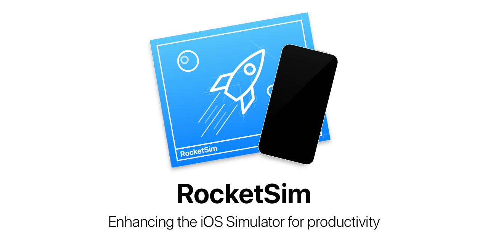

    

RocketSim makes it easy to launch universal links in the iOS simulator. Universal links, also known as deeplinks, open directly in your app and can be hard to manage for testing. RocketSim makes this easy!

## Requirements
- Xcode 11 and up
- MacOS 10.14+ (Mojave and up)

## FAQ
#### I need another feature!
That's great, I would love to hear your ideas. Please, open an issue with your idea.

#### I found a bug 🐛
Too bad but you're at the right place. I'm all in for fixing that bug! Please, open a bug report.

#### The wrong simulator is used!
RocketSim tries to open the focused simulator based on the screen ratio. However, as some devices have the same ratio the focused simulator can't always be determined. You can use the option for screen recording permissions in the preferences window to fix this. Screen recording is only used to get the actual focused Simulator name.

#### My shortcuts aren't working 🤔
The shortcuts are only activated when your simulator is focused. This is to prevent your shortcuts from overriding other system wide set shortcuts. Just open the simulator and use your shortcut again.

#### Where can I follow progress on updates?
All work in progress is posted on our [RocketSim Twitter](https://twitter.com/rocketsim_app)

## Contact
RocketSim is developed by [Antoine van der Lee](https://www.twitter.com/twannl) and proudly made possible by [SwiftLee](https://www.avanderlee.com).
