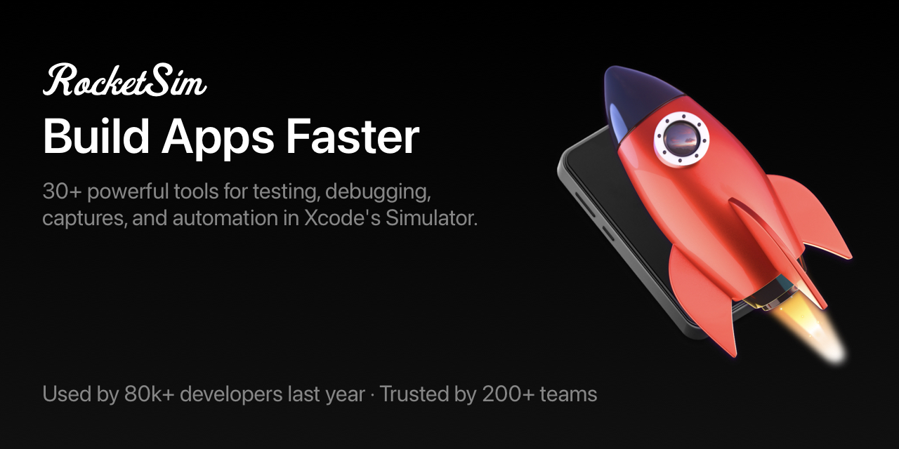

# RocketSim - Build Apps Faster

RocketSim enhances the iOS Simulator with tools for testing, debugging, captures, accessibility, app actions, and more. It helps iOS developers move faster by making common Simulator workflows easier to inspect, automate, and repeat.

Developers use RocketSim to:

- Inspect and debug simulator behavior faster
- Trigger app actions and test flows without leaving their coding environment
- Capture screenshots and recordings with less manual work
- Automate simulator interaction through the RocketSim CLI and bundled agent skill

## RocketSim Agent Skill

The RocketSim agent skill gives AI coding tools a reliable way to work with the iOS Simulator through RocketSim. It detects the installed RocketSim version, uses the matching RocketSim CLI, and enables agents to inspect what is visible on screen before interacting with the app.

In practice, this gives your agents eyes. Instead of guessing with brittle simulator automation, they can use RocketSim to understand the current UI state and interact with it efficiently using the same stateful tooling that powers RocketSim itself.

### What it does

- Detects the correct RocketSim app bundle on disk
- Uses the matching RocketSim CLI for the installed version
- Lets agents list visible elements on screen before taking action
- Enables agents to tap, type, swipe, and move through Simulator flows more reliably

### Why install it

Install this skill if you want your AI coding tool to use RocketSim as its Simulator interaction layer instead of relying on ad-hoc automation.

This is especially useful if you want an agent to:

- Navigate and test iOS Simulator apps
- Read visible accessibility elements before interacting
- Tap, type, swipe, and trigger flows more reliably
- Use the RocketSim version already installed on your machine

## How It Works

The public skill in this repository stays intentionally small:

- `Agent-Skill/SKILL.md` discovers and validates a RocketSim app bundle
- It resolves the bundled in-app skill and CLI from the installed app
- The bundled skill contains the version-matched CLI guidance for simulator interaction

This split keeps the public discovery layer stable while letting the installed RocketSim app define the exact simulator automation capabilities for that version.

## How To Install

### Option A: Using skills.sh

Install this skill with a single command:

```bash
npx skills add https://github.com/AvdLee/RocketSimApp --skill rocketsim
```

### Option B: Claude Code

To install this skill for your personal use in Claude Code:

1. Add the marketplace:

```bash
/plugin marketplace add AvdLee/RocketSimApp
```

2. Install the skill:

```bash
/plugin install rocketsim@rocketsim
```

### Option C: Cursor

Install or symlink the `Agent-Skill/` folder into your Cursor skills directory following Cursor's skills documentation.

```bash
mkdir -p .cursor/skills
ln -s /path/to/RocketSimApp/Agent-Skill .cursor/skills/rocketsim
```

### Option D: Codex / OpenAI-compatible tools

Copy or symlink the `Agent-Skill/` folder into your Codex skills directory:

```bash
cp -R Agent-Skill/ "$CODEX_HOME/skills/rocketsim"
```

See the [Codex skills documentation](https://developers.openai.com/codex/skills/) for where to save skills.

### How To Verify

Open an agent and ask it to:

> Use RocketSim to navigate through the `<app_name>` in the Simulator

If the skill is installed and RocketSim is running, the agent should detect the installed RocketSim version, connect through the bundled CLI, inspect the visible Simulator UI, and start interacting with the app based on what is on screen.

## Learn More

If you want to learn more about RocketSim itself, use the canonical product resources:

- [RocketSim website](https://www.rocketsim.app)
- [RocketSim documentation](https://www.rocketsim.app/docs)
- [RocketSim on the Mac App Store](https://apps.apple.com/us/app/rocketsim-for-xcode-simulator/id1504940162)

## Support And Feedback

- Open a GitHub issue for bugs or feature requests related to RocketSim or this public skill.
- Use the documentation site for feature guides and setup help.

RocketSim is developed by [Antoine van der Lee](https://www.avanderlee.com) and built by SwiftLee.