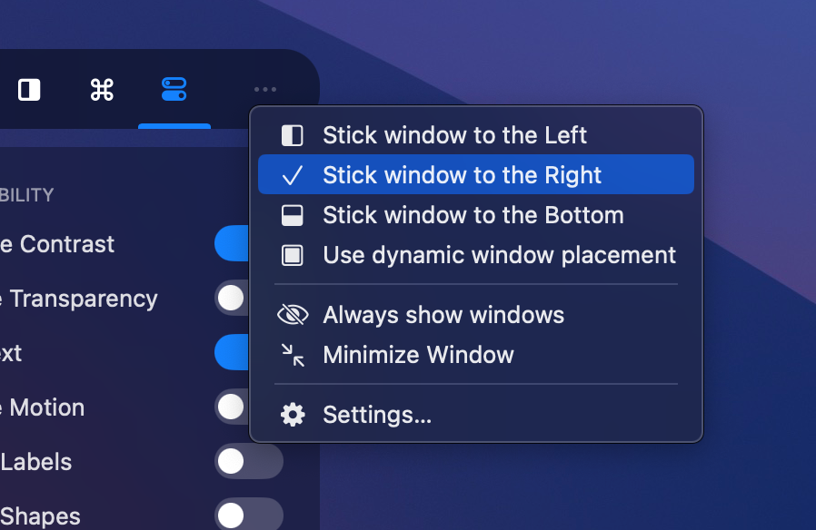
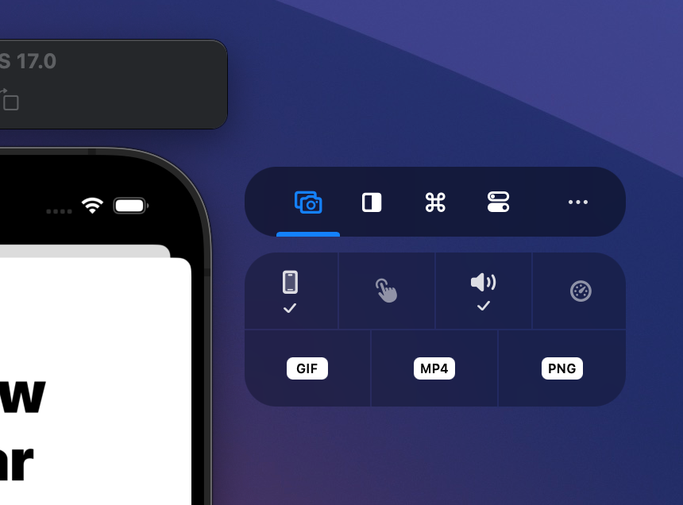

RocketSim’s Side Window is unique and always accessible when you’re testing your app in the Simulator. However, you might not always enjoy that floating window following you everywhere. Therefore, I’ve built several options to adjust the Side Window’s appearance.

## Hiding the Side Window

Using the more button:

You can hide the Side Window and move it into a red label:

## Sticky window placement

By default, the side window will be placed left or right based on the available space. However, you might prefer always showing the window on the left, right, bottom, or top. Use the more button and select your preference:

## Always show windows

In some cases, you want the side window to never hide. From within the more menu, you can enable this mode:

## Minimized Capturing Window

The captures section is built for new users, explaining each available feature. However, you might enjoy a minimized version:

Which you can enable from the general settings page:

## Always hide the Side Window

The Side Window is not required to access all functionality. You can use RocketSim’s Status Bar Menu as well:

From the general settings page, you can disable the floating window completely:

