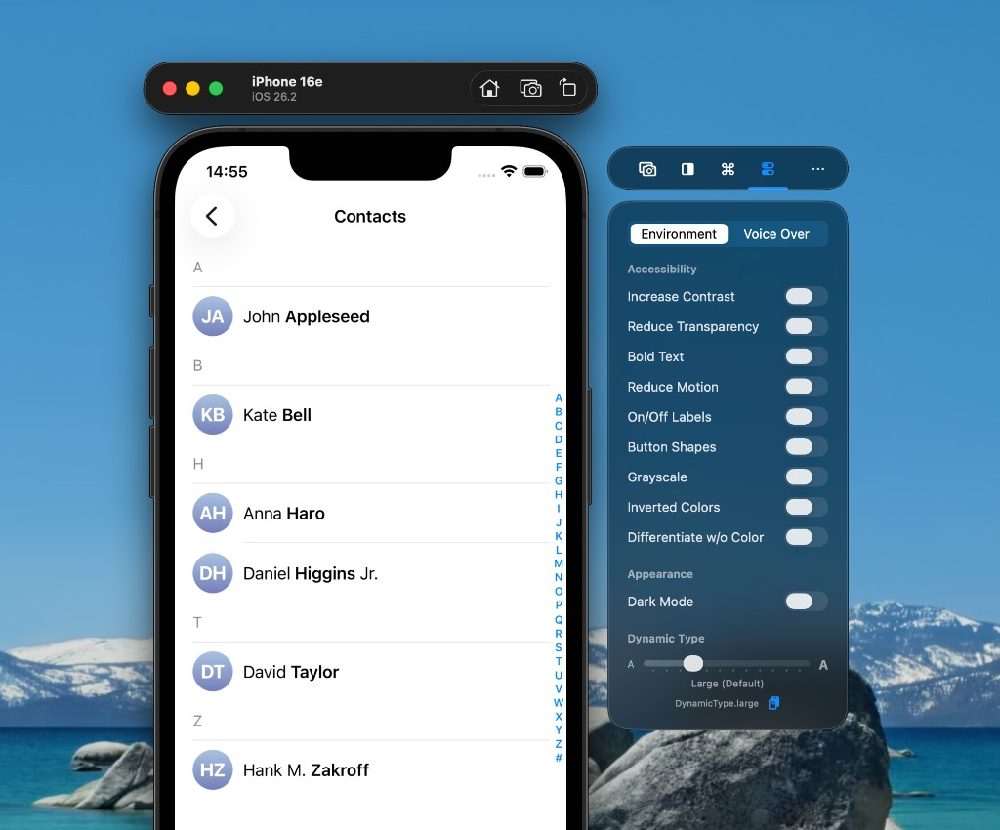

Testing accessibility settings usually means navigating deep into Simulator Settings. RocketSim's Environment Overrides put all the important toggles right in the side window, so you can switch settings while looking at your app.

## Accessibility toggles

You get direct access to: Increase Contrast, Reduce Transparency, Bold Text, Reduce Motion, On/Off Labels, Button Shapes, Grayscale, Inverted Colors, and Differentiate without Color. Toggle any of them and see the effect immediately in your running app.

## Dark Mode

Toggle between light and dark mode with a single click. No need to navigate through Simulator settings. Dark Mode is a Pro feature.

## Dynamic Type

A slider lets you test every Dynamic Type size. RocketSim also shows the SwiftUI code for each size, so you can copy it directly into your previews. That makes it easy to verify your layouts at different text scales.
