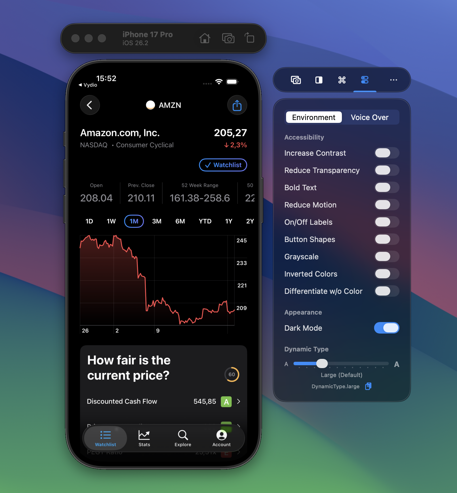

Testing accessibility settings usually means navigating deep into Simulator Settings. RocketSim's Environment Overrides put all the important toggles right in the side window, so you can switch settings while looking at your app.

## Accessibility toggles

You get direct access to Increase Contrast, Reduce Transparency, Reduce Motion, Show Borders, and a Color Filter with grayscale and color blindness options. Simulators that run iOS 26 or earlier also offer Bold Text, On/Off Labels, Inverted Colors, and Differentiate without Color. Toggle any of them and see the effect immediately in your running app.

## Liquid Glass

Enable Tinted Liquid Glass and adjust the Liquid Glass opacity to check legibility of your glass surfaces.

## Dark Mode and StandBy

Toggle between light and dark mode with a single click. No need to navigate through Simulator settings. Dark Mode is a Pro feature. On Xcode 27 or later you can also show or hide StandBy on iPhone Simulators.

## Dynamic Type

A slider lets you test every Dynamic Type size. RocketSim also shows the SwiftUI code for each size, so you can copy it directly into your previews. That makes it easy to verify your layouts at different text scales.

## Learn more

- [Toggles & Dynamic Text](/docs/features/accessibility/toggles-and-dynamic-text/) for every toggle and its Xcode requirements
- [VoiceOver Navigator](/docs/features/accessibility/voiceover-navigator/) to verify reading order
- [Accessibility Audit](/docs/features/accessibility/accessibility-audit/) to find issues automatically
