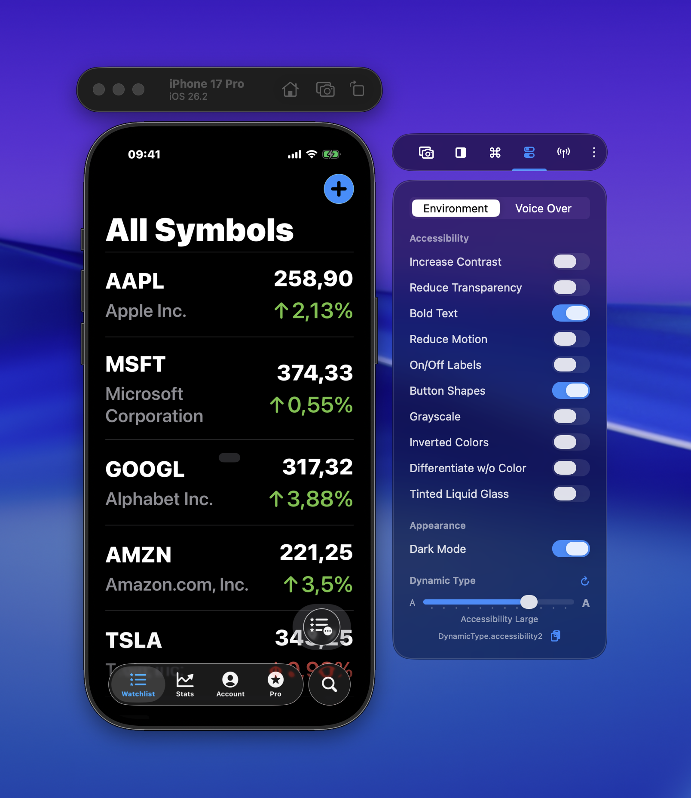
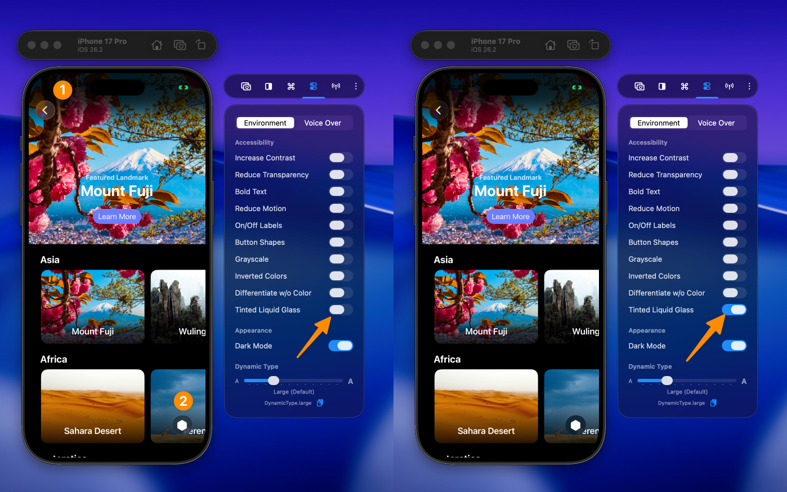

During app development, it's important to test your app's accessibility support to ensure it's usable by everyone. Xcode provides so-called Environment Toggles, but they're not easily accessible when you're focused on the Simulator.

RocketSim's Side Window provides similar functionality and keeps accessibility toggles available whenever you need them:

## Tinted Liquid Glass testing

When Liquid Glass was introduced, many developers quickly ran into accessibility concerns. iOS later added a Tinted Liquid Glass mode to improve contrast, but that does not automatically guarantee your UI will remain readable in every case.

Until recently, testing this mode usually required a physical device. With RocketSim's accessibility toggles, you can now enable Tinted Liquid Glass directly in the Simulator and compare both states while iterating on your app.

Even small visual changes can affect legibility, hierarchy, and overall usability. This comparison shows how a subtle difference can still have a meaningful impact for users who rely on accessibility features.

## Accessibility toggles and Dynamic Type

Beyond Tinted Liquid Glass, RocketSim lets you quickly test settings like Increase Contrast, Reduce Transparency, Bold Text, Reduce Motion, On/Off Labels, Button Shapes, Grayscale, Inverted Colors, and Differentiate without Color.

You can also adjust Dynamic Type sizes from the same side window, making it easy to verify layouts, spacing, and truncation without navigating away from your app.
