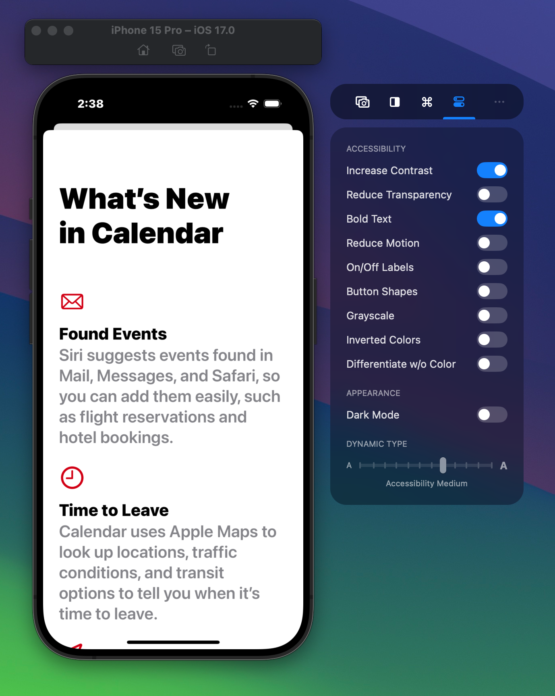

During app development, it’s important to test your app’s accessibility support to ensure it’s usable by everyone. Xcode provides so-called Environment Toggles, but they’re not accessible when you’re focused on the Simulator.

RocketSim’s Side Window provides similar functionality but makes them available whenever you need them:

