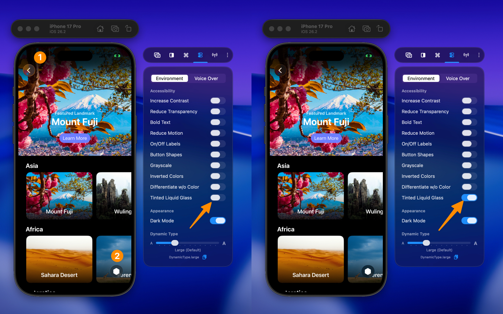

During app development, it's important to test your app's accessibility support to ensure it's usable by everyone. Xcode provides so-called Environment Toggles, but they're not easily accessible when you're focused on the Simulator.

RocketSim's side window provides similar functionality and keeps accessibility toggles available whenever you need them. Open the **Accessibility** tab, then select **Toggles**:

<!-- prettier-ignore -->
<video src="/features/accessibility-toggles.mp4" aria-label="Switching accessibility toggles, color filters, Liquid Glass options, Dark Mode, StandBy, and Dynamic Type from RocketSim's Accessibility side window while an app runs in the Simulator." controls autoplay muted loop playsinline preload="metadata" poster="/features/posters/accessibility-toggles.webp" style="width: 100%; border-radius: 0.75rem;"></video>

The Accessibility window has three tabs: **Toggles** for the controls on this page, [**VoiceOver**](/docs/features/accessibility/voiceover-navigator/) for the VoiceOver Navigator, and [**Audit**](/docs/features/accessibility/accessibility-audit/) for automatic accessibility checks.

## Accessibility toggles

Switch these settings with one click and see the effect immediately in your running app:

- **Increase Contrast**
- **Reduce Transparency**
- **Reduce Motion**
- **Show Borders** (called Button Shapes in earlier versions, matching iOS)
- **Color Filter**, including a grayscale filter and color blindness filters

On iOS 26 and earlier Simulators, the list also includes **Bold Text**, **On/Off Labels**, **Inverted Colors**, and **Differentiate without Color**. RocketSim hides these four on iOS 27 Simulators for now.

## Color filters

Use the **Color Filter** menu to check whether your interface still works when color is harder to tell apart. Choose **Grayscale** or one of the red-green, green-red, and blue-yellow color blindness filters (protanopia, deuteranopia, and tritanopia).

The color blindness filters have an **Intensity** slider from 25% to 100%, so you can compare a mild impairment with a strong one. Color filters require **Xcode 27 or later**.

## Liquid Glass

When Liquid Glass was introduced, many developers quickly ran into accessibility concerns. The **Liquid Glass** section lets you test the two settings iOS offers to improve legibility:

- **Tinted** — Enables Tinted Liquid Glass, which iOS added to improve contrast. It doesn't automatically guarantee your UI remains readable in every case.
- **Opacity** — Adjust how opaque Liquid Glass is with a slider, and use the reset button to return to the default. The opacity slider requires **Xcode 27 or later**.

Until recently, testing these modes usually required a physical device. Now you can compare both states directly in the Simulator while iterating on your app.

Even small visual changes can affect legibility, hierarchy, and overall usability. This comparison shows how a subtle difference can still have a meaningful impact for users who rely on accessibility features.

## Dark Mode and StandBy

The **Appearance** section contains **Dark Mode** and **StandBy**. Dark Mode is a Pro feature.

The **StandBy** toggle shows or hides StandBy on iPhone Simulators, so you can check how your app's StandBy presentation looks. StandBy can only be shown while the Simulator displays its lock screen, and the toggle requires **Xcode 27 or later**.

## Dynamic Type

A slider lets you test every Dynamic Type size. RocketSim also shows the SwiftUI code for each size, so you can copy it directly into your previews. That makes it easy to verify layouts, spacing, and truncation without navigating away from your app.

## Stays in sync with the Simulator

With Xcode 27 or later, the Accessibility window follows changes you make in the Simulator itself, such as switching Dark Mode or Increase Contrast, without polling. The toggles, Dark Mode, and Dynamic Type apply consistently, including on the iOS 27 Simulator.
