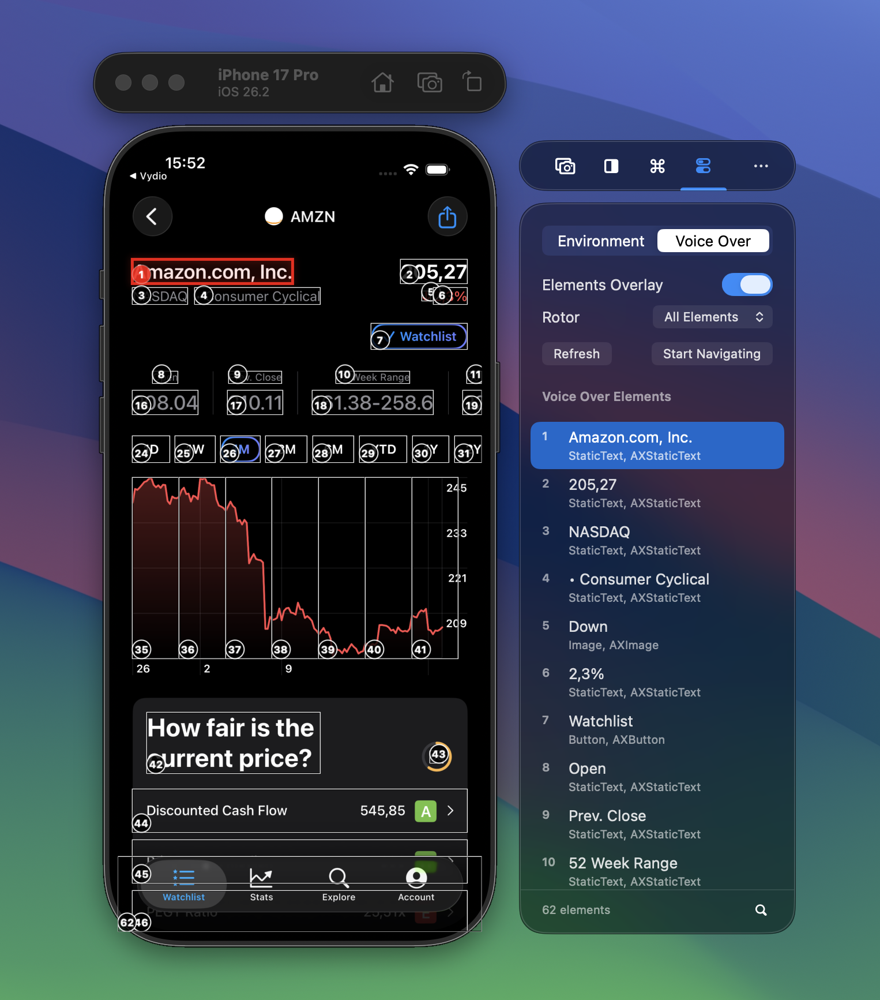
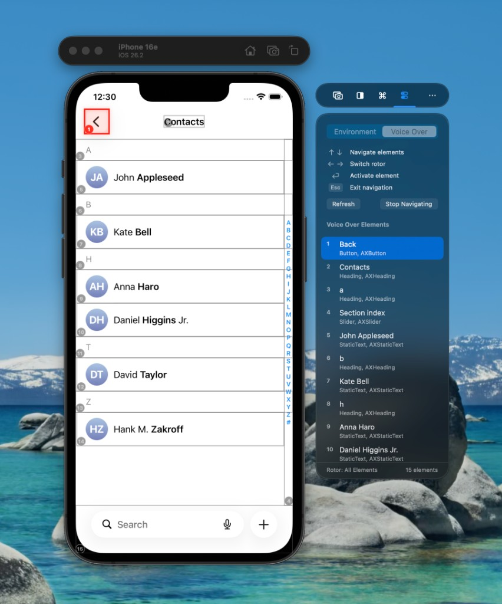

:::note
VoiceOver Navigator is available in the latest RocketSim beta. [Join the beta via TestFlight](https://testflight.apple.com/join/emGszFpq) to try it out.
:::

Testing VoiceOver used to mean grabbing a physical device, enabling VoiceOver, and swiping through your app. VoiceOver Navigator lets you stay in the Simulator: you get a visual overlay of the accessibility element order and keyboard-driven navigation, so you can verify reading order and rotor behavior without leaving your flow.

## Introduction to the VoiceOver Overlay

When you open the **Voice Over** tab in RocketSim’s side window, you can turn on **Elements Overlay**. Numbered labels appear on each accessibility element in the same order VoiceOver would use on a real device — so you can see at a glance whether your reading order makes sense. The panel lists every element with its role (e.g. Button, Heading, StaticText) and the total count. Use the **Rotor** dropdown to filter by category (e.g. Headings, Buttons) or leave it on **All Elements**. **Refresh** updates the list after the app’s UI changes.

This view is read-only: you’re inspecting the tree and the overlay. When you’re ready to step through the experience the way VoiceOver would, use **Start Navigating**.

## Using the VoiceOver Navigator

In navigation mode, the overlay stays on screen and the panel shows the same element list, but the current focus is highlighted. You move through the app using the keyboard:

- **↑↓** — Move to the previous or next element in VoiceOver order
- **←→** — Switch between rotor categories (like swiping on device)
- **⏎ Enter** — Activate the focused element (e.g. tap a button); the app navigates and the overlay updates
- **Esc** — Exit navigation mode

You can search for elements, change the rotor category from the dropdown, and turn the overlay on or off from the panel. When you’re done, **Stop Navigating** returns you to the overlay-only view.

No device, no gestures, no context switch — you get a much quicker loop for checking VoiceOver behavior while you develop.
