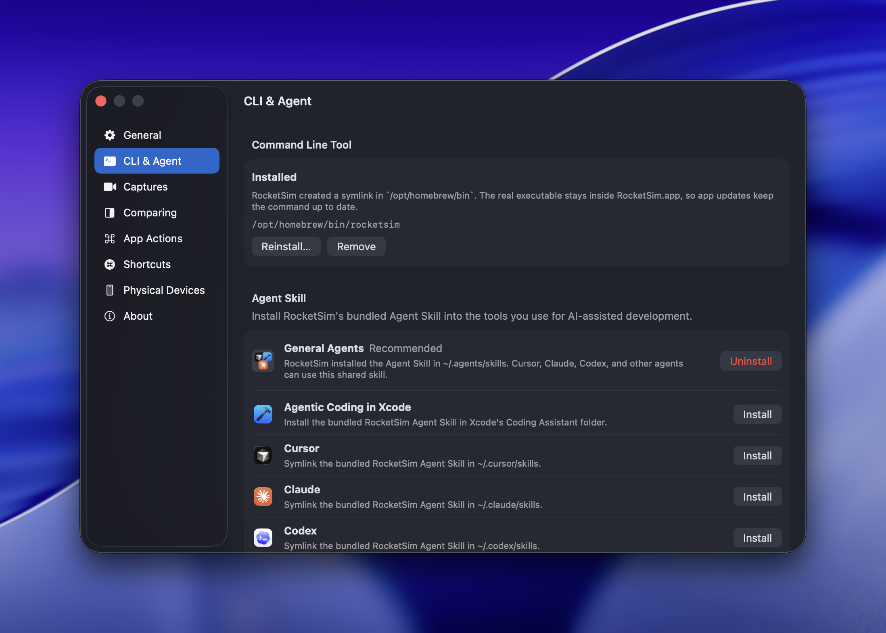

The RocketSim Agent Skill is the recommended way to connect AI coding tools to RocketSim. It teaches your agent how to use the version-matched `rocketsim` CLI, when to read elements, when to interact, how to recover after screen changes, and when to use a screenshot fallback.

Install it from **RocketSim → Settings → CLI & Agent**.

## Why the skill is recommended

You can run the CLI yourself, but agents perform best when they have clear, tool-specific instructions. The RocketSim Agent Skill provides those instructions without requiring you to copy prompts into every project.

The skill helps agents:

- Use RocketSim's compact `--agent` output before deciding what to do
- Prefer semantic interactions over fragile coordinate taps when possible
- Work with RocketSim's `rs/1` agent protocol without needing to know its internals
- Recover when a screen changes between inspection and interaction
- Use screenshots when accessibility data is sparse or incomplete
- Run `rocketsim doctor` when setup needs to be checked

In our internal research, RocketSim's CLI completed the same agent workflows about **19% faster, avoided wrong taps entirely**, and used about **63% fewer estimated tokens** than a popular alternative.

## Install from RocketSim

1. Open **RocketSim → Settings → CLI & Agent**
2. Install the **Command Line Tool** if `rocketsim` is not on your `PATH` yet
3. In **Agent Skill**, choose **General Agents** for broad support or **Agentic Coding in Xcode** for Xcode's built-in coding assistant
4. Click **Install** or **Repair**
5. Restart or refresh your AI coding tool if it does not discover new skills automatically

RocketSim installs the skill as a symlink to the bundled skill inside `RocketSim.app`. When RocketSim updates, the skill keeps pointing at the latest installed app version.



## Supported destinations

We recommend **General Agents** for most setups. It installs the skill into the shared `.agents/skills` location, so multiple AI coding tools can use the same version-matched RocketSim skill instead of each tool needing its own copy.

Choose **Agentic Coding in Xcode** when you use Xcode's built-in Claude Agent or Codex integration. Xcode keeps its coding assistant configuration in `~/Library/Developer/Xcode/CodingAssistant`, separate from Claude Code's `~/.claude/skills` folder. Restart Xcode after installing or repairing this destination.

Use a tool-specific destination like **Cursor**, **Claude**, or **Codex** if that tool only scans its own skill folder. You can also choose a custom skill folder if your tool stores skills somewhere else.

If RocketSim shows **Repair**, the existing symlink points somewhere unexpected or the app has moved. Repairing updates the symlink to the current RocketSim app.

## Why it stays up to date

RocketSim ships the CLI and Agent Skill inside the app bundle. The installed files are symlinks, not copied snapshots. That matters because the CLI surface and skill instructions evolve together.

After an App Store update, your `rocketsim` command and installed skill still resolve to the current app bundle. Agents get the guidance that matches the RocketSim version they are controlling.

## What the agent can do after setup

Once the skill is installed and RocketSim is running, your agent can:

- Read visible accessibility elements, including navigation and tab bar items
- Tap, long-press, swipe, and type using labels or coordinates
- Press simulator hardware buttons like Home, Lock, or Siri
- Navigate multi-step app flows with fewer retries
- Use compact screen summaries to spend fewer tokens per screen read
- Capture a screenshot when visual context is needed

## How to verify it works

First, check your setup:

```bash
rocketsim doctor
```

Then open your AI coding tool and try:

> Use RocketSim to navigate through `<your_app_name>` in the Simulator

If the skill is installed, RocketSim is running, and your app is already open in the Simulator, the agent should detect RocketSim, read the visible UI, and start interacting with the app based on what is on screen.

## Learn more

- [RocketSim CLI](/docs/features/agentic-development/rocketsim-cli) -- the commands agents use to inspect and interact with the Simulator
- [Agentic Development with RocketSim](/docs/features/agentic-development/) -- scenarios, example prompts, and why RocketSim is effective for agent-driven Simulator automation
- [CLI & Agent settings](/docs/settings/cli-and-agent) -- installing and repairing the CLI and skill
