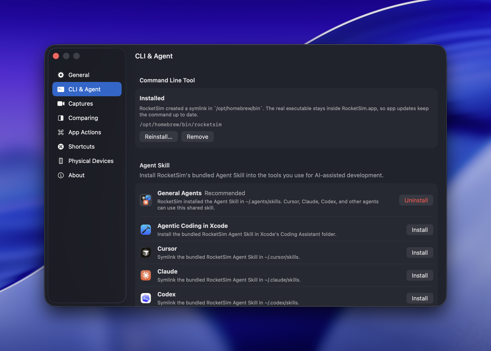

RocketSim includes a built-in CLI that lets agents inspect visible UI and interact with the Simulator through the running RocketSim Mac app. The app stays connected to the Simulator, keeps useful state warm, and exposes a compact command line surface for agents and local automation.

For agentic development, we recommend installing both the CLI and [RocketSim Agent Skill](/docs/features/agentic-development/agent-skill) from **RocketSim → Settings → CLI & Agent**.

The CLI works with the Simulator UI that is already running. It does not build, install, or launch apps from an Xcode project; use Xcode or your normal build tooling for that step, then let RocketSim inspect and interact with the app on screen.

## Installing the CLI

1. Open **RocketSim → Settings → CLI & Agent**
2. In **Command Line Tool**, click **Install Command Line Tool**
3. Choose the default selected folder if it is on your `PATH`, or pick another folder such as `/opt/homebrew/bin` or `/usr/local/bin`
4. Confirm the installation

RocketSim creates a `rocketsim` symlink in that folder. The real executable stays inside `RocketSim.app`, so App Store updates keep the command up to date automatically.



This symlink setup is useful for both agents and CI scripts. Anything that runs `rocketsim` from `PATH` uses the same RocketSim version you have installed.

## The agent interaction loop

The CLI gives agents a compact workflow:

1. Ask RocketSim which simulator is currently focused
2. Read the visible UI elements
3. Decide what to do next
4. Tap, swipe, type, or press a hardware button
5. Read the updated UI state
6. Repeat

That loop is fast because RocketSim is already connected to the Simulator. There is no reconnection overhead between steps, and the running app can cache and optimize work across repeated commands.

RocketSim resolves booted Simulators through the same device service used by the Mac app. Commands therefore work whether the Simulator is shown in Simulator.app, Xcode 27's Device Hub, or booted headlessly with `simctl boot`. Without a focused Simulator window, RocketSim automatically targets the only booted Simulator. If several are booted, focus one or pass `--udid` to choose one.

## Why RocketSim is fast for agents

RocketSim is not just a standalone command that starts from scratch every time. The CLI talks to the running Mac app, which can keep simulator state, reuse context between commands, and optimize repeated screen reads and interactions.

The CLI uses RocketSim's [`rs/1` protocol](/docs/features/agentic-development/rs1-protocol) for agent workflows. You do not need to learn the protocol details; it is the compact, agent-optimized layer that lets RocketSim provide reliable screen reads, interaction feedback, and recovery paths while keeping output small.

Compared with other tools available to control the iOS Simulator, RocketSim produced **over 99% less command output**, had an **about 95% lower byte-based context estimate**, and used **about 24% less measured command time** in our July 2026 head-to-head benchmark. Read [how we test the CLI and Agent Skill](/blog/testing-ai-agents-ios-simulator) for the scenarios, methodology, and improvement findings.

## Key commands

### Doctor

Checks whether the CLI install, RocketSim app, IPC connection, Simulator state, accessibility permission, and snapshot store are ready for agent workflows.

```bash
rocketsim doctor
```

### Focused simulator

Returns the currently focused simulator as JSON, including name, runtime, and UDID.

```bash
rocketsim simulator focused
```

### Browser Preview

Starts a live, interactive Simulator preview and prints its local URL:

```bash
rocketsim preview
```

Pass `--port <port>` to choose a localhost port or `--udid <udid>` to target a specific booted Simulator. See [Browser Preview](/docs/features/agentic-development/browser-preview) for the interactive controls and visual feedback workflow.

### Visible elements

Returns the accessibility elements currently visible on screen.

```bash
rocketsim elements [--udid <udid>] [--agent] [--agent-mode nav|act|debug]
```

The `--agent` flag is the recommended default for agent workflows. It returns compact rows inside the `rs/1` response:

- `nav` focuses on headings, tabs, navigation bars, and top-level controls while omitting plain static text, images, and nested duplicate text composites
- `act` includes interactive element identifiers, labels, roles, values, and state
- `debug` returns the full hierarchy when an action fails or an element looks wrong

Both compact modes omit individual software-keyboard keys because keyboard visibility is already reported in the response header. They also omit elements whose frames are fully outside the device canvas. Debug and plain JSON output remain unchanged when you need the complete hierarchy.

RocketSim's element pipeline is designed for real app navigation. It can include visible controls from top bars, navigation bars, tab bars, and other chrome that agents often need to move through a flow. When web content or other complex views expose limited accessibility data, RocketSim can add recovery hints so the agent knows when to use visual context.

### Screen summary and annotated snapshots

For agents that need a stable view of the current screen, RocketSim provides screen and snapshot commands:

```bash
rocketsim screen
rocketsim snapshot --agent-mode act > state.png
rocketsim snapshot --label "Photo" --scale 2 --screen latest > photo.png
```

`screen` returns a compact description and screen hash. `snapshot` writes an annotated PNG whose numbered badges connect visible elements to their identifiers. Filter snapshots by label, type, identifiers, or a crop rectangle when the complete screen would add unnecessary visual context.

The JSON snapshot also includes `data.canvasSize` (`[width, height]` in device points), which describes the full screen the elements were laid out in. This is the union of every raw accessibility frame, including the full-screen application root, so it spans the true device bounds rather than just the box around the visible content. Use it to scale element frames onto a rendered screenshot or overlay without re-deriving the device size, which is especially important on scrollable screens where the visible content does not fill the screen.

Use `--screen latest` for the next action or annotated snapshot. RocketSim resolves it against the current stored screen, which avoids copying hashes between commands while still protecting the interaction from a stale snapshot.

### Screenshots

When accessibility data is not enough, agents can request a plain PNG screenshot:

```bash
rocketsim screenshot > screen.png
```

This is useful for visual fallback flows, sparse web content, or debugging what the agent sees. The raw PNG bytes are written to stdout, so redirect them to a file. Target a specific simulator with `--udid <udid>` instead of the focused one.

Screenshots can also be styled with the same options RocketSim uses for its capturing tools:

```bash
rocketsim screenshot \
  --bezel simulator \
  --background "#0B1221" \
  --device-shadow \
  --ratio 16:9 > styled.png
```

| Option                  | Description                                                                                 |
| ----------------------- | ------------------------------------------------------------------------------------------- |
| `--background <value>`  | Background color: `transparent`, a preset color, or `#RRGGBB`.                              |
| `--bezel <style>`       | Device frame style: `none`, `simulator`, or `device`.                                       |
| `--frame-color <value>` | Device frame tint as a preset color or `#RRGGBB`.                                           |
| `--device-shadow`       | Render a shadow behind the device frame.                                                    |
| `--ratio <ratio>`       | Output ratio: `auto`, `1:1`, `5:4`, `4:3`, `3:2`, or `16:9`.                                |
| `--asc`                 | Optimize output dimensions for App Store Connect.                                           |
| `--watermark`           | Render the RocketSim watermark.                                                             |
| `--metadata`            | Render app metadata when available and supported by the selected ratio.                     |
| `--touches`             | Render captured touches.                                                                    |
| `--touch-color <value>` | Touch color as a preset color or `#RRGGBB`.                                                 |
| `--touch-stroke`        | Render a stroke around touches.                                                             |
| `--orientation <value>` | Output orientation: `portrait`, `portraitUpsideDown`, `landscapeLeft`, or `landscapeRight`. |

To preview the capture in RocketSim's [floating thumbnail](/docs/features/capturing/floating-thumbnail) instead of writing bytes to stdout, add `--show-floating-thumbnail`:

```bash
rocketsim screenshot --show-floating-thumbnail
```

### Video recordings

Agents and scripts can record the simulator to an MP4. Recording continues until `Ctrl+C`, SIGTERM, or an optional duration elapses, at which point RocketSim finalizes the file and writes the bytes to stdout:

```bash
rocketsim video record > recording.mp4
```

Press `Ctrl+C`, send SIGTERM, or pass `--duration <seconds>` to stop and flush the MP4. Target a specific simulator with `--udid <udid>` and set the frame rate with `--fps <value>` (between 1 and 120, default 30):

```bash
rocketsim video record --fps 60 --duration 5 --udid <udid> > recording.mp4
```

`video record` accepts the same styling options as `screenshot` (see the table above), so you can record framed, touch-annotated, or App Store Connect–optimized clips. As with screenshots, add `--show-floating-thumbnail` to send the finished recording to RocketSim's floating thumbnail instead of stdout:

```bash
rocketsim video record --bezel device --touches --show-floating-thumbnail
```

### Network conditions

Agents can test offline and poor-network handling without disconnecting the Mac:

```bash
rocketsim network set airplane
rocketsim network set 3g
rocketsim network set 100-loss --bundle-id com.example.app
rocketsim network status
rocketsim network off
```

Network control requires RocketSim Pro and an approved RocketSim Network Extension. Without `--bundle-id`, RocketSim targets the current Recent Builds. Always turn the condition off after the test.

Network commands are bounded: when the extension is not approved or does not respond within roughly ten seconds, the command fails fast with a `network_extension_not_ready` error instead of hanging. Its `context.reason` tells the agent whether to ask you to approve the extension in RocketSim's Networking window (`needs_user_approval`) or to simply retry (`timed_out`).

See [Network Speed Control & Simulator Airplane Mode](/docs/features/networking/network-speed-control/) for profiles and setup.

### Waiting for UI changes

Agents can wait for screen changes or elements before continuing:

```bash
rocketsim wait screen-changed
rocketsim wait element --label "Continue"
rocketsim wait keyboard --state shown
rocketsim wait keyboard --state hidden --timeout 1
rocketsim wait time --ms 800
```

This keeps agent flows from racing ahead before the app has finished navigating or rendering. For keyboard waits, `shown` is an alias for `visible`; use `hidden` to wait for dismissal. Prefer observable waits; use the capped `wait time --ms <1...10000>` fallback only when no screen, element, or keyboard postcondition exists.

When the perception backend itself is failing (rather than the predicate simply staying false), `wait` reports that backend failure as an `execution_failed` error instead of a misleading timeout, so agents can run `rocketsim doctor` and recover instead of retrying a wait that can never succeed.

### Interactions

RocketSim supports the most common agent interactions through `rocketsim interact`:

```bash
rocketsim interact tap --label "Continue"
rocketsim interact tap --label "Delete" --index 2 --screen latest
rocketsim interact activate --label "Hidden Debug Menu"
rocketsim interact tap 210 642
rocketsim interact long-press --label "Delete"
rocketsim interact long-press --label "Debug" --touches 2 --duration 1
rocketsim interact swipe --direction up
rocketsim interact swipe --from 200,650 --to 200,150
rocketsim interact scroll --label "Results" --direction up --pages 1 --screen latest
rocketsim interact focus --label "Email" --screen latest
rocketsim interact type "hello@example.com"
rocketsim interact button home
rocketsim interact biometric match
rocketsim interact biometric nomatch
```

`interact` is designed to work with fresh screen state. After dispatching an interaction, RocketSim actively refreshes snapshots during a bounded settlement window before computing the result delta. The returned `screen_changed` value therefore reflects the post-interaction screen instead of a stale cached snapshot. Large `appeared` and `disappeared` detail arrays are capped while `appeared_count` and `disappeared_count` retain the complete totals.

Use `interact activate` for an accessibility element that does not respond to coordinate taps, such as a hidden debug control. It performs an accessibility press on the resolved element instead of sending a HID tap.

Use `--touches 2` or `--number-of-touches 2` with `tap` or `long-press` to automate two-finger gestures.

Use `interact biometric match` to complete a Face ID request successfully, or `nomatch` to test the failure path. Biometric commands target the active Simulator and do not take an element selector.

### Batched flows

When the next steps are already known, combine them in one `rocketsim do` process. Smart refresh keeps screen state current between interactions while avoiding redundant reads:

```bash
rocketsim do \
  --refresh-policy smart \
  --step "interact tap --label 'Sign In' --screen latest" \
  --step "wait element --label Email --timeout 2" \
  --step "interact type 'hello@example.com' --label Email --screen latest" \
  --step "interact tap --label Submit --screen latest"
```

Prefer a concrete postcondition such as an element appearing or the keyboard hiding. Interaction responses already include a screen delta, so an extra screen-change wait is often unnecessary.

Each step normally starts with `interact`, `wait`, `elements`, or `screen`. Interaction actions such as `tap`, `swipe`, and `focus` are also accepted directly as shorthand inside a batch.

## Why `--agent` matters

The `--agent` flag replaces the full accessibility hierarchy with compact pipe-delimited rows inside the `rs/1` response. That means less context per screen read and easier recovery after each interaction.

An `act` response looks like this:

```json
{
  "rs": "1",
  "ok": true,
  "data": {
    "mode": "act",
    "screen": "a3f291bc",
    "rows": ["7|button|Continue||enabled", "8|textField|Email||enabled"]
  }
}
```

The identifiers are ephemeral and belong to that screen. Prefer a label selector, use 1-based `--index` for repeated labels, or use an identifier with `--screen latest` when duplicate labels make the selector ambiguous. Use `debug` mode or omit `--agent` when you need parent relationships, raw frames, scrollable-container metadata, or the complete hierarchy.

This structured output for agents works especially well with the [RocketSim Agent Skill](/docs/features/agentic-development/agent-skill), which connects your AI coding tool to the CLI automatically. We highly recommend using the Agent Skill instead of asking an agent to invent CLI calls on its own.

## Selector-based interaction

When possible, agents should prefer targeting elements by label, type, or value instead of raw coordinates:

```bash
rocketsim interact tap --label "Submit" --screen latest
rocketsim interact tap --type Button --label "OK" --screen latest
rocketsim interact long-press --label "Reorder" --duration 1.5 --screen latest
```

Selector-based taps first try semantic accessibility activation, which is more reliable than a coordinate tap when the visual affordance does not align perfectly with the accessibility frame — think toggles, list rows, and buttons with asymmetric tappable areas. When semantic activation is unavailable, RocketSim falls back to a precise HID tap at the element's center. Coordinate taps and multi-touch taps always use HID directly. Use `interact activate` when you explicitly need an accessibility press without any HID fallback, such as for a hidden debug control that ignores coordinate hit-testing.

When a selector matches several elements with the same label, RocketSim automatically chooses the only actionable match if the others are non-actionable containers around it. For genuinely distinct matches, pass 1-based `--index <N>` in reading order or use an element id.

Coordinates are still available as a fallback when the element is visible on screen but not exposed with a stable label. Raw coordinate and untargeted actions accept the same `--screen` flag; pass the explicit hash from the snapshot where you chose the coordinate to detect a stale screen before dispatch.

## Named swipe directions

For common gestures, agents can use named directions instead of explicit coordinates:

```bash
rocketsim interact swipe --direction up
rocketsim interact swipe --direction back
rocketsim interact swipe --direction notification-center
rocketsim interact swipe --direction control-center
```

Valid directions: `up`, `down`, `left`, `right`, `back`, `notification-center`, `control-center`.

## Example prompts

These prompts work well with the CLI interaction loop:

> Use RocketSim to read the visible elements and tap the primary action button

> Use RocketSim to swipe through the onboarding carousel and verify each page title

> Use RocketSim to type a search query into the search field and select the first result

> Use RocketSim to press the home button, then inspect the Simulator after the app is open again

## Requirements

The CLI works when:

- RocketSim is running
- At least one iOS Simulator is booted
- The command line tool is installed from **Settings → CLI & Agent**
- The [RocketSim Agent Skill](/docs/features/agentic-development/agent-skill) has been installed so agents can discover RocketSim automatically

Run `rocketsim doctor` when the CLI cannot connect, a booted Simulator is not discovered, or accessibility and interactions fail unexpectedly. Routine navigation should start with `rocketsim screen` or compact elements output instead.

RocketSim refreshes stale Simulator service caches once before failing a command. If the retry is exhausted, the rs/1 response uses `simulator_not_booted` with `context.reason` set to `simulator_control_lookup_failed`. Boot the Simulator, verify its UDID, and retry once. When several Simulators are booted without a focused window, `simulator_not_focused` tells you to focus one or pass `--udid`.

On Xcode 27 runtimes, accessibility may be unavailable because of Apple's remote-automation restrictions. RocketSim returns `accessibility_unavailable` immediately instead of hanging. In that state, use plain screenshots and coordinate interactions; do not keep retrying accessibility reads, selector interactions, waits, or annotated snapshots for that Simulator.
