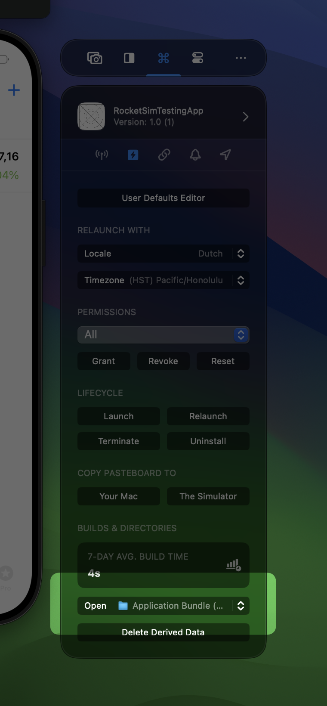

Finding your app's sandbox directory in the Simulator has always been painful. The path is buried deep inside `~/Library/Developer/CoreSimulator` and changes with every install. RocketSim gives you one-click access to any directory your app uses.

## Available Directories

**Free tier:** Application Bundle (.app), Sandbox User Data (root), and User Defaults plist — which opens directly in the User Defaults Editor.

**Pro tier:** Documents, Library, Caches, Application Support, Temp, Derived Data folder, App Group directories (with nested User Defaults plists), and File Provider Storage.

## How to Access

Available from the side window under the directories dropdown, and from the status bar menu under your app's submenu.

## User Defaults Integration

Clicking a `.plist` file opens it directly in RocketSim's User Defaults Editor. This works for both standard User Defaults and App Group User Defaults.

For more on Simulator directory structure, see [Simulator directories access](https://www.avanderlee.com/xcode/simulator-directories-access/).
