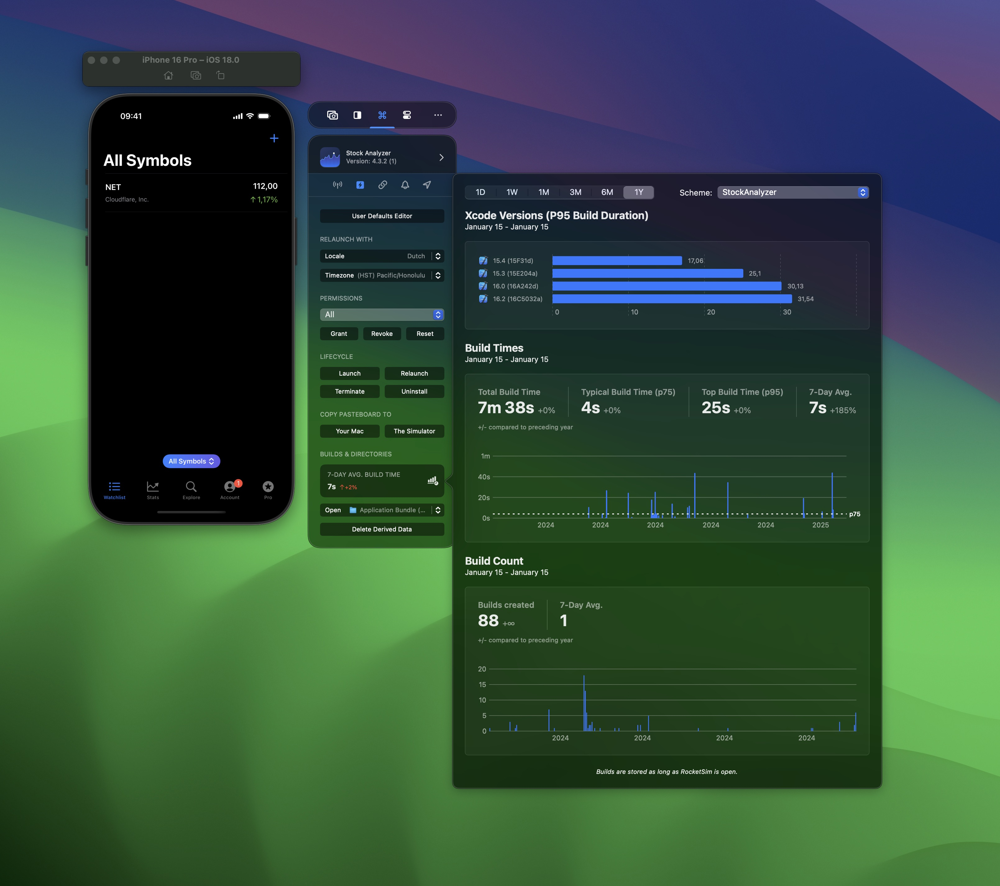

RocketSim’s Build Insights allow you to keep track of build counts and durations. Unlike Xcode, RocketSim will cache your build statistics, enabling valuable insights:

- How did your build times improve over time?
- What impact did the latest Xcode version have?
- Which Swift Packages the slowest in building?

You can access Build Insights for any recent build inside the side window:

## FAQ

### I don’t see any builds?

RocketSim will start tracking as soon as you’ve updated to 12.9.0 or higher. At first, it’s only able to track the builds that Xcode cached. Since Xcode is often clearing cache, it’s likely that you don’t see many builds yet.

### Can I also keep track of modules (Swift packages)?

Yes, RocketSim keeps track of all schemes within a main project. You can use the scheme switcher to select any of your dependencies.

### Do I have to keep RocketSim open to track builds?

As for now, yes. However, we’re planning to implement a background monitor that will keep track of builds while RocketSim isn’t running.

### It would be amazing to compare my build times to colleagues, is that possible?

Yes, this is possible with [RocketSim for Teams](https://www.rocketsim.app/team-insights).
