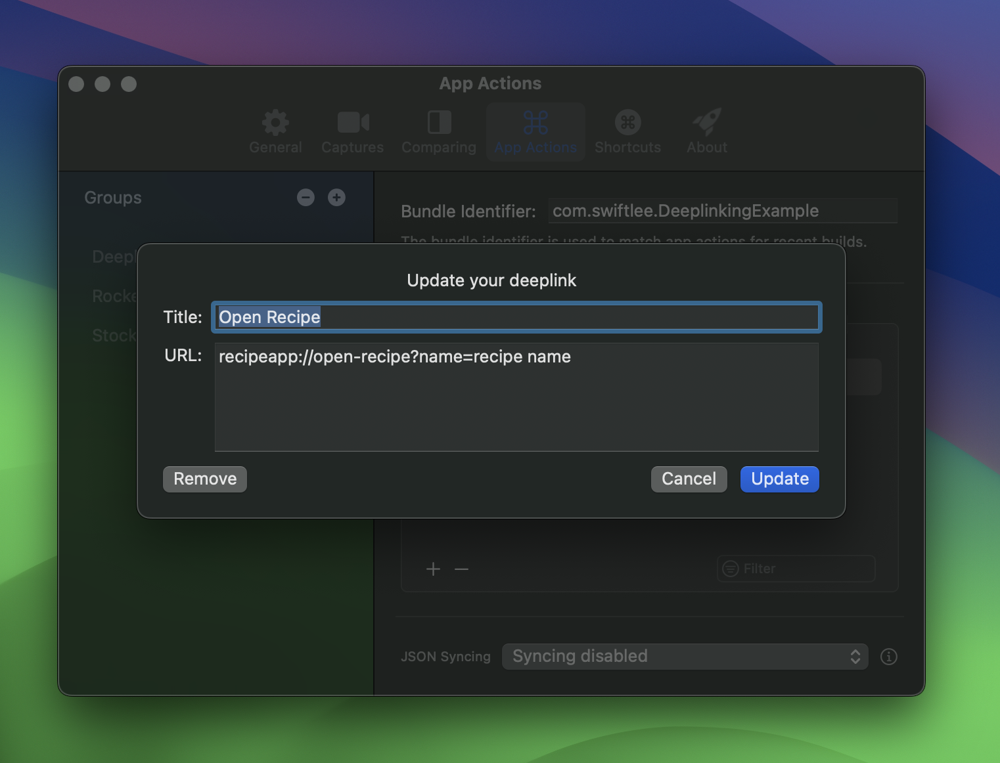
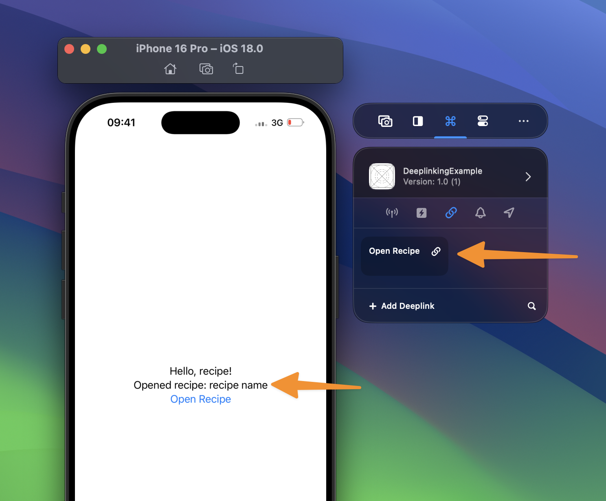
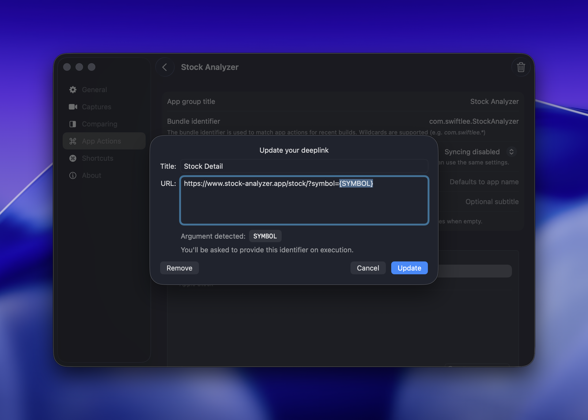
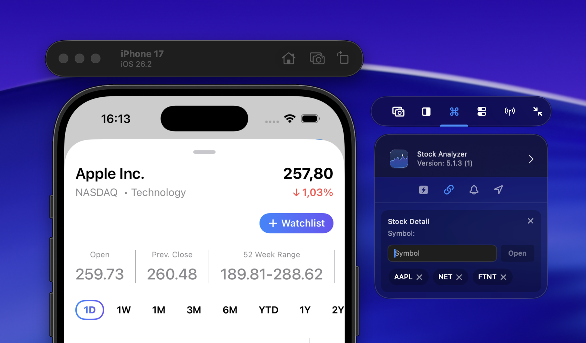

A deeplink or Universal Link allows you to redirect users to a specific location of your app. A common example is opening a map location in WhatsApp, which will directly open inside Apple Maps.

The same functionality can be built into your apps. I’ve seen developers manage all supported deeplinks in notes, reminders, or hosted HTML pages. With RocketSim, you can now manage all supported deeplinks in a single place, accessible for all Simulators.

## Creating a deeplink (Universal Link)

1. Open Settings
2. Select the **App Actions** tab
3. Create a new deeplink inside your app's group:

   

4. Open the Simulator
5. Execute the action by tapping your deeplink from the side window:

   

## Deeplinks with arguments

RocketSim 15.1 adds support for a single runtime argument inside a deeplink URL. Use curly braces to mark the placeholder, for example `stocks://analyze/{SYMBOL}`.

That makes it easy to keep one reusable deeplink around for many test cases instead of saving a separate action per symbol, product ID, or user identifier.

When you trigger that deeplink from the side window, RocketSim opens a compact input view right there in the Simulator context. Enter the value you want to use and RocketSim substitutes it into the final URL before launching your app.

RocketSim also keeps a few recently used values as quick relaunch pills, so repeating the same test case only takes one click.

## Learn more

If you’d like to learn more about deeplinks and Universal Links, I encourage you to read the following articles:

- [**Deeplink URL handling in SwiftUI**](https://www.avanderlee.com/swiftui/deeplink-url-handling/)
- [**Universal Links implementation on iOS**](https://www.avanderlee.com/swiftui/universal-links-ios/)
