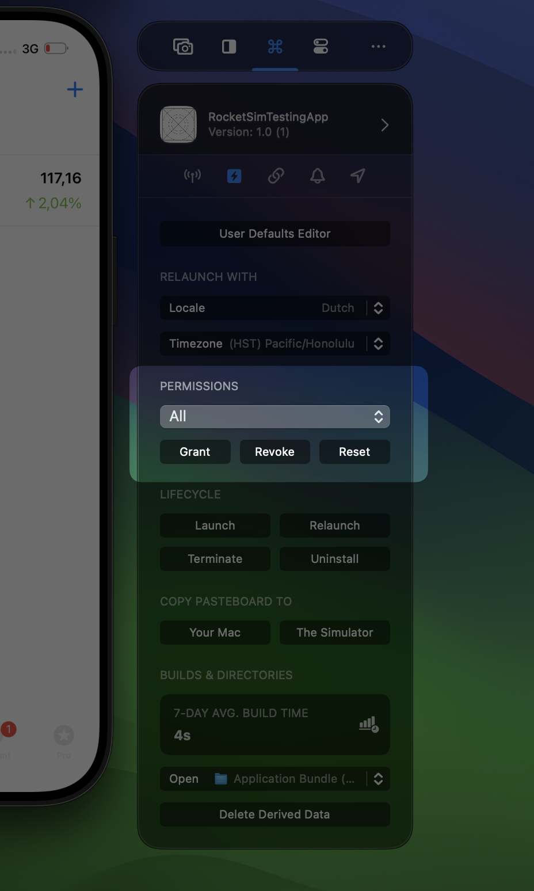
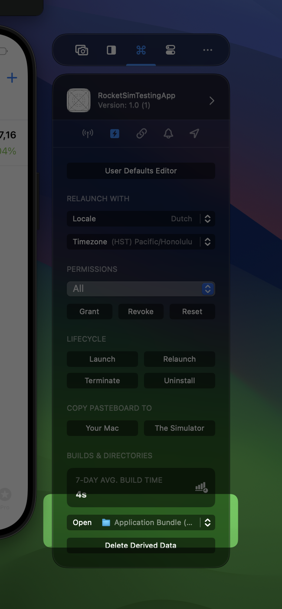

RocketSim’s General app actions window pane provides access to all kinds of features that help you test your app’s functionality.

## Relaunch with Locale or Timezone

Quickly test your app in any supported locale or specific timezone. You can read more about this feature here: [**Localization testing in Xcode](https://www.avanderlee.com/xcode/localization-testing-in-xcode/).** This feature is demonstrated in the following YouTube video:

[https://youtu.be/zukRdke1cP8?si=FWrQNWq-2O4gHJF_](https://youtu.be/zukRdke1cP8?si=FWrQNWq-2O4gHJF_)

## Grant, Revoke, or Reset Permissions

When working on features like Calendar access, it can be useful to quickly grant, revoke, or reset permissions for testing purposes. You can use **All** to grant, revoke, or reset all permissions.

## Accessing directories

Directories important to your app are listed in logical order. Each directory has its purpose and I encourage you to read my detailed article if you want to know more: [**Xcode Simulator Directories Exploration](https://www.avanderlee.com/xcode/simulator-directories-access/).**

## User Defaults

By selecting either the Standard or Group User Defaults you’ll be able to monitor or edit defaults using the User Defaults Editor:

You can read more about this in my dedicated article: [**User Defaults reading and writing in Swift](https://www.avanderlee.com/swift/user-defaults-preferences/).** Or watch the demo video on YouTube:

[https://youtu.be/zTbQck3ofcc?si=15HABuxsj_3yAlIu](https://youtu.be/zTbQck3ofcc?si=15HABuxsj_3yAlIu)

## Launch, Terminate, Relaunch, and Uninstall

These options speak for themselves. If not, give it a try!

## Copy Pasteboard to Your Mac or The Simulator

Use the buttons to transfer clipboard content from your Mac to the Simulator or the other way around. 

## Deleting Derived Data

Quickly deleted derived data for only the currently selected app. This prevents you from having to rebuild all apps that you’re working on in Xcode.
