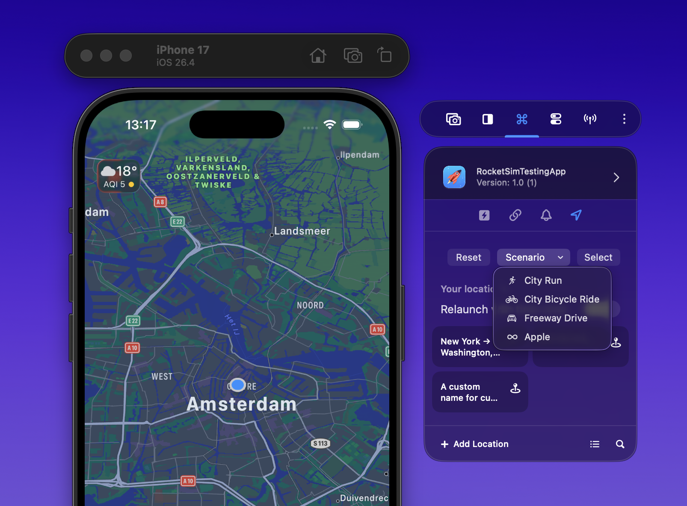
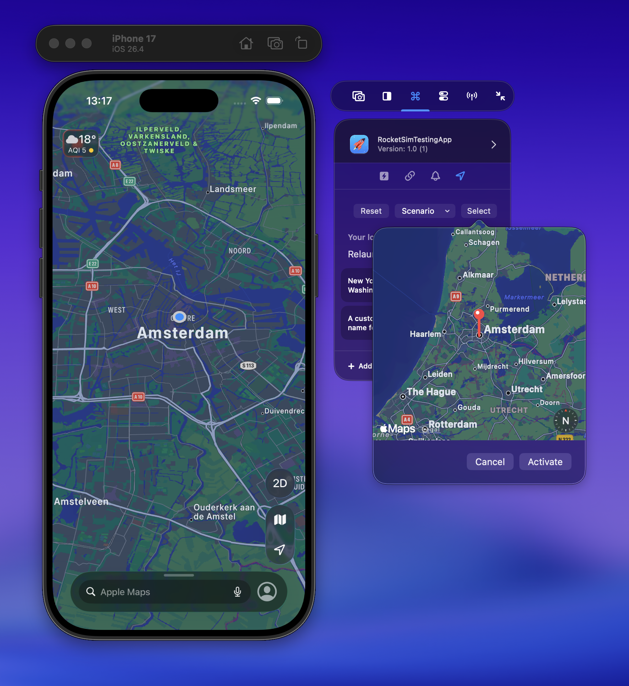
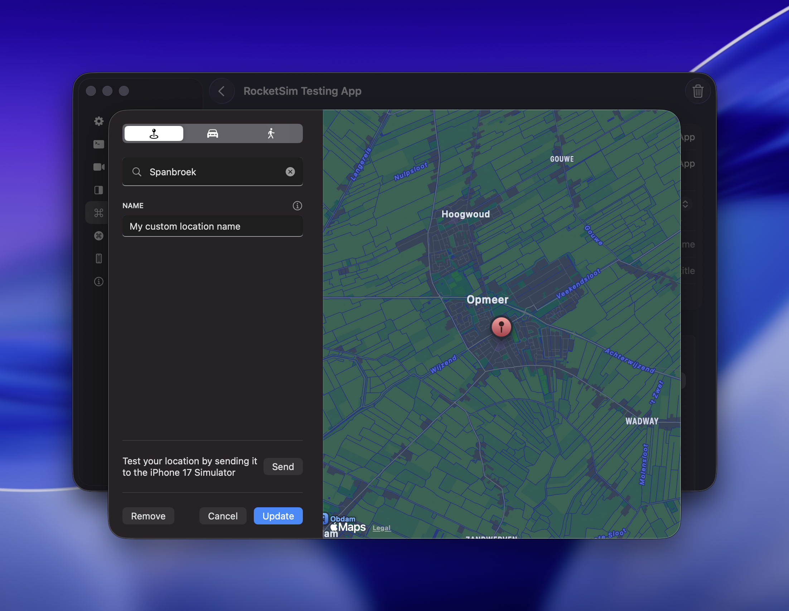
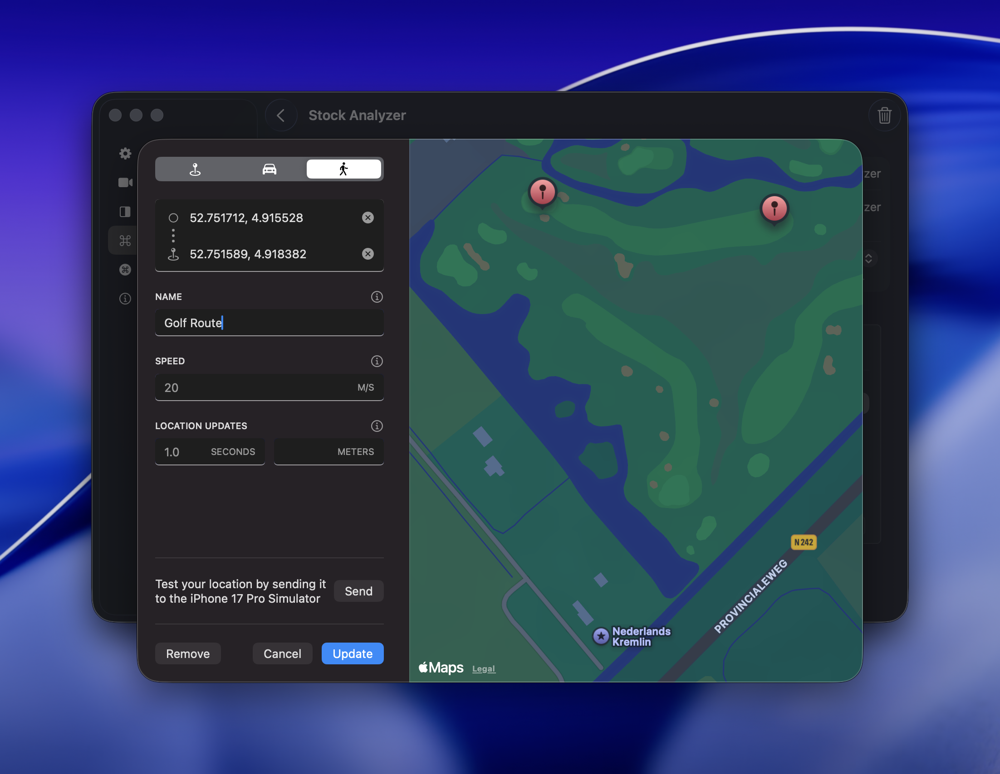
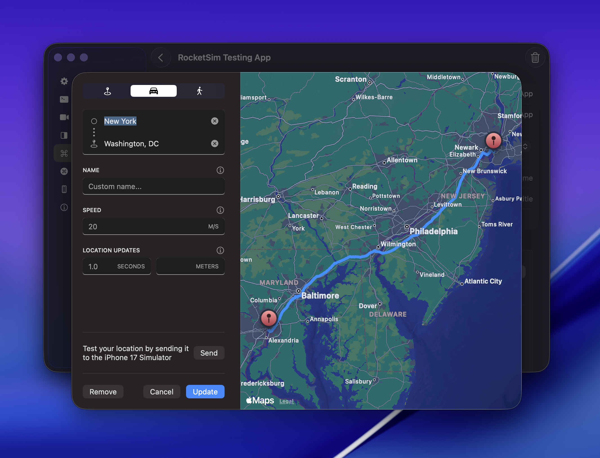
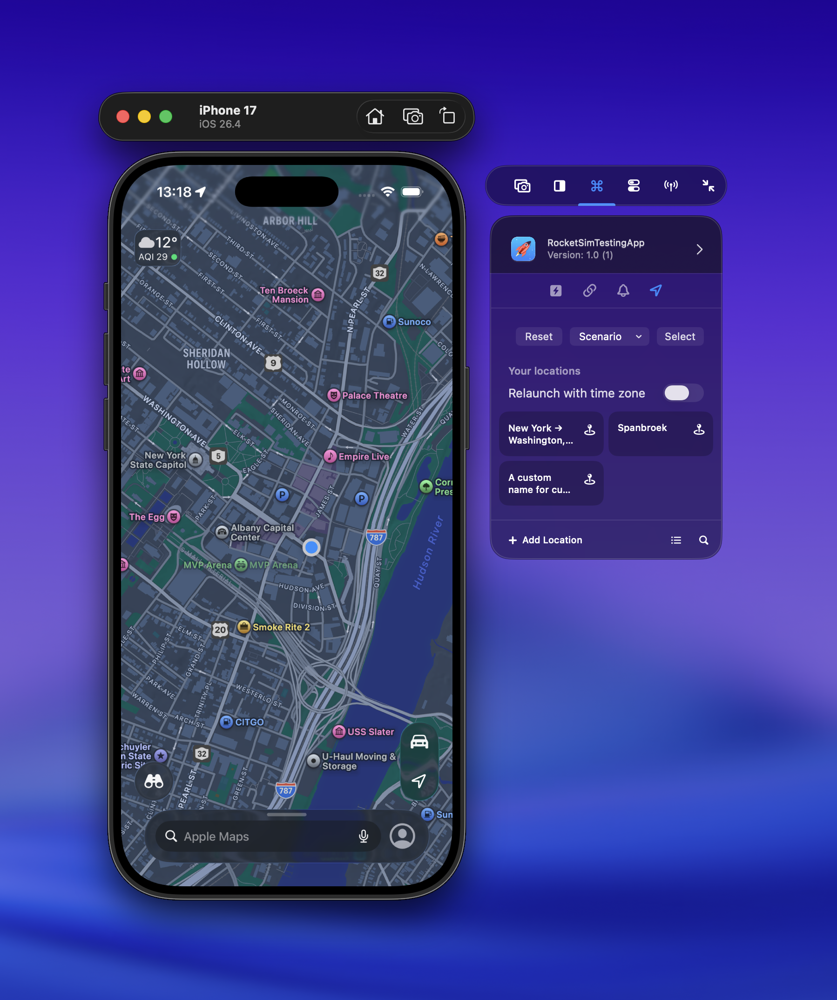

Testing location-aware apps should not require driving around with a MacBook. RocketSim lets you simulate GPS updates directly on the iOS Simulator, either as one-off actions from the side window or as reusable App Actions for your project.

## Quick location controls

Open the **Locations** tab in the RocketSim side window for the focused Simulator. From there you can reset the current simulated location, run a built-in scenario, or pick a custom location from the map.



The **Scenario** menu uses the Simulator's built-in location scenarios:

- **City Run**
- **City Bicycle Ride**
- **Freeway Drive**
- **Apple**

Use **Select** when you want to test a one-off location. Move the map so the pin points at the desired place and press **Activate**.



## Save locations as App Actions

For locations you use often, create a saved location App Action in **Settings** → **App Actions**. Saved locations are linked to your app's bundle identifier and appear in the side window whenever the matching build is selected.



RocketSim supports three saved location types:

- **Single location:** set the Simulator to one coordinate.
- **Car route:** simulate a driving route between two locations.
- **Walking route:** simulate a walking route between two locations.

You can provide a custom name so the action is easy to recognize in the side window. Use the **Send** button while editing to test the location before saving it.

## Use custom coordinates

The location search fields accept addresses and raw coordinates. Enter coordinates as `latitude, longitude`, for example:

```text
52.371807, 4.896029
```

When RocketSim recognizes the format, it shows the result as **Custom Coordinates**. This works for single locations and for the start or destination of routes.



Custom coordinates are useful for testing repeatable real-world paths. For example, a golf app can save a walking route from one hole coordinate to another and replay that route whenever you need to validate distance, map rendering, or location update handling.

## Simulate car and walking routes

Choose the car or walking icon in the location editor to create a route. RocketSim calculates the route using Apple Maps directions and previews it on the map before you save it.



Route App Actions support optional tuning:

- **Speed:** meters per second. If empty, the Simulator uses `20 m/s`.
- **Interval:** send location updates at a fixed number of seconds. If empty, the Simulator uses `1.0` second.
- **Distance:** send location updates every number of meters traveled.

Use interval or distance depending on what you want to validate. Interval-based updates are useful for UI refresh behavior, while distance-based updates are useful for apps that react to traveled distance.



Saved routes currently use a start and destination. Multi-stop paths are not exposed as a saved App Action route, but you can still create precise point-to-point routes by entering custom coordinates for both fields.

## Relaunch with the matching time zone

Enable **Relaunch with time zone** in the Locations tab when your app needs its process time zone to match the simulated location. RocketSim reverse-geocodes the simulated location, terminates the selected app, and launches it again with the matching time zone environment.

This is helpful for apps that combine location and date logic, such as calendars, travel apps, delivery apps, or booking flows.

## Share location actions with your team

Saved location App Actions are included when you sync App Actions to JSON, including their route option, speed, interval, distance, and waypoints. This lets a team keep common test locations and routes in Git next to deeplinks and push notifications.

See [How Large Teams Use RocketSim](/docs/getting-started/how-large-teams-use-rocketsim) for more on sharing App Actions using Git.

## Related testing

Location simulation changes the Simulator's GPS location. If you also need to test permission states, use [Privacy & Permissions](/docs/features/app-actions/privacy-permissions) to grant, revoke, or reset Location and Location Always permissions.

Location App Actions are Simulator-only. Physical-device support currently focuses on capturing workflows.

For more background, read [Location Simulation in Xcode's Simulator](https://www.avanderlee.com/workflow/location-simulation-xcode-simulator/).
