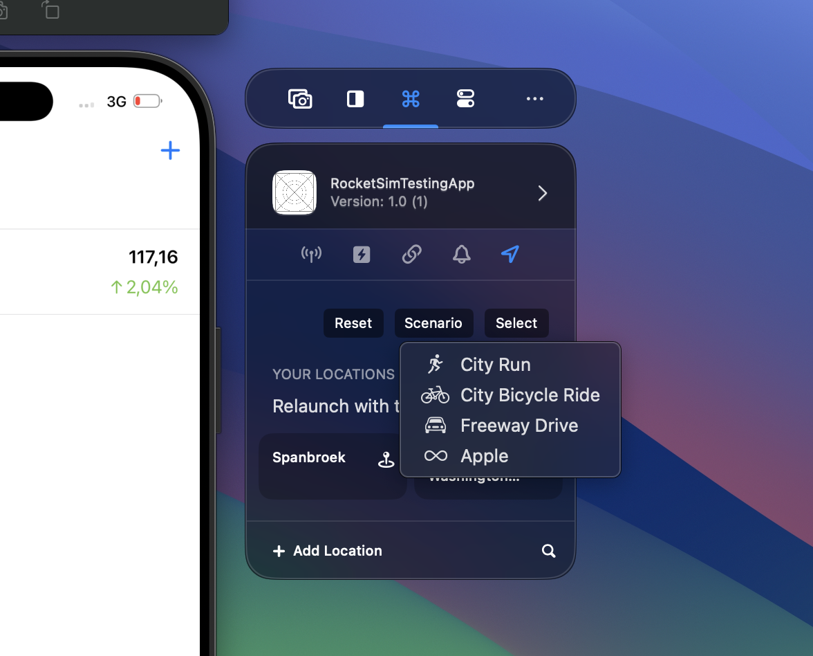
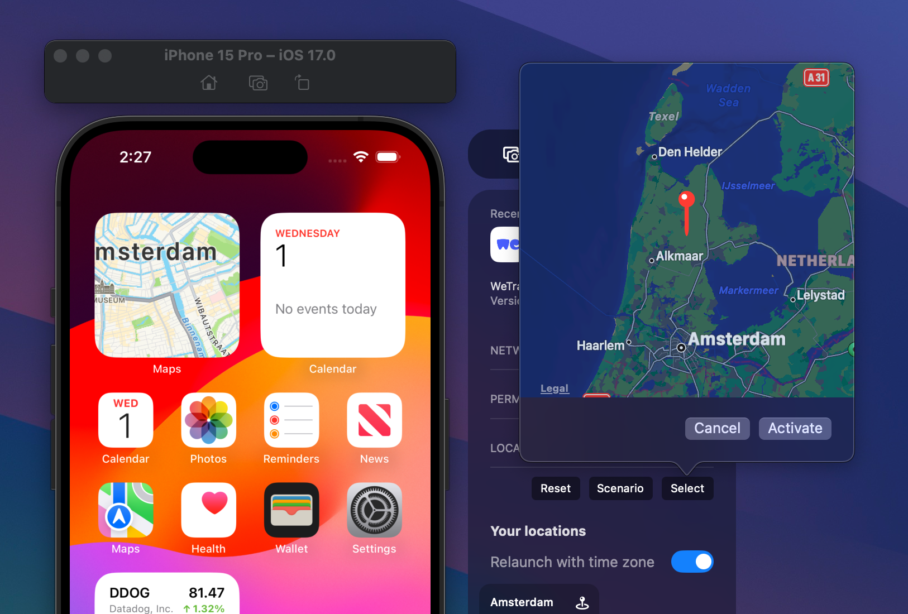
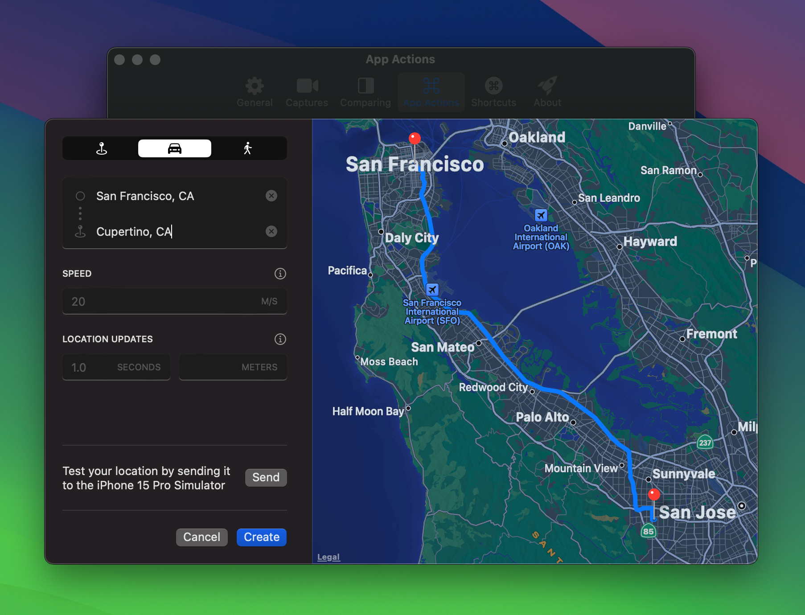

Testing your app at different locations requires you to step in a car and bring your MacBook anywhere. This is time-consuming and not optimized for developing apps quickly.

RocketSim solves this by providing several ways of simulating locations. You can:

- Run specific scenarios:
  
- Select a specific location:

- Or configure often-used locations and routes using App Actions:
  

For more details, I encourage you to read my article [\*\*Location Simulation in Xcode’s Simulator](https://www.avanderlee.com/workflow/location-simulation-xcode-simulator/).\*\*
