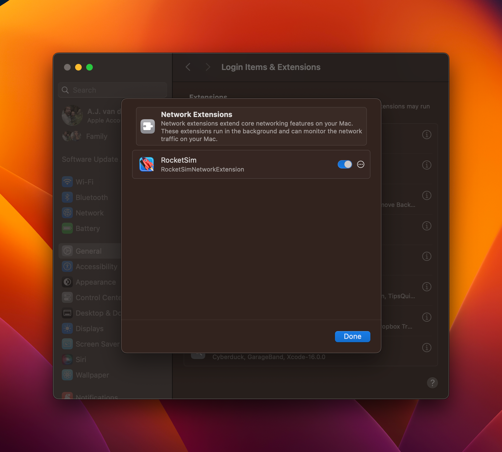

It's essential to test your app in bad networking conditions during app development. Historically, you've had to test this on an actual device using Airplane mode or turn off your Mac's WiFi. Both are not ideal and often slow you down during development.

<Youtube id="xK3iI5TzuA4" title="Network Speed Control & Simulator Airplane Mode" />

RocketSim’s Network Speed Control allows you to test your app for poor connections within the Simulator. The best thing of all: your Mac’s internet connection stays working, so you can still access ChatGPT or Stack Overflow while developing support.

I encourage you to read my article [**Optimizing your app for Network Reachability](https://www.avanderlee.com/swift/optimizing-network-reachability/)** to prepare your app for bad networking conditions using RocketSim.

## FAQ

### How does this feature differ from the Network Link Conditioner?

Apple’s Network Link Conditioner works great, but also affects your Mac’s connectivity. RocketSim only impacts your Simulator’s application so you can still enjoy a lightning fast internet connection while optimizing your app for slow networking conditions.

### Can I see the network profile that is applied for each configuration?

Yes, you can! Just click the little info button next to the Network Speed Control button:

### How do I enable Network Speed Control on macOS Sequoia?

The system settings are a bit more hidden, but you can find them here: *System Settings → General → Login Items & Extensions → Network Extensions.*

Make sure to switch the permissions switch to on and you should be able to get started with Simulator Airplane Mode.

### I turned on the Network Speed Control Airplane Mode, but networking still works?

RocketSim only blocks connections coming from your configured bundle identifier. We’re also optimized for URLSession-based applications. In case you’re still running into issues, we recommend getting in touch via [support@rocketsim.app](mailto:support@rocketsim.app).

Also, make sure to update to 13.0.0 or up since we improved quite a bit!

## **Network Speed Control isn’t working for me, what can I do?**

This is usually caused by missing system permissions.

1. Quit **Xcode**, all **Simulators**, and **RocketSim**, then reopen them.
    
    (This often fixes the issue after Xcode or macOS updates.)
    
2. Open **System Settings → Privacy & Security** and approve any pending **RocketSim** permissions.
3. Open System Settings → Network → Filter and verify whether RocketSim is present & enabled
4. On **macOS 26**, enable the Network Extension:
    - **System Settings → General → Login Items & Extensions**
    - Find **RocketSim**, click **(i)**, and enable **Network Extension**
        
        You may need to approve permissions more than once.
        
5. Still not working? Do a clean reinstall:
    - Delete **RocketSim.app** from Applications
    - Empty the Trash and reinstall RocketSim
6. If it *still* doesn’t work, run `systemextensionsctl list`and email the output to [support@rocketsim.app](https://www.notion.so/RocketSim-Quarterly-Finances-201fe943204d8077945ecd6c92940f86?pvs=21)
