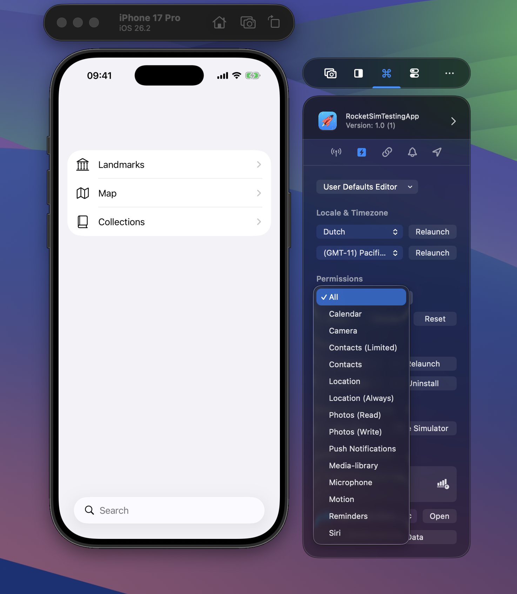

Testing permission flows is one of those things that's surprisingly tedious. You need to verify that your app handles denied permissions gracefully, that the permission dialog shows up at the right time, and that your onboarding flow works after a fresh permission state. RocketSim makes this fast.

## Supported Permissions

RocketSim supports all 15 permission types: Calendar, Camera, Contacts (Limited), Contacts, Location, Location Always, Photos (Read), Photos (Write), Push Notifications, Media Library, Microphone, Motion, Reminders, and Siri. Use **All** for bulk actions across permissions.

## Actions

**Grant** (available to all users) sets the permission without showing a dialog. **Revoke** (Pro) denies the permission. **Reset** (Pro) returns to the "not determined" state so the system dialog appears again on next use.

## Push Notification Reset — Unique to RocketSim

This is the standout feature. When you implement push notification support, you typically show a page explaining why notifications are needed, then the user accepts. To re-test that flow, you'd normally have to uninstall and reinstall the app.

With RocketSim, press Reset for push notifications and test again immediately. This drastically speeds up the testing cycle. It works because RocketSim directly modifies the Simulator's internal BulletinBoard configuration — something `xcrun simctl privacy` doesn't support for push notifications.

## Where to Find It

Available from both the side window (under the permissions picker) and the status bar menu.
