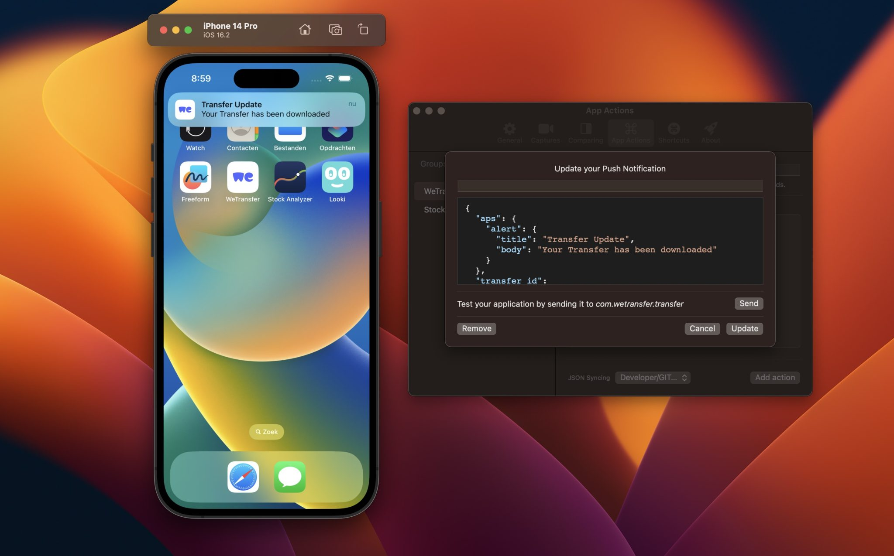
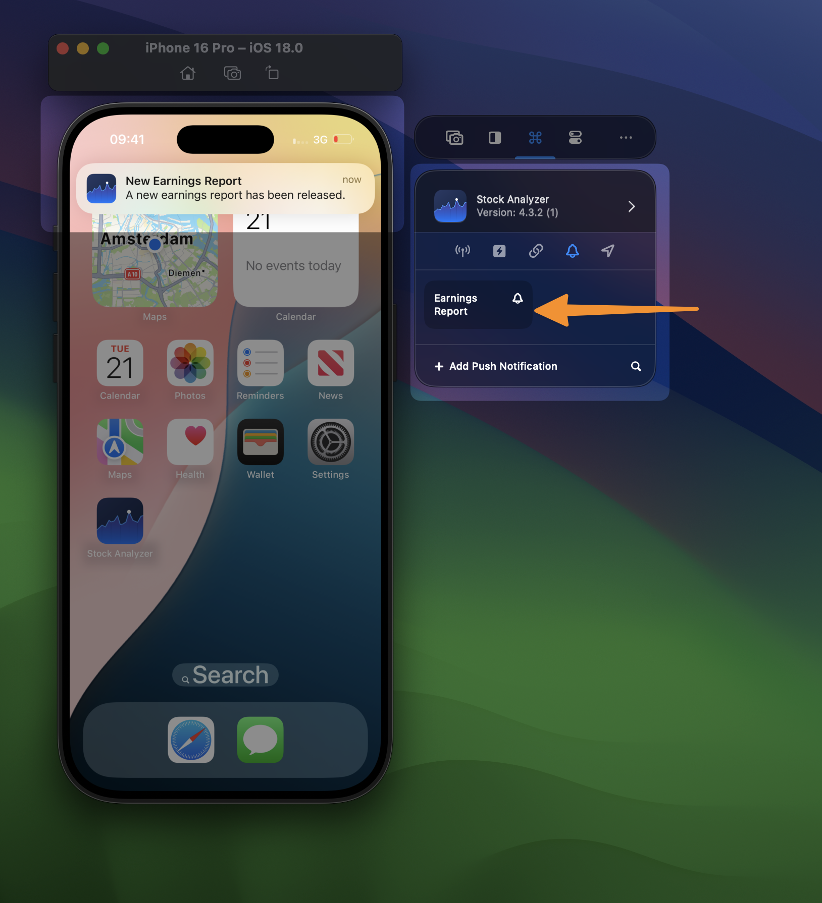

Many developers think you can only test Push Notifications on a real device. The opposite is true and once you know, you’ll be much faster in building support for notifications into your app.

## Create a Push Notification

Push notifications can be added like Deeplinks and Locations into your App Group. You’ll have to store the JSON that comes with your notification:

Within the editor, you can click the **Send** button to test out the notification in the Simulator. Once configured correctly, you can access and test the notification at any time from the side window:

You can read more about this feature in my dedicated article [\*\*Testing push notifications on the iOS simulator](https://www.avanderlee.com/workflow/testing-push-notifications-ios-simulator/).\*\*
