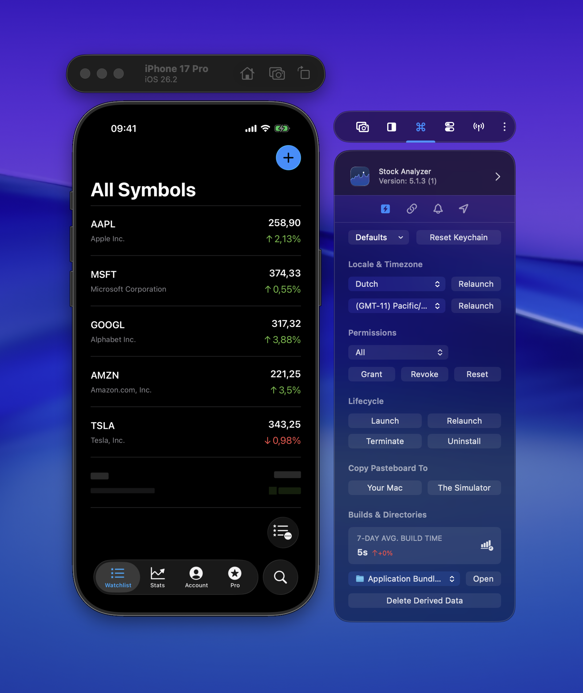
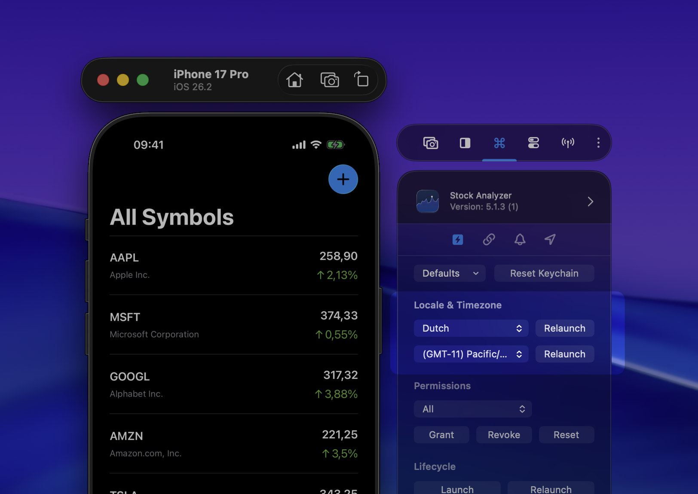
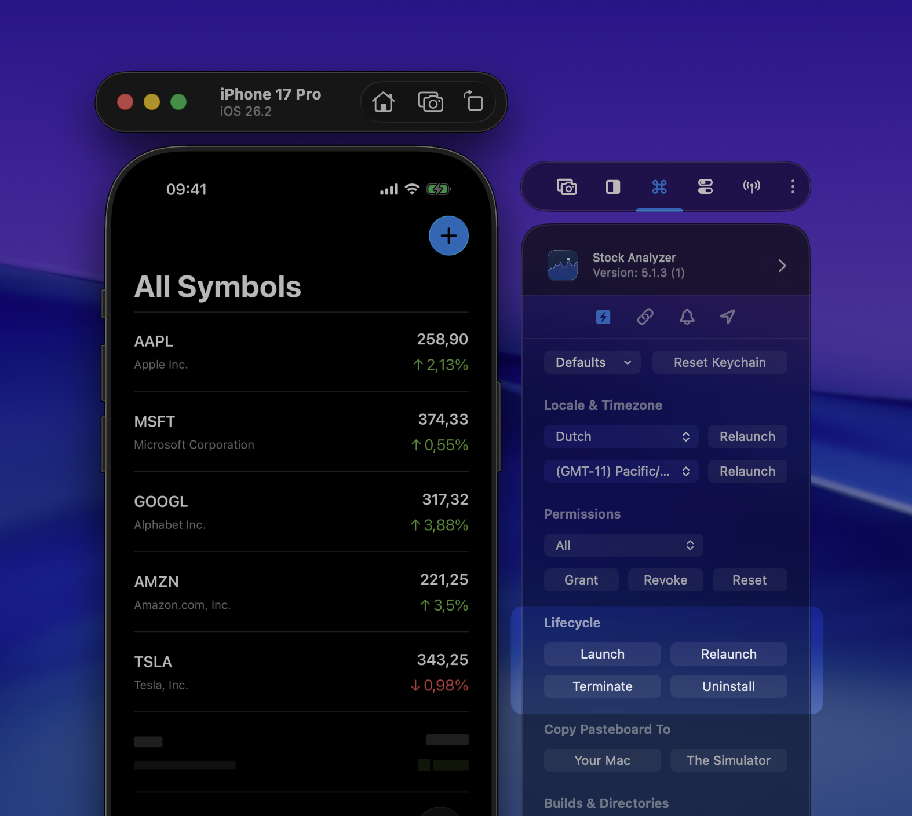

Quick Actions speed up your testing workflow by giving you one-click access to common operations. Instead of navigating through Xcode or Simulator menus, you can perform everything from RocketSim's side window.

## Relaunch with Locale (Pro)

Test your app in any supported locale without restarting the Simulator. Pick a locale from the dropdown and your app relaunches immediately in that language. Great for quickly verifying localization.

For a deeper dive into localization testing, see [Localization testing in Xcode](https://www.avanderlee.com/xcode/localization-testing-in-xcode/).

## Relaunch with Time Zone (Pro)

Similar to locale — pick a timezone and your app relaunches with that timezone active. Useful for testing time-dependent features like scheduling or date formatting.

## Lifecycle Actions

Launch, Relaunch, Terminate, and Uninstall your app. These speak for themselves. No need to switch to the Simulator or Xcode to manage your app's state.

## Copy Pasteboard

Transfer clipboard content between your Mac and the Simulator. Useful when you need to paste test data into your app without manually typing it.

## Delete Derived Data

Deletes derived data only for the selected app. This avoids rebuilding every project you have open in Xcode when you just need a clean build for one target.
