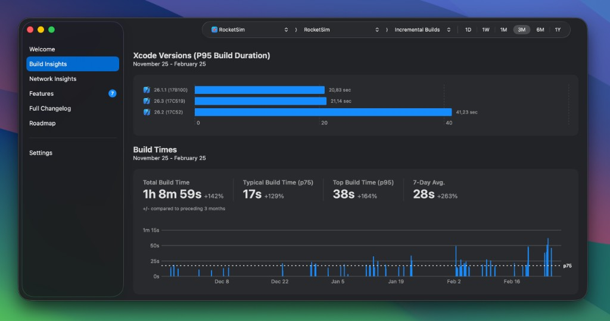
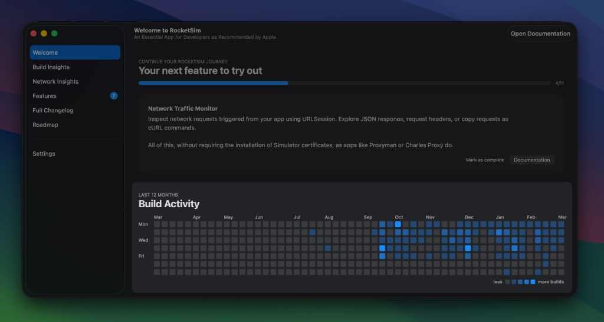

Build Insights tracks every Xcode build you make and shows you trends over time. You'll see how many builds you do per day, how long they take, and whether things are getting faster or slower.

## What gets tracked

RocketSim tracks incremental vs. clean builds — automatically detected. It also captures build duration and scheme information. RocketSim classifies builds by analyzing your DerivedData folder, so no build phase scripts are needed.

## Build Insights view

The main view shows your build statistics over a chosen period — filter by incremental or clean builds and by day, week, month, or year. The screenshot below shows the past three months of incremental builds: builds from different Xcode versions, a typical build time (p75) of 17 seconds, and a 7-day average of 28 seconds.

A GitHub-style contribution grid is also available for the last 12 months. Each cell represents a day, with color intensity based on build count, so you can quickly spot busy periods and quiet weeks.

## Build statistics

You get Total Build Time, Typical Build Time (p75), Top Build Time (p95), and 7-Day Average. Filter by day, week, month, or year. Compare against the previous period to see trends — whether builds are speeding up or slowing down.

## Scheme switching

If you work on multiple schemes, you can filter your insights per scheme. That gives you accurate numbers for each target instead of mixing everything together.

## Welcome view

The RocketSim Welcome view shows your build activity for the last 12 months in a GitHub-style contribution graph. Each cell is a day; color intensity reflects how many builds you did that day. You can quickly see busy periods and quieter weeks at a glance.

For team-wide visibility, check out [Team Build Insights](/docs/features/build-insights/team-build-insights).
