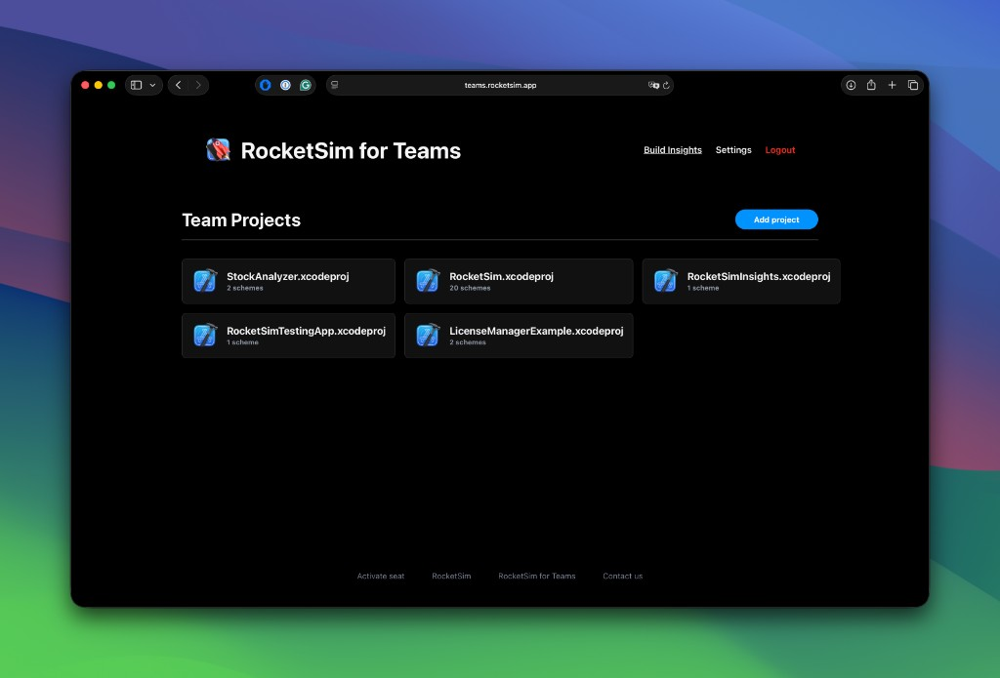
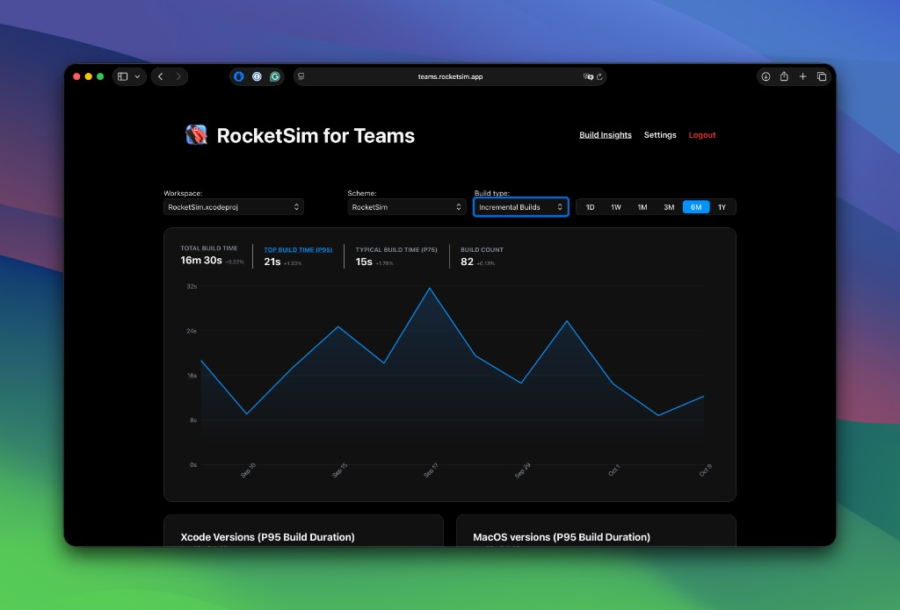
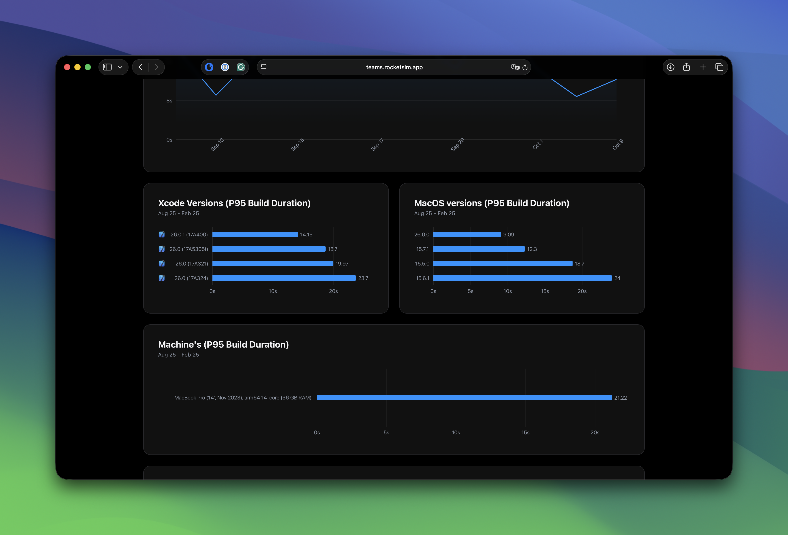

Individual Build Insights show you how your project builds on your machine. Team Build Insights take it further — you get visibility into how the same project builds across your entire team.

## What you can measure

Compare build performance across different machines. Think M1 Pro vs M3 Max, or your laptop vs a colleague's desktop. You can measure the impact of adding SDKs or changing build configurations — reflected in both incremental and clean build data.

All of this without any extra setup or build phase hacks. RocketSim handles the tracking automatically.

## How it works

RocketSim silently syncs build data in the background. It syncs at most once per hour, so it stays out of your way. It captures machine info — chip, cores, memory, model — alongside build metrics.

Team Build Insights requires a Pro subscription with a team license key. Once configured, data flows automatically.

## Online dashboard

Team insights are available at [teams.rocketsim.app](https://teams.rocketsim.app). You get a web-based overview of your team's build performance, so you can compare machines and spot trends without opening RocketSim.

## Team Projects overview

The dashboard starts with a Team Projects overview. You can add multiple Xcode projects; each project can have multiple schemes. Everything is in one place — pick a project and a scheme, and you can analyze build performance across your whole team for that target.

## Build Insights view

Select a project and scheme, then choose build type (incremental or clean) and time range (day, week, month, 3 months, 6 months, year). You get **Total Build Time**, **Typical Build Time (p75)**, **Top Build Time (p95)**, **Build Count**, and a duration graph over the selected period. The screenshot below shows the RocketSim project with incremental builds over the past six months.

## P95 by Xcode, macOS, and machines

The dashboard breaks down P95 build duration by **Xcode version**, **macOS version**, and **machine**. That's where Team Build Insights really pays off: you see how the same project performs on different hardware and different OS/Xcode combinations. In a team setup, multiple machines show up side by side, so you can point to real data when deciding on hardware upgrades or standardizing on a particular Xcode version. As an indie developer you might only see one machine — but the same breakdown applies, and it's useful for tracking the impact of Xcode or macOS updates.

Teams that use Team Build Insights often say the same thing: once you see build data across machines and versions, you stop guessing and start making decisions based on real numbers. Max Godfrey from Tilt put it like this:

> "RocketSim Team Insights finally gives us visibility into our build times beyond just gut feeling. We can actually measure the impact of adding SDKs or improving configurations, seeing results reflected in incremental and clean builds. It's been invaluable for decisions like upgrading hardware—we can point to real data showing how different machines affect build times. The metrics are broken down beautifully, no extra setup or build phase hacks required—it just works quietly in the background. Honestly, it's something we could never have justified building in-house, but it's been a total game-changer."
>
> — Max Godfrey, iOS Developer at Tilt

If you're on a team, a [team license](https://www.rocketsim.app) gives everyone this visibility — no extra setup, no build phase scripts. You get the dashboard, the P95 breakdowns by machine and Xcode, and data that backs up hardware and tooling decisions. Worth checking out if you've ever wondered how your build times compare to the rest of the team.
