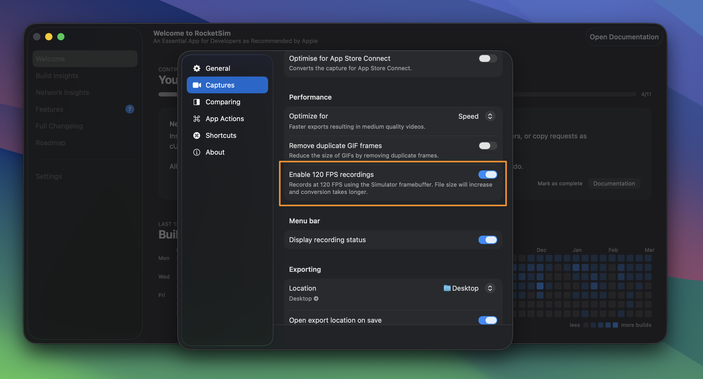

:::note
120 FPS Recordings is available in the latest RocketSim beta. [Join the beta via TestFlight](https://testflight.apple.com/join/PLACEHOLDER) to try it out.
:::

Standard Simulator recordings run at 30 FPS. RocketSim's 120 FPS mode produces much smoother recordings, which makes a real difference for demo videos, presentations, and social media content.

## Enabling 120 FPS

Open **RocketSim Settings → Captures** and enable **120 FPS Recordings**. This is a Pro feature. Once enabled, your recordings will capture at 120 frames per second instead of 30.

## When to use

120 FPS is great for recording smooth scrolling, animations, and transitions. The file size will be larger than 30 FPS recordings, so use the standard mode when file size matters more than smoothness.

Recordings use the HEVC codec at 120 FPS for optimal quality.
