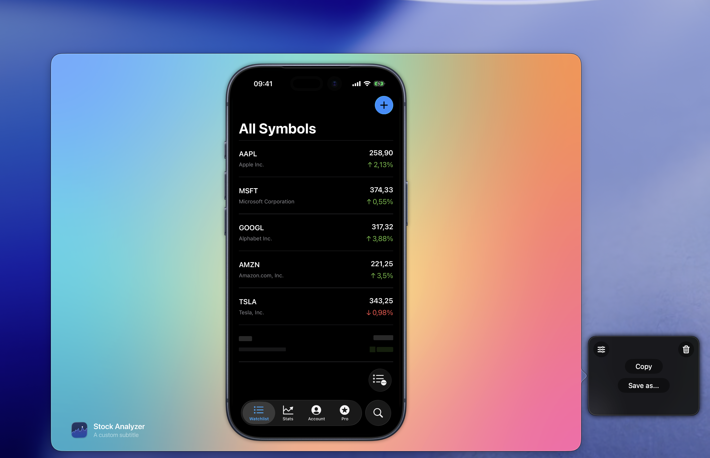

After every screenshot or recording, a floating thumbnail appears in the bottom-right corner of your screen. It's the fastest way to share, save, preview, or continue editing your captures.

## Available actions

Use the thumbnail buttons to **Copy** to clipboard, **Save** (hold Cmd and click for Save As...), open the [Post Editor](/docs/features/capturing/post-editor), or **Delete** (trash icon). For recordings, RocketSim also gives you a trim/editing flow so you can refine the clip before exporting.

## Drag and drop

The real power is drag-and-drop. Drag the thumbnail directly into Slack, GitHub, iMessage, App Store Connect, or any other destination. No need to find the file in Finder first.

## Preview and dismiss

Hover over the thumbnail and press Spacebar for a quick preview. Swipe the thumbnail to dismiss it.

## Continue editing after capture

The floating thumbnail is also the handoff point into RocketSim 15's [Post Editor](/docs/features/capturing/post-editor). That makes it easy to capture first and decide on the final framing, metadata, ratio, or trim afterwards.
