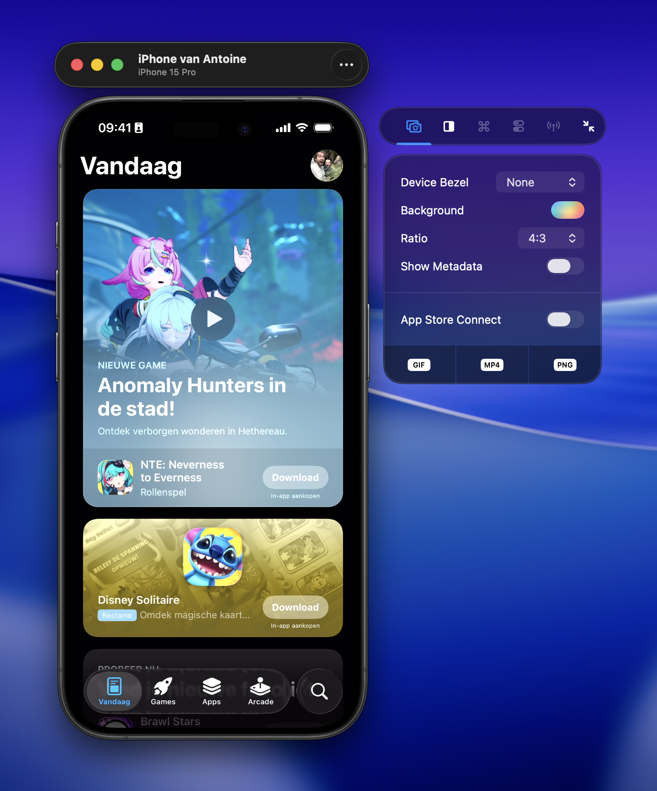
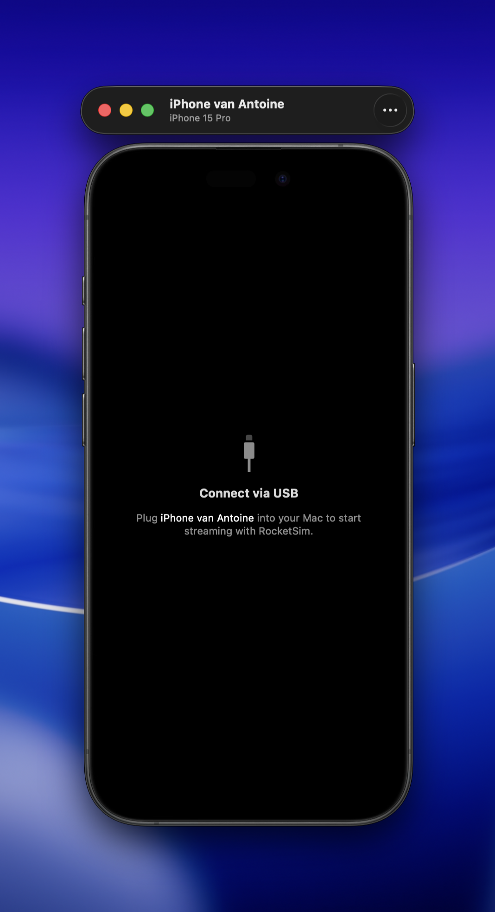
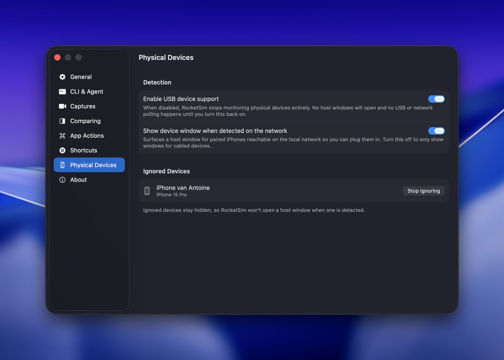
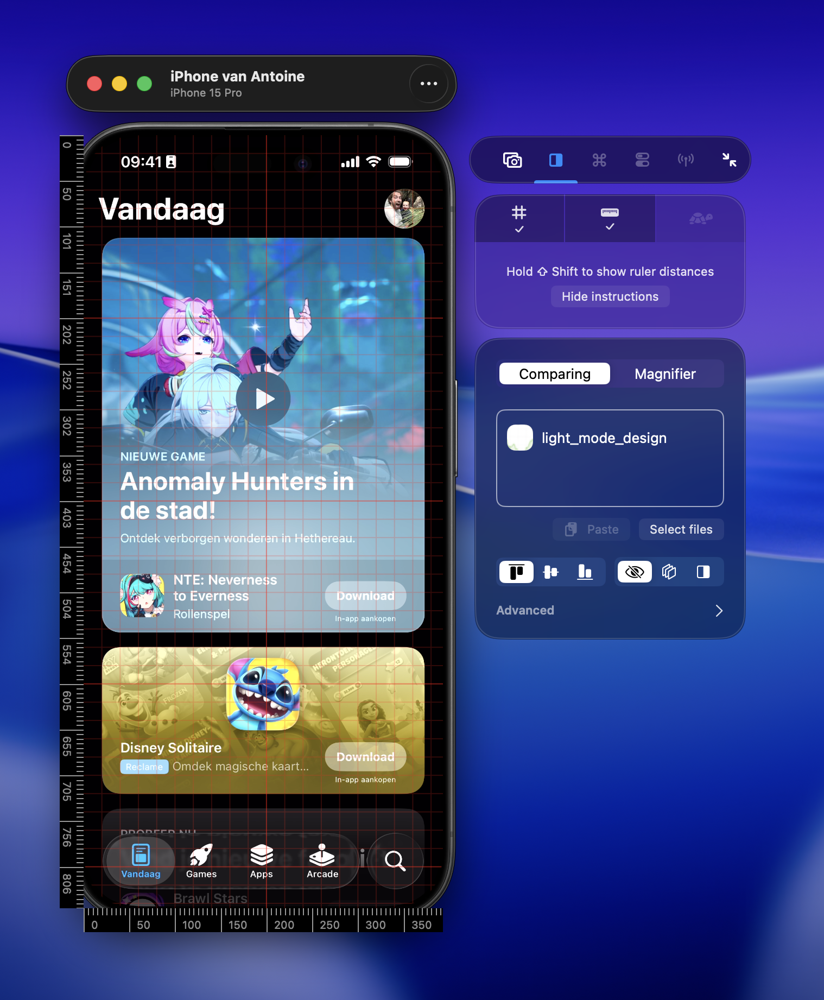

RocketSim 16 adds first-class support for connected physical iOS devices. Plug in a supported iPhone over USB and RocketSim can show a live device preview window next to your Simulator workflows.

Physical device support is useful when you need to validate behavior that is hard to trust in the Simulator, such as real-device rendering, performance, camera behavior, or device-specific capture output.

## What you can do

With a connected physical device, you can:

- Capture screenshots from the device stream
- Capture GIFs
- Record videos with device audio
- Use comparing overlays, grids, and rulers on the physical device window

RocketSim opens a live preview window for the device and attaches the side window automatically, so these workflows feel similar to working with the Simulator.

Not every RocketSim feature supports physical devices yet. Simulator app actions, Network Monitoring, and environment toggles are still Simulator-only for now. We're hoping to add support for more physical-device workflows in the future.

## Getting started

1. Connect your iPhone to your Mac using USB
2. Open RocketSim
3. Wait for the physical device preview window to appear
4. Use the RocketSim side window next to the device window, just like you would with the Simulator

If the device does not appear, open **RocketSim → Settings → Physical Devices** and make sure USB device support is enabled.

## Discovery and streaming

RocketSim can discover devices that are paired with your Mac for development, including devices that are reachable on the local network. Network discovery helps RocketSim explain that a known device exists, but live streaming requires a USB cable.

Connect the device with a cable to start the live preview and use physical-device screenshots, recordings, and design comparison tools.

## Screenshots and recordings

Physical-device screenshots and recordings use the device stream directly. That means you can capture what is happening on a real device while still using RocketSim's capture workflow.

Recordings include audio from the device stream. If a device disconnects while recording, RocketSim treats the disconnect as a clean stop and keeps the footage captured up to that point.

For capture options that also apply to Simulator recordings, see [Creating Recordings](/docs/features/capturing/recordings) and [Taking Screenshots](/docs/features/capturing/screenshots).

### Status bar time (9:41)

Screenshots and recordings from a connected physical iPhone often show **9:41** in the status bar. That comes from **iOS itself** when the system captures the device screen — it is not a RocketSim feature you can turn on or off.

There is no known setting on iPhone (or in RocketSim) to disable this for physical-device captures. RocketSim cannot override it.

The Simulator is different: you can customize the status bar there, including the 9:41 preset. See [Status Bar Appearance](/docs/features/capturing/statusbar-appearance).

If your app shows its own time and it does not match what appears in captures, add a debug or screenshot flag so in-app clocks also display **9:41** when you record marketing assets. The same behavior shows up in other Mac tools that mirror a device, such as QuickTime screen recording.

## Design comparison

The physical device window supports RocketSim's design comparison tools. You can use grids and rulers on top of the device preview to check spacing, alignment, and layout behavior on real hardware.

See [Grids & Rulers](/docs/features/design-comparison/grids-and-rulers) for the shared comparison workflow.

## Device windows

Physical device windows use dark preview chrome and full-bleed device bezels so the device content stays visually focused. RocketSim also restores window positions and supports resizing from the visible device corners.

USB discovery and reconnect handling are designed to recover from common attach, detach, and rediscovery transitions. If a device is temporarily unavailable, reconnect it over USB and let RocketSim refresh the preview.

## Managing devices

Use [Physical Devices settings](/docs/settings/physical-devices) to control whether RocketSim monitors USB devices, whether network-detected devices are shown, and which devices should be ignored.

If there is a device you do not want RocketSim to manage, use the device window menu to ignore it. You can stop ignoring it later from Settings.
