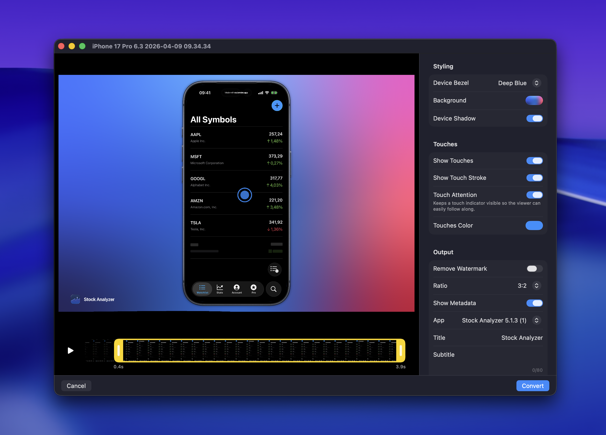
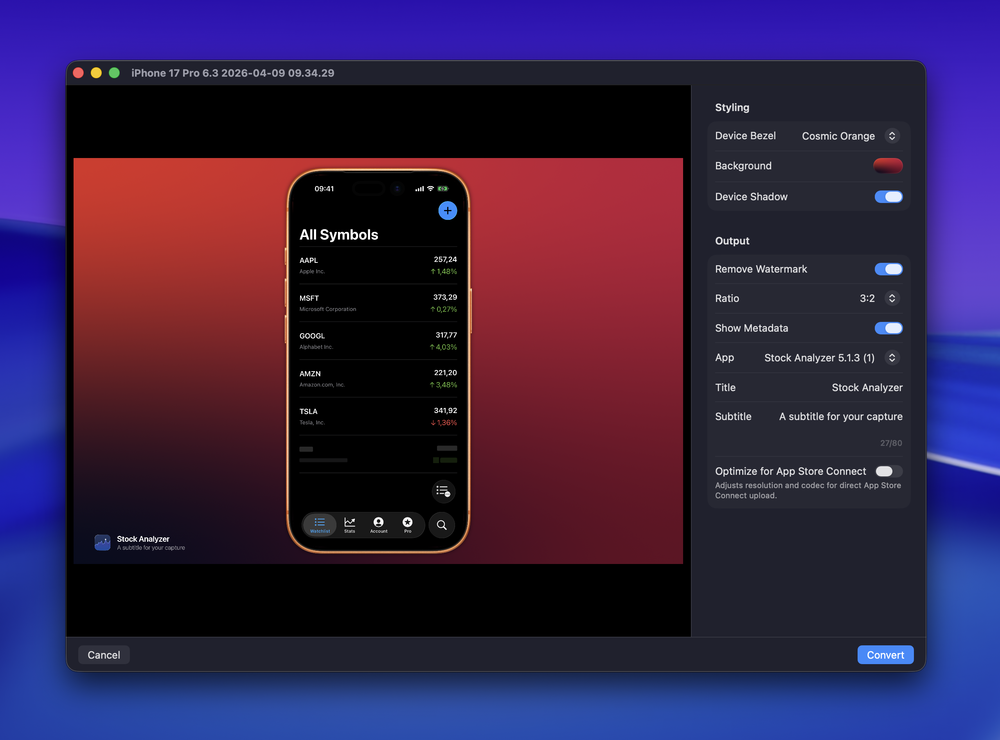

RocketSim 15 adds a built-in post editor for both screenshots and recordings. After you capture media, you can open it in the editor and make final tweaks before you export the finished result.

RocketSim refers to this window as the **Capture Editor** in the app, but you can think of it as the post-editing step for your captures.

## Opening the editor

The quickest way to open the post editor is from the [floating thumbnail](/docs/features/capturing/floating-thumbnail) that appears after you create a screenshot or recording.

For recordings, you can also jump into the editor right after capture when you want to trim the timeline and adjust the final look before exporting.

## What you can edit

The editor lets you refine the final output without retaking the capture:

- **Device bezel**: switch between no bezel, the Simulator bezel, or a real device bezel when available
- **Background**: keep it transparent, use a solid color, or choose a gradient background
- **Frame styling**: adjust frame color and device shadow when using framed output
- **Touches**: keep or refine touch visualization for recordings
- **Output ratio**: export in ratios like **1:1** or **16:9** for social media, presentations, or demos
- **Metadata**: show the app icon, title, and subtitle on the exported result
- **Watermark**: remove the watermark when your plan supports it

## Editing recordings

When the source is a video, the editor adds a timeline so you can trim the beginning and end of the recording before exporting. You can also preview the clip while you work and use the same styling controls that are available for screenshots.

RocketSim 15 also supports keyboard-friendly previewing, so playback controls fit nicely into a fast editing workflow.

## Editing screenshots

Screenshots use the same editing flow, minus the video timeline. This is especially useful when you want to change the final framing, background, or metadata after the capture has already been taken.

That means you can take one clean base screenshot and then create multiple polished variants for presentations, changelogs, social posts, or App Store assets.

## Exporting the final result

When you're happy with the preview, click **Convert** to generate the final edited asset.

If you're preparing App Store assets, combine the post editor with [App Store Connect optimization](/docs/features/capturing/app-store-connect-optimization) to keep your visuals polished while still matching the required output format.
