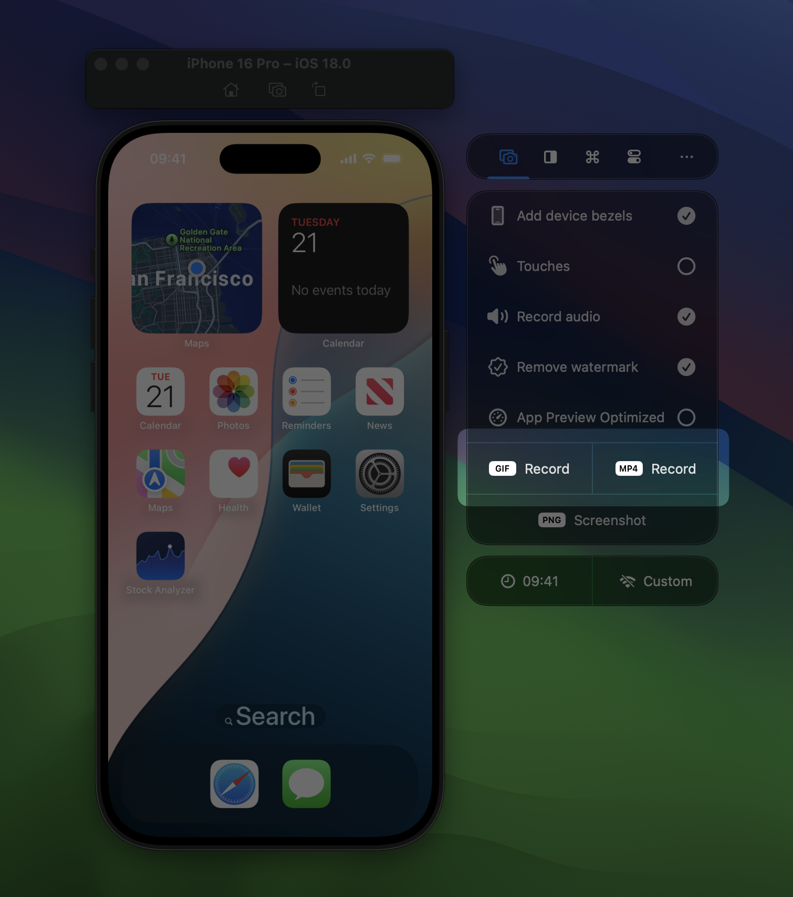
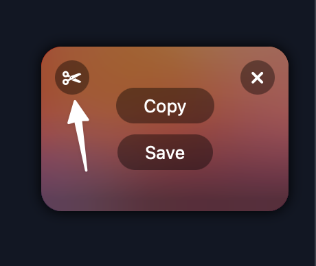
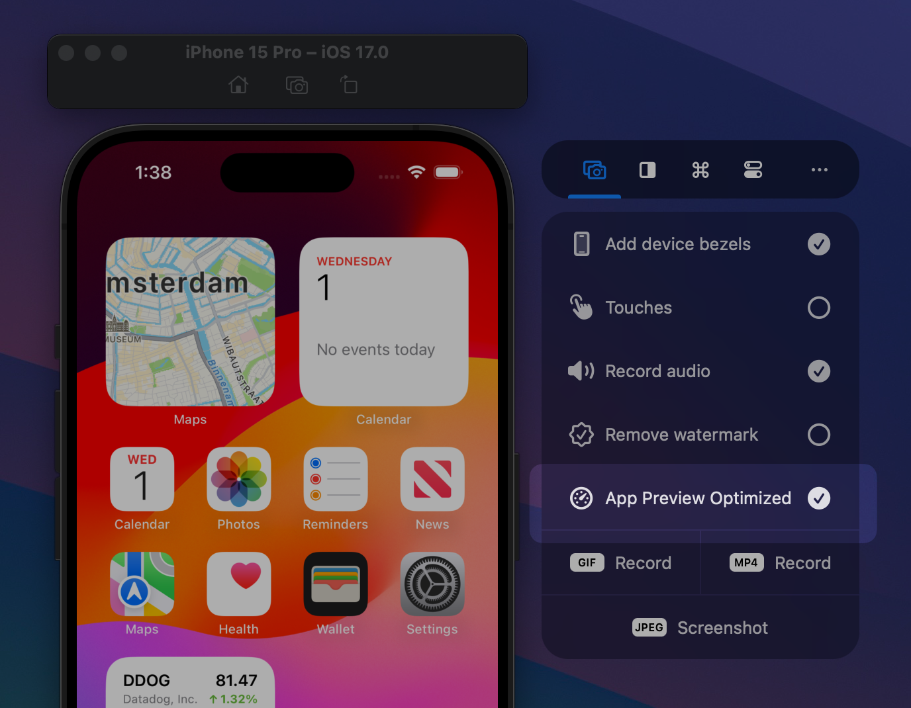
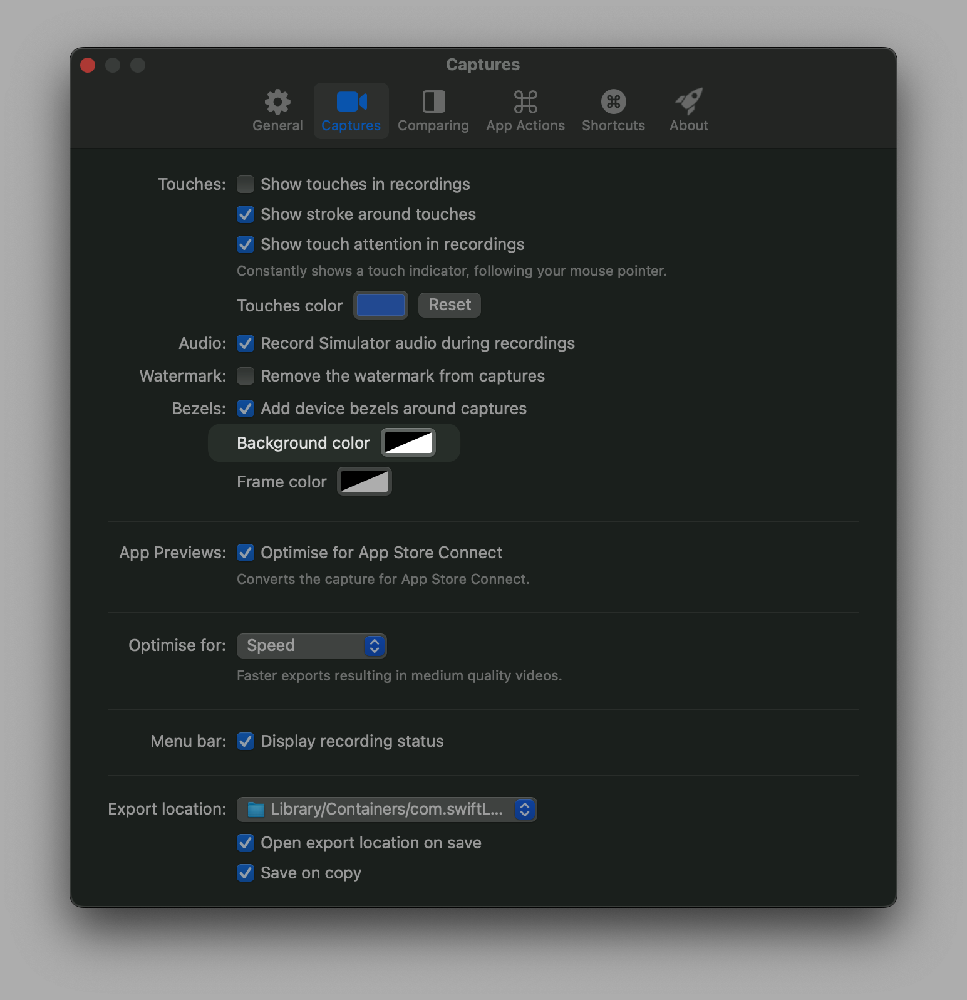

RocketSim allows you to create both screenshots and videos of the Xcode Simulator. Unlike the default Simulator recording capabilities, RocketSim allows you to record touches, audio, and bezels. Using the App Store Connect Preview mode, you’re recordings will be ready to upload directly into App Store Connect.

## Creating a recording

1. Open the Simulator
2. Select the Captures tab inside the RocketSim Side Window
3. Click **GIF Record** or **MP4 Record** and perform your interactions

1. Press **Stop** when you’re done
2. Drag or copy your recording using the floating thumbnail in the bottom right corner
    
    
    

## Showing touches

RocketSim recordings can show touches in different ways. Using the **Settings**, you can select the type of touches you prefer:

You can change the color of the touch points or enable an extra stroke around the touch circles.

### Showing touch attention in recordings

A feature you should definitely try out is touch attention. Apple uses this technique in their demo videos as it allows viewers to follow your mouse while navigating through your app. In other words, by enabling this mode, your video will constantly show a touch indicator.

## Trimming a recording

Once you’re done with your recording, you can decide to trim the result by tapping the scissors button on the floating thumbnail:

This will open up a trim editor. Adjust your video and click on **Trim** once you’re done.

## App Preview Optimized

:::tip
Your App Preview recordings have to conform to [Apple’s App Preview Specifications](https://developer.apple.com/help/app-store-connect/reference/app-preview-specifications/). It can be challenging to convert your videos into the right format, but RocketSim does this all automatically for you.
:::

App Preview videos can make your App Store Product page look a little more interactive. It can be a great way to demonstrate your application’s features.

Simply enable App Preview Optimized, create your recording, and drag it directly into App Store Connect.

## Troubleshooting

### I enabled audio, but it’s not working?

Make sure you don’t have any audio routing enabled. Doing so will confuse RocketSim and make it impossible to record your audio.

### Does RocketSim install a custom audio driver for audio recording?

No, there’s nothing you need to install for audio recording to work. 🎉

### Why are my iPad recordings upside-down?

RocketSim cannot detect landscape-left or landscape-right and defaults to one landscape rotation. The fix is simple: rotate your Simulator twice and restart the recording.

### Can I create transparent recordings?

Yes, you can! Make sure to change the background color inside **Settings** to transparent:

Note that App Preview videos can’t have alpha layers, so you need to disable **App Preview Optimized mode.** Lastly, apps like QuickTime make it look like your video’s background isn’t transparent. It’s best to copy your video into an app like keynote to verify transparency:

