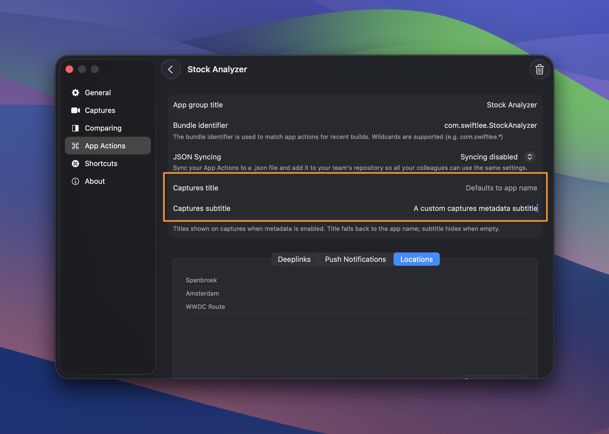

RocketSim lets you create GIF and MP4 recordings of the Xcode Simulator from the **Captures** tab in the side window. You can record with touches, audio, device bezels, and transparent or custom backgrounds. If you need recordings optimized for App Store Connect, see [App Store Connect Optimization](/docs/features/capturing/app-store-connect-optimization).

For final tweaks after recording, RocketSim 15 also includes a built-in [Post Editor](/docs/features/capturing/post-editor) that lets you trim and restyle the exported result.

## Creating a recording

1. Open the Simulator
2. Select the **Captures** tab inside the RocketSim Side Window
3. Click **GIF Record** or **MP4 Record** and perform your interactions

4. Press **Stop** when you're done
5. A floating thumbnail appears in the bottom right corner — drag or copy your recording from there

Most capture options (bezels, touches, audio, ratio, background) can be set before you start, either in the **Captures** tab or in **Settings → Captures**.

## Capture options

Configure how your recordings look and what they include. All of the following are available in the **Captures** tab of the side window; many are also in **Settings → Captures**.

### Device bezels

You can add a device frame around the Simulator content. Choose **None**, **Simulator Bezel** (the standard Simulator chrome), or a **real device bezel** (device-specific frames for supported iPhone and iPad models). Use the **Device Bezel** picker in the Captures tab. Your choice is stored per device, so each Simulator type can have its own preference.

### Touches and touch attention

- **Show touches in recordings** — Renders touch indicators so viewers can see taps and gestures. You can also enable **Show stroke around touches** in Settings → Captures.
- **Touch Attention Mode** — Keeps a single touch indicator on screen that follows your mouse pointer the whole time, useful for directing attention in demos.
- **Touches color** — Pick a custom color for the touch indicators in the Captures tab or in Settings → Captures (plain colors only).

See also [Touch indicators](/docs/features/capturing/touch-indicators) for more on how touches appear in captures.

### Device shadow

When you use device bezels, you can turn on **Device shadow** to add a shadow behind the device frame. The toggle is in the Captures tab and in Settings → Captures under Bezels.

### Audio

- **Simulator audio** — Records only the audio that comes out of the Simulator (your app's sound). It does not record system audio or other apps. Enable it with **Record audio** in the Captures tab or **Record Simulator audio during recordings** in Settings → Captures. No custom drivers are required.
- **Microphone** — Optionally record from any system microphone (e.g. for voiceover). In the Captures tab, use the **Microphone** picker and choose **None** or a device. You can use Simulator audio and a microphone at the same time.

### Output ratio

You can lock the output to a specific aspect ratio. Supported values: **Auto** (no fixed ratio), **1:1**, **5:4**, **4:3**, **3:2**, and **16:9**. Set it with the **Ratio** picker in the Captures tab.

### Background and frame

- **Background** — Choose what appears behind the device: **plain colors**, **gradient (mesh) backgrounds**, or **transparent**. Use the **Background** control in the Captures tab or **Captures background** in Settings → Captures. Transparent is the default.
- **Device Frame color** — When using bezels, you can set the frame color separately (plain colors) in Settings → Captures under Bezels.

## Audio recording

Enable **Record audio** (Simulator audio) or pick a **Microphone** (or both) in the Captures tab or in **Settings → Captures**. RocketSim does not install custom audio drivers; it works with the system as-is. For details on what each option records, see [Capture options > Audio](#audio) above.

## Editing and trimming a recording

Once your recording is done, open it from the [floating thumbnail](/docs/features/capturing/floating-thumbnail) to continue in the [Post Editor](/docs/features/capturing/post-editor). There you can trim the beginning and end of the recording, preview playback, and refine the final styling before converting the result.

## Transparent recordings

You can create recordings with a transparent background. Set the background to transparent in the **Background** picker (see [Capture options > Background and frame](#background-and-frame)) in the Captures tab or in **Settings → Captures**:

App Store Connect videos cannot have alpha layers, so disable **App Preview Optimized** mode if you need transparency. Apps like QuickTime may not show transparency correctly — copy your video into Keynote to verify:

## Capture Metadata

Recordings can show the app icon, app title, and an optional subtitle on the background. That helps viewers see which app they're watching in demos and App Store previews.

RocketSim takes this metadata from your most recent build: it reads the app icon and display name from the running Simulator app, so you don't have to configure anything for the basics.

### Using a custom metadata title or subtitle

To override the app name or add a custom subtitle (e.g. a version or tagline), configure them in the App Group settings for that app. RocketSim will use those values on the recording background instead of the default app name. You can also fine-tune the metadata contents later in the [Post Editor](/docs/features/capturing/post-editor).

For more on creating and managing App Groups, see [Configuring App Actions](/docs/getting-started/configuring-app-actions).

## Troubleshooting

### I enabled audio, but it's not working?

Make sure you don't have any audio routing enabled. Doing so can prevent RocketSim from recording Simulator audio or your microphone correctly.

### Does RocketSim install a custom audio driver for audio recording?

No, there's nothing you need to install for audio recording to work.

### Why are my iPad recordings upside-down?

RocketSim cannot detect landscape-left or landscape-right and defaults to one landscape rotation. The fix is simple: rotate your Simulator twice and restart the recording.
