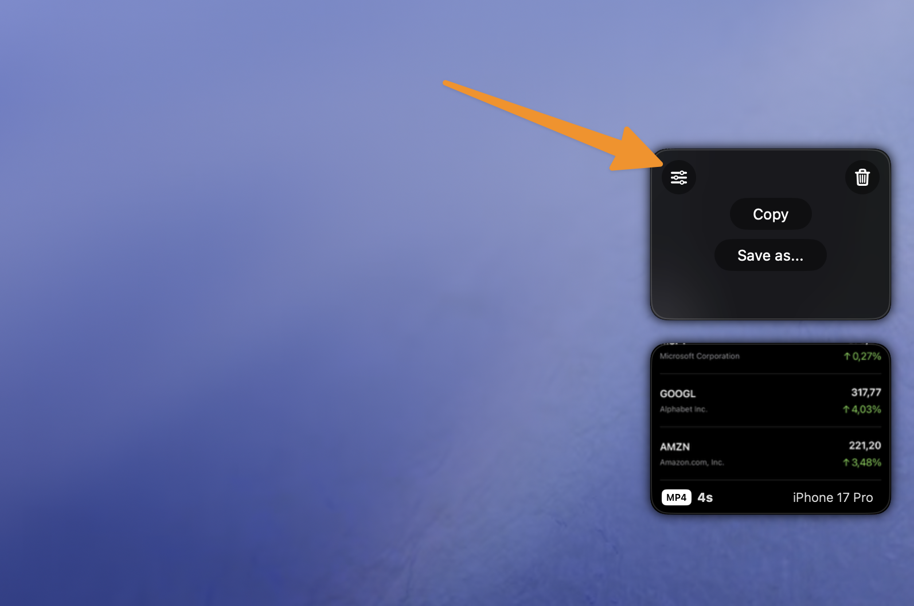
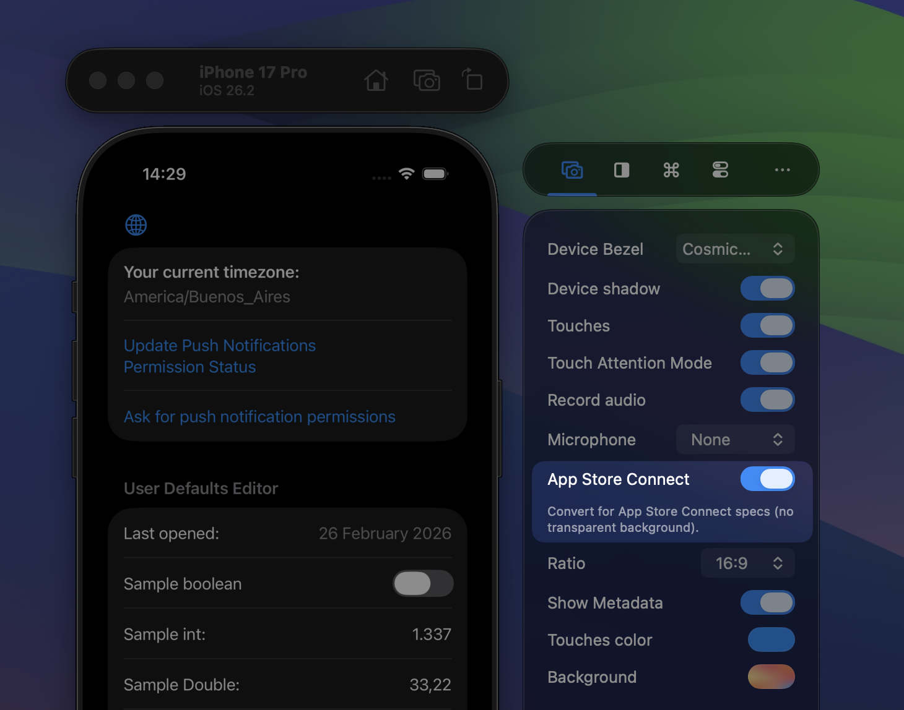
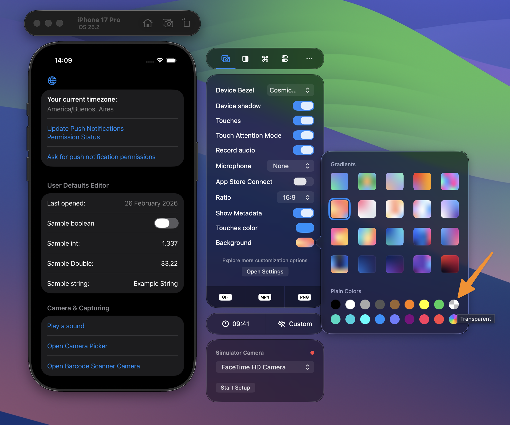
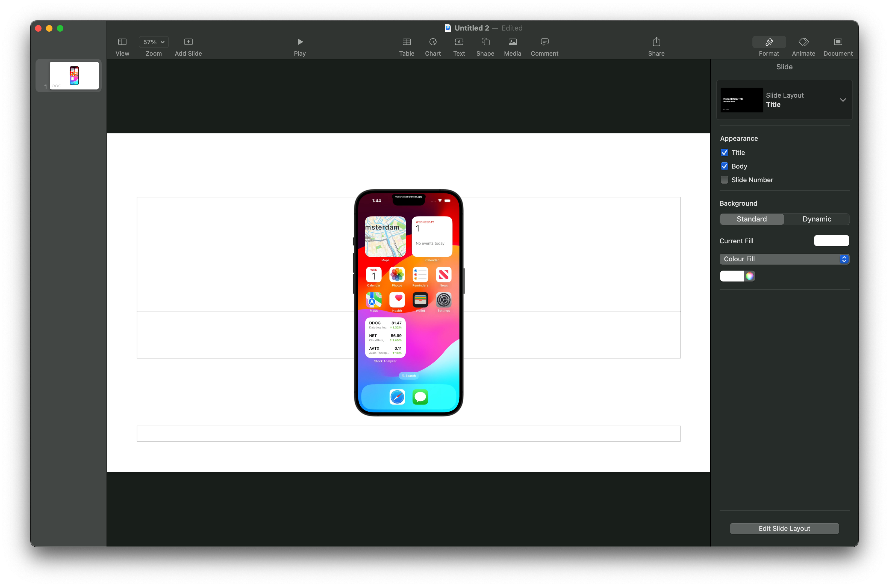

RocketSim lets you create screenshots from the **Captures** tab in the side window, with bezels, custom backgrounds (including transparent), and optional [App Store Connect optimization](/docs/docs/features/capturing/app-store-connect-optimization). When optimized, you can drag screenshots directly into App Store Connect.

## Creating a screenshot

1. Open the Simulator
2. Select the **Captures** tab inside the RocketSim Side Window
3. Click **JPEG Screenshot** (when App Preview Optimized is enabled) or **PNG Screenshot**

4. Drag or copy your screenshot from the [floating thumbnail](/docs/docs/features/capturing/floating-thumbnail) in the bottom right corner:

You can set the background, bezels, and other capture options before taking a screenshot in the **Captures** tab or in **Settings → Captures**. For the full list of options, see [Creating Recordings](/docs/docs/features/capturing/recordings) — the same options apply to screenshots.

## App Preview Optimized

:::tip
Your App Store Connect screenshots must conform to [Apple’s Screenshot Specifications](https://developer.apple.com/help/app-store-connect/reference/screenshot-specifications/). It can be challenging to convert your screenshots into the right format, but RocketSim does this all automatically for you.
:::

Updating your app’s screenshots can be time-consuming, but RocketSim simplifies this process by converting each capture into the right specifications.

Simply enable App Preview Optimized, create your screenshot, and drag it directly into App Store Connect.

## Troubleshooting

### Why is JPEG the default?

It’s not! You probably just enabled App Preview Optimized. App Store Connect does not accept alpha channels in images, which is why we decided to go for JPEG.

### How is App Preview Optimized, optimized?

We’re converting your images to match the image specifications and resolutions as required by App Store Connect.

### How is this better than doing CMD-S on a simulator?

The Simulator has a few flaws in their screenshots:

- Landscape is not always well supported
- You’ll always get an image without device bezels
- The resolution output is not accepted by App Store Connect

Other than that, you’ll see similar results with RocketSim.

### Why are my iPad screenshots upside-down?

RocketSim cannot detect landscape-left or landscape-right and defaults to one landscape rotation. The fix is simple: rotate your Simulator twice and create another screenshot.

### Can I create transparent screenshots?

Yes, you can! Set the background to transparent in the **Captures** tab or in **Settings → Captures**:

Note that App Store Connect images can’t have alpha layers, so you need to disable **App Preview Optimized mode.** Lastly, apps like Preview make it look like your screenshot’s background isn’t transparent. It’s best to copy your image into an app like Keynote to verify transparency:

