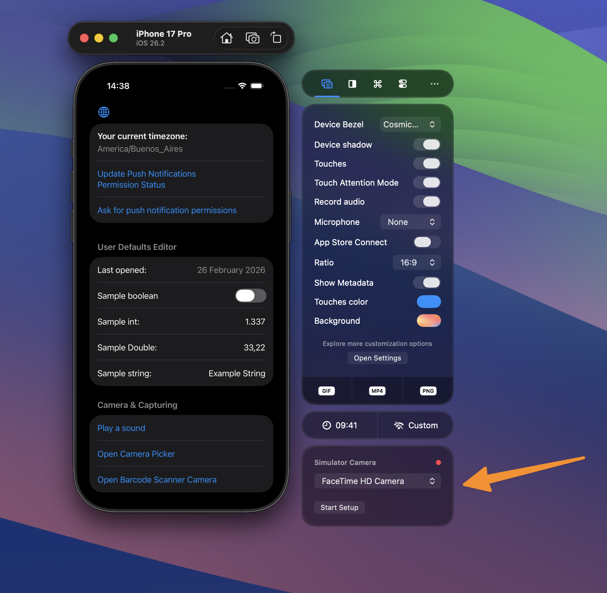

A top requested feature has always been Simulator camera support. Constantly having to test the camera on an actual device can be a pain and it’s annoying to run into dead ends on the Simulator for apps that come with camera features.

We hear you and we’re excited to share the early beta of RocketSim Camera Simulation.

Check out these demo’s:

- [Glimpsify open-source project demo video](https://x.com/twannl/status/1935303234714792340)
- [Vision object detection demo video](https://x.com/twannl/status/1926715711277203563)
- [Continuity camera demo video](https://x.com/twannl/status/1928014373210972202)

## How do I access this feature?

Camera simulation is available from the Capture side window tab:

1. Open the Simulator
2. Navigate to the bottom of the capturing side window
3. Setup camera authorization via RocketSim’s Side Window

   

   The side window in its state after camera permissions have been granted.

4. Integrate RocketSim Connect following the in-app instructions. For more info, see [Setting up RocketSim Connect](/docs/getting-started/setting-up-rocketsim-connect)
5. Start running your app

## Troubleshooting

Since this is an early version of Camera Simulation, I’m pretty sure you’ll find edge cases that aren’t supported. I’d love to fix these! Could you please:

1. Add `-com.swiftlee.rocketsim.debug 1` as a launch argument to your app
2. Relaunch your app and try to get Camera Simulation to work
   _Note: functionality won’t change, but you’ll have more debug logs_
3. Copy the logs from your console
4. Start a new email to me via Settings → About → Report a bug
5. Add the copied logs
6. Hit send!
7. (Optional) if you can share me an Xcode project with your camera code in it, I’ll be able to fix your specific case much quicker

That email will give me all I need to dive deeper into your specific issue

## Known issues

- The macOS camera resolution is used as the resolution of returned sample buffers. This means your captures won’t have the resolution of the original (Simulator) device camera.
- Video’s do not contain any audio
- Switching camera from `front` to `back` does nothing since there’s only one camera available
- `DataScannerViewController` does not yet work (see [this issue](https://github.com/AvdLee/RocketSimApp/issues/769))
