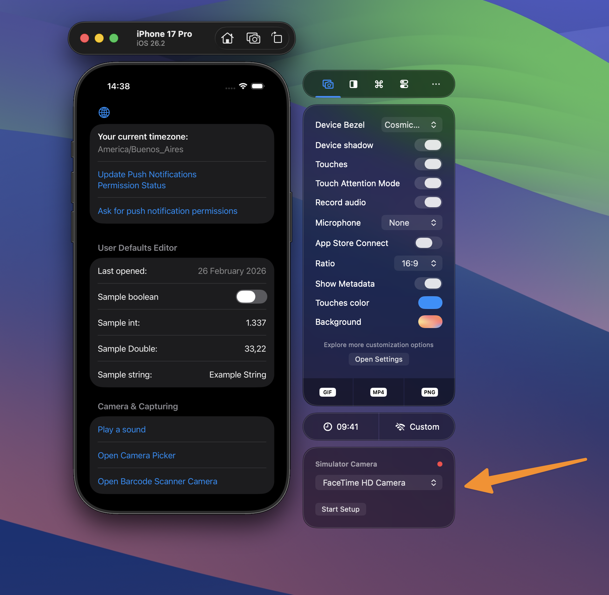

Testing camera flows on the iOS Simulator usually ends with a fallback screen, since the Simulator does not expose a real camera like a physical device. That makes every QR scanner, document scanner, profile photo picker, or video capture flow slower to validate.

## Does the iOS Simulator have a camera?

No, Xcode's Simulator does not come with camera support: apps won't discover any capture device. RocketSim adds this missing camera by streaming your Mac's camera, a photo, or a video into your running Simulator app through RocketSim Connect. You can keep your normal Simulator workflow and test camera-dependent UI without repeatedly deploying to an iPhone.

You can find an overview of what's possible on the [Simulator Camera feature page](/features/simulator-camera/).

Check out these demos:

- [Glimpsify open-source project demo video](https://x.com/twannl/status/1935303234714792340)
- [Vision object detection demo video](https://x.com/twannl/status/1926715711277203563)
- [Continuity camera demo video](https://x.com/twannl/status/1928014373210972202)

## How do I access this feature?

Camera simulation is available from the Capture side window tab:

1. Open the Simulator
2. Navigate to the bottom of the capturing side window
3. Set up camera authorization via RocketSim's side window

   

   The side window in its state after camera permissions have been granted.

4. Integrate RocketSim Connect following the in-app instructions. For more info, see [Setting up RocketSim Connect](/docs/getting-started/setting-up-rocketsim-connect)
5. Start running your app

## Testing no-camera fallbacks

If you want your app to behave as if no Simulator Camera stream is available, select **None** in the Simulator Camera picker. RocketSim Connect remains active, but video camera discovery behaves as unavailable so apps can show their own fallback UI.

You can also enable this behavior from your app’s launch environment:

```bash
ROCKETSIM_SIMULATOR_CAMERA=none
```

For CI or scripted runs, `ROCKETSIM_DISABLE_SIMULATOR_CAMERA=1` is supported as an equivalent explicit opt-out.

## Troubleshooting

If you run into an edge case that isn’t supported yet, I’d love to fix it. Could you please:

1. Add `-com.swiftlee.rocketsim.debug 1` as a launch argument to your app
2. Relaunch your app and try to get Camera Simulation to work
   _Note: functionality won’t change, but you’ll have more debug logs_
3. Copy the logs from your console
4. Start a new email to me via Settings → About → Report a bug
5. Add the copied logs
6. Hit send!
7. (Optional) if you can share me an Xcode project with your camera code in it, I’ll be able to fix your specific case much quicker

That email will give me all I need to dive deeper into your specific issue.

## Known issues

- The macOS camera resolution is used as the resolution of returned sample buffers. This means your captures won’t have the resolution of the original (Simulator) device camera.
- Videos do not contain any audio
- Switching camera from `front` to `back` does nothing since there’s only one camera available
- `DataScannerViewController` does not yet work (see [this issue](https://github.com/AvdLee/RocketSimApp/issues/769))
