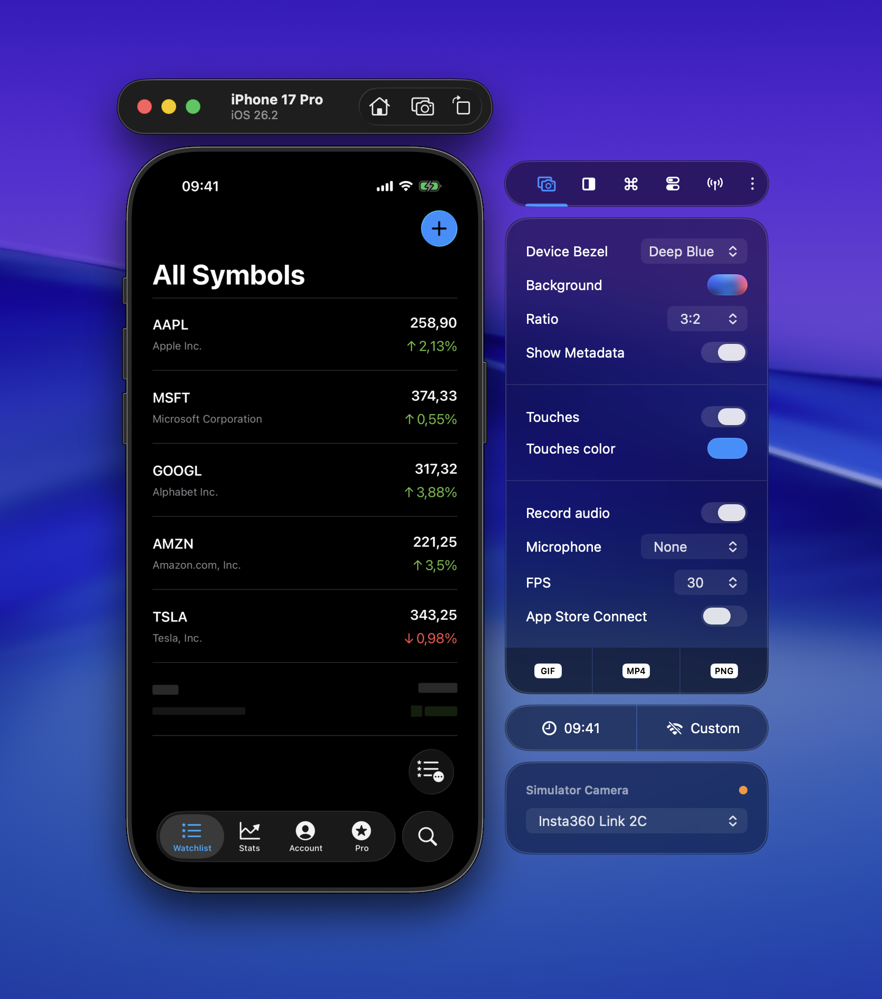

Touch indicators make your recordings more engaging by showing exactly where you're interacting with the app. This is especially useful for demo videos and presentations where viewers need to follow your actions.

## Enabling touch indicators

You can configure touch indicators in the **Captures** tab of the side window or in **Settings → Captures**. Enable **Show touches in recordings** (a circle appears on each tap), **Show stroke around touches** (adds a border around touch circles), and set **Touches color** to any plain color. The same options are used for both screenshots and recordings.

## Touch attention mode

This is the standout feature. When enabled, a constant touch indicator follows your mouse pointer throughout the entire recording. Apple uses this same technique in their demo videos — it helps viewers keep track of where the action is happening.

Touch indicators work in both GIF and MP4 recordings. For the full set of capture options (bezels, ratio, background, and more), see [Creating Recordings](/docs/features/capturing/recordings).

## Pinch and rotate gestures

RocketSim 15.1 also shows both touch points when you record Simulator pinch and rotate gestures. Hold `Option` to simulate the second finger, then hold `Shift` as well when you want to move the gesture center before pinching.

That means your exported videos no longer just show a single interaction point for zoom gestures, making demos of maps, charts, and media viewers much easier to follow.
