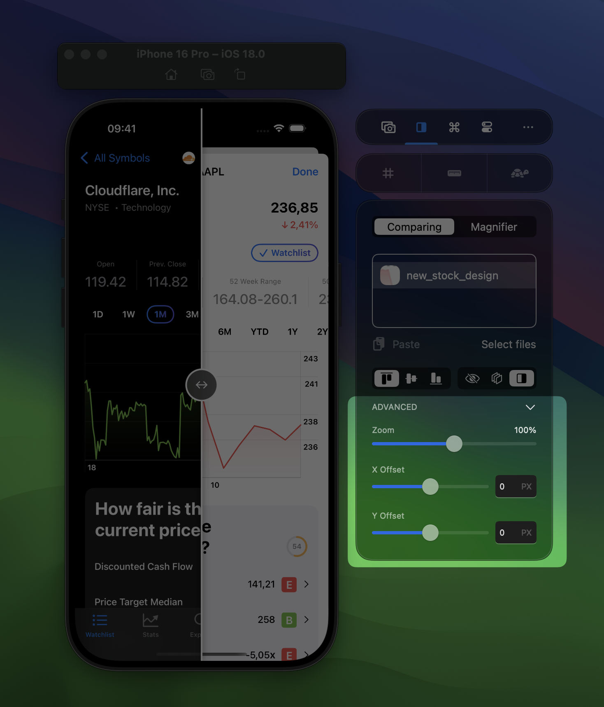

RocketSim’s unique design comparison tool allows you to display a design on top of the Simulator in the correct dimensions. It’s the best way to verify you’ve implemented designs pixel-perfectly.

## Comparing a design on top of the Simulator

1. Open the Simulator
2. Select the comparing tab
3. Upload the design you want to compare. In this example, I’ve selected the Stock Detail page for my app:

1. Use the alignment tools and different modes to compare the image with your design implementation. In the above example, you can see that I’m comparing the dark mode design (right side) with the light mode real application (left side).

## Adjusting the image position

Toggle the advanced section to adjust zoom level, x- and y-position:

