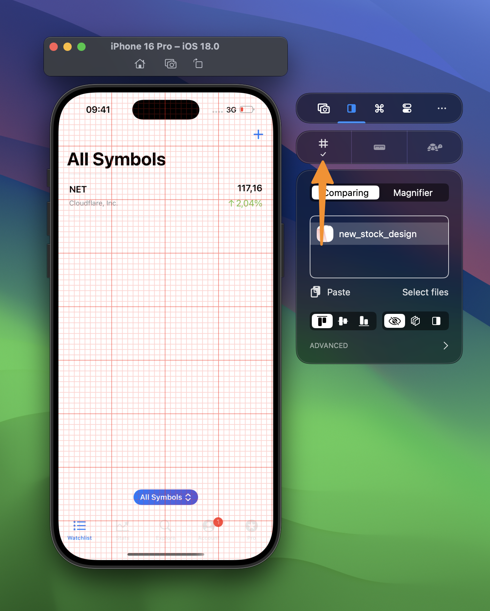

Aligning elements based on grids and rulers allows you to create a balanced design. 

## Showing the Grid

1. Open the Simulator
2. Select the comparing tab
3. Click on the Grid button:

## Showing Rulers

1. Open the Simulator
2. Select the comparing tab
3. Click on the Rulers button
4. Hover over the horizontal or vertical ruler and left-mouse click to store a ruler:

## Showing the distance between rulers

By tapping `⇧ Shift` while your rulers are visible, you’ll be able to see the distance between Rulers and the edges:

## Deleting a ruler

You can delete a ruler by dragging it outside of the Simulator’s view or by right-clicking the ruler bar:

## Adjusting the grid size, color, and Ruler settings

From within the Settings page, you can adjust the size of the grid, as well as the colors of both grid and rulers:

