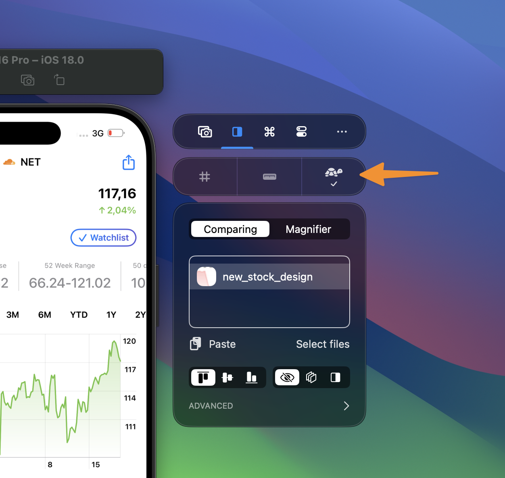

**Slow Animations** makes an iOS Simulator transition slowly enough to inspect timing, movement, and visual details. It is particularly useful for finding unexpected jumps or comparing an implementation with a design.

<!-- prettier-ignore -->
<video src="/blog/xcode-device-hub-simulator-features/comparing-simulator-actions.mp4" aria-label="Toggling Slow Animations and other Simulator actions from RocketSim's Comparing tab beside Xcode Device Hub." controls autoplay muted loop playsinline preload="metadata" style="width: 100%; border-radius: 0.75rem;"></video>

## Enable Slow Animations

1. Focus the Simulator you want to control.
2. Open RocketSim's **Comparing** tab.
3. Enable **Slow Animations** and choose the speed multiplier you want to inspect.

The control works with Simulator.app and Xcode 27 Device Hub. It remains available in Device Hub's expanded mode because it does not require a screen-relative overlay.

## Use a keyboard shortcut

Open **RocketSim → Settings → Shortcuts → Simulator** and record a shortcut for **Toggle slow animations**. The shortcut is global, so you can use it while your app or Device Hub is frontmost.

RocketSim leaves the action unassigned by default to avoid taking over an existing key combination. See [Shortcuts](/docs/settings/shortcuts/) for conflict behavior and the complete Simulator action group.

## Simulator-only support

Slow Animations only supports Simulators. The action is unavailable when a physical device is focused.

For other controls missing from Xcode 27, including Shake, appearance switching, and memory warnings, read [Simulator Actions](/docs/features/app-actions/simulator-actions/). The [Device Hub Support guide](/docs/features/capturing/device-hub-support/) covers window modes and the complete integration.
