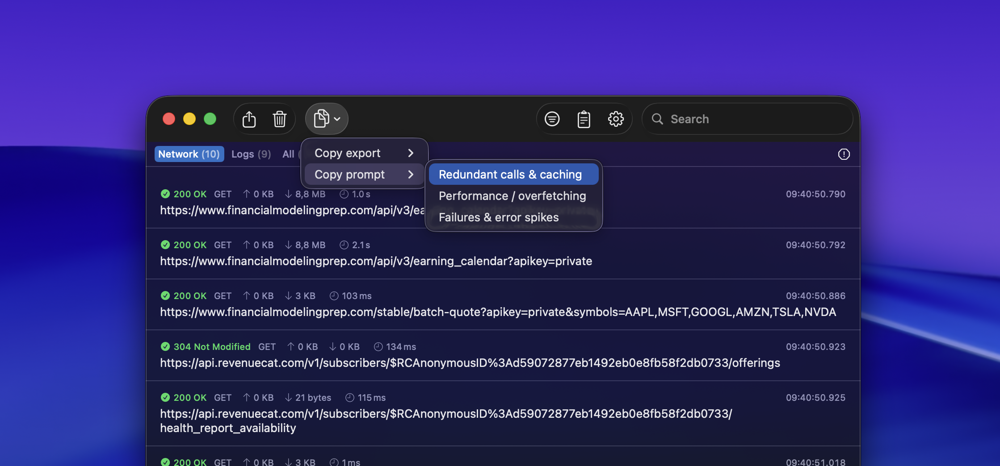

RocketSim can turn captured network traffic into a format that is much easier to share with AI coding assistants. Instead of pasting raw requests one by one, you can export a filtered request set as a compact summary or generate a built-in prompt tailored to the problem you want to investigate.

## Where to find it

Open either [Network Traffic Monitoring](/docs/features/networking/network-traffic-monitoring) or [Networking Insights](/docs/features/networking/networking-insights), then use the toolbar's copy menu.

From there, RocketSim gives you two paths:

- **Copy export** for a compact, redacted summary of the selected request set
- **Copy prompt** for a ready-made AI prompt based on the currently filtered requests

## Copy export options

`Copy export` creates a minimal representation of the filtered traffic so it stays readable and token-efficient when pasted into an AI tool.

You can export:

- **Minimal (redacted)** for a compact request summary
- **Minimal + JSON schema (if any)** when you also want a lightweight schema summary of JSON responses

RocketSim intentionally keeps the export lean so you can focus on debugging patterns instead of scrolling through full payload dumps.

## Built-in prompt templates

`Copy prompt` creates a more guided prompt for common network-debugging tasks. RocketSim currently includes:

- **Redundant calls & caching** to detect duplicate requests, deduplication opportunities, and missing cache strategy
- **Performance / overfetching** to spot slow endpoints, oversized payloads, and opportunities to trim fields
- **Failures & error spikes** to focus on non-2xx responses and likely causes such as authentication, validation, rate limits, or backend issues

Because the prompt is built from the current filters, you can narrow the analysis first by app or time range and then copy a much more focused prompt.

## Copy Summary for individual requests

When you're inspecting a single request, the context menu also includes **Copy Summary**. This is useful when you want to share one request with a teammate or paste one request into an AI chat without including the entire session.

Sensitive values such as API keys and bearer tokens are automatically redacted, making it safer to share request summaries.

## Suggested workflows

### Debug a spike in failures

1. Open **Networking Insights**
2. Filter to the affected app and time range
3. Inspect the failure cluster
4. Use **Copy prompt → Failures & error spikes**
5. Paste the result into your AI assistant and compare the suggestions with the failing endpoints in RocketSim

### Find duplicate or wasteful calls

1. Open **Networking Insights** or **Network Traffic Monitoring**
2. Filter to the feature or screen you're working on
3. Use **Copy prompt → Redundant calls & caching**
4. Review the AI suggestions for repeated calls, cache hints, and batching opportunities

### Share a single request safely

1. Right-click the request
2. Choose **Copy Summary**
3. Paste the redacted output into GitHub, Slack, or your AI assistant

This gives you the useful debugging context without exposing raw secrets.
