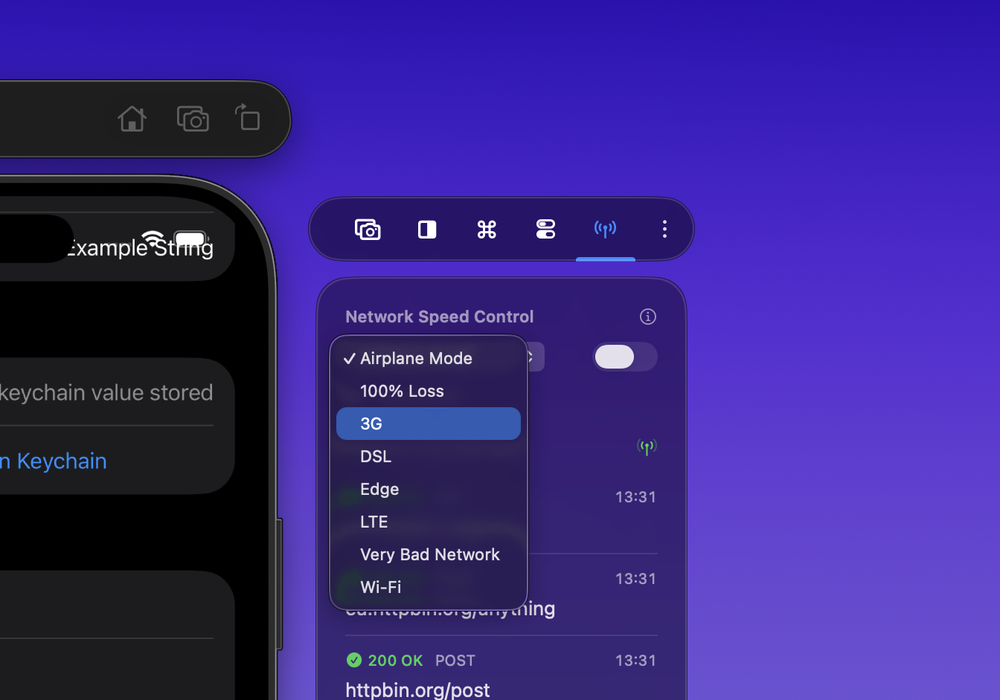
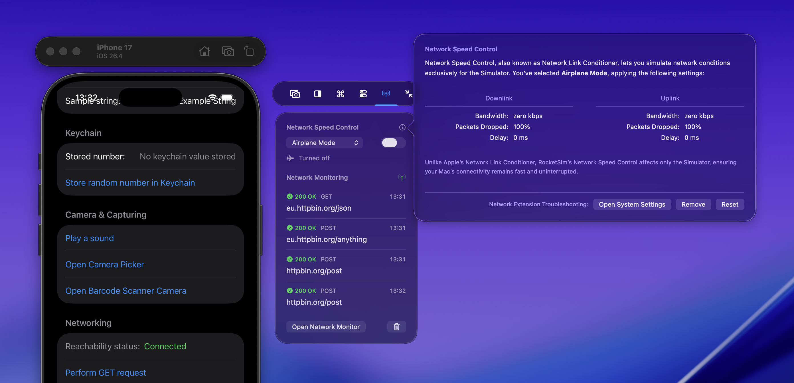
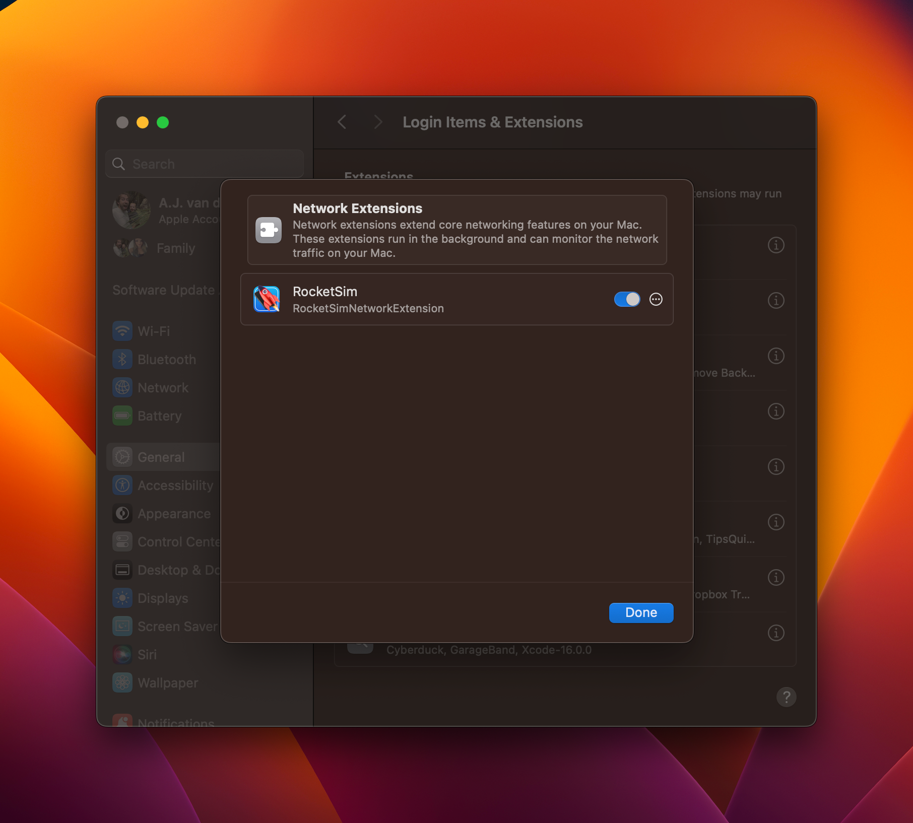

It's essential to test your app in bad networking conditions during app development. Historically, you've had to test this on an actual device using Airplane mode or turn off your Mac's WiFi. Both are not ideal and often slow you down during development.

## How to use

Open the side window and select the **Networking** tab with the antenna icon. Use **Network Speed Control** to choose a profile — for example 3G, Edge, 100% packet loss, or **Simulator Airplane Mode** — then enable it for your Simulator app. Your Mac stays online; only the Simulator's network is affected.



To see this in action, you can watch our Network Monitoring demo on YouTube:

<Youtube
  id="xK3iI5TzuA4"
  title="Network Speed Control & Simulator Airplane Mode"
/>

RocketSim’s Network Speed Control allows you to test your app for poor connections within the Simulator. The best thing of all: your Mac’s internet connection stays working, so you can still access ChatGPT or Stack Overflow while developing your app.

I encourage you to read my article [**Optimizing your app for Network Reachability**](https://www.avanderlee.com/swift/optimizing-network-reachability/) to prepare your app for bad networking conditions using RocketSim. For inspecting requests while testing, see [Network Traffic Monitoring](/docs/features/networking/network-traffic-monitoring). Network Speed Control is part of RocketSim's [networking tools for the iOS Simulator](/features/networking/).

## Turn off the network for the Simulator only

You don't have to turn off your Mac's WiFi to test your app offline. Select **Simulator Airplane Mode** to block all connections for your app, or use **100% packet loss** to simulate a connection that looks alive but never delivers data. Both profiles only affect the Simulator app you configured, so your Mac stays online.

This is the quickest way to test offline mode, empty states, and error handling. You switch profiles from the side window while your app keeps running, so you can immediately see how your app responds.

## Control network conditions from the CLI

RocketSim 16.3 lets scripts and AI coding agents enable the same profiles through the version-matched `rocketsim` CLI:

```bash
rocketsim network set 3g
rocketsim network status
rocketsim network off
```

Available profiles are `airplane`, `100-loss`, `3g`, `edge`, `lte`, `wifi`, `dsl`, and `very-bad`.

By default, `network set` targets the apps in RocketSim's Recent Builds list. Pass one or more bundle identifiers when you need explicit targets:

```bash
rocketsim network set 100-loss \
  --bundle-id com.example.store \
  --bundle-id com.example.store.widgets
```

CLI network control requires RocketSim Pro and the same enabled Network Extension as the side-window control. See [RocketSim CLI](/docs/features/agentic-development/rocketsim-cli/) for the full agent workflow.

RocketSim 16.4.2 prevents network commands from waiting indefinitely when the extension is unavailable. A `network_extension_not_ready` response includes a reason:

- `needs_user_approval`: open RocketSim's Networking window and approve the Network Extension. macOS requires this user action.
- `timed_out`: the bounded backend operation did not finish. Retry once before checking the extension in System Settings.

Always run `rocketsim network off` when the test is complete.

## FAQ

### How does this feature differ from the Network Link Conditioner?

Apple’s Network Link Conditioner works great, but also affects your Mac’s connectivity. RocketSim only impacts your Simulator’s application so you can still enjoy a lightning fast internet connection while optimizing your app for slow networking conditions.

### Can I see the network profile that is applied for each configuration?

Yes, you can! Just click the little info button next to the Network Speed Control button:



### How do I enable Network Speed Control on macOS Sequoia?

The system settings are a bit more hidden, but you can find them here: _System Settings → General → Login Items & Extensions → Network Extensions._



Make sure to switch the permissions switch to on and you should be able to get started with Simulator Airplane Mode.

### I turned on the Network Speed Control Airplane Mode, but networking still works?

RocketSim only blocks connections coming from your configured bundle identifier. We’re also optimized for URLSession-based applications. In case you’re still running into issues, we recommend getting in touch via [support@rocketsim.app](mailto:support@rocketsim.app).

Also, make sure to update to 13.0.0 or up since we improved quite a bit!

### What if Network Speed Control isn't working?

This is usually caused by missing system permissions.

1. Quit **Xcode**, all **Simulators**, and **RocketSim**, then reopen them.

   (This often fixes the issue after Xcode or macOS updates.)

2. Open **System Settings → Privacy & Security** and approve any pending **RocketSim** permissions.
3. Open System Settings → Network → Filter and verify whether RocketSim is present & enabled
4. On **macOS Sequoia (15) and later**, enable the Network Extension:
   - **System Settings → General → Login Items & Extensions**
   - Find **RocketSim**, click **(i)**, and enable **Network Extension**
     You may need to approve permissions more than once.
5. Still not working? Do a clean reinstall:
   - Delete **RocketSim.app** from Applications
   - Empty the Trash and reinstall RocketSim
6. If it *still* doesn’t work, run `systemextensionsctl list` and email the output to [support@rocketsim.app](mailto:support@rocketsim.app)
