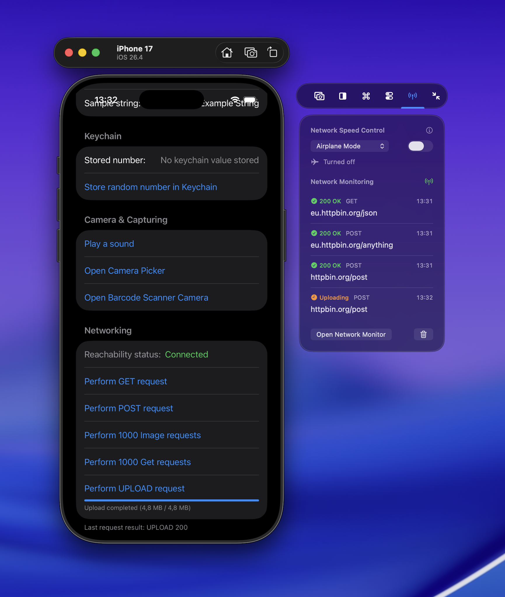
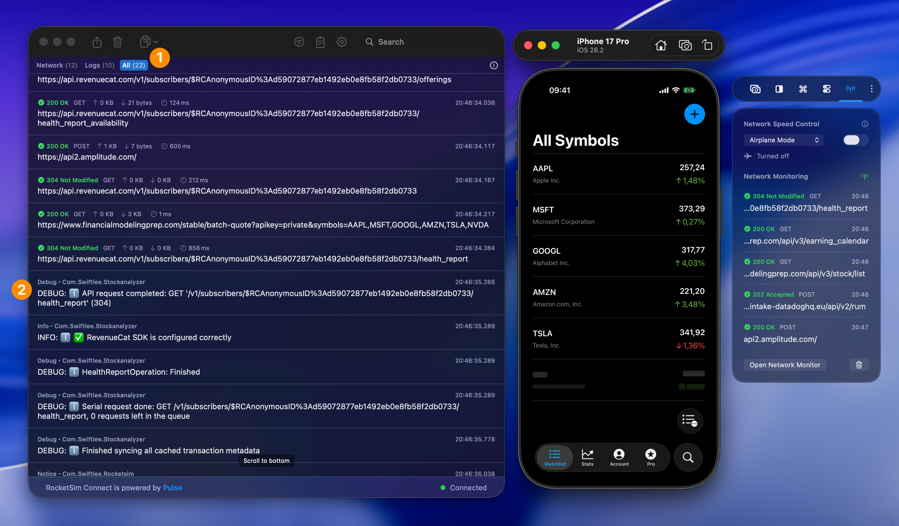

Powered by RocketSim Connect, you can monitor outgoing URLSession requests from your iOS Simulator app without setting up a proxy, installing custom certificates, or switching away from the Simulator.

::::tip[Debug networking without leaving the Simulator]
See live requests, responses, logs, and shareable cURL commands in one place, without proxy certificates or switching tools.
::::

Open the side window and select the **Networking** tab with the antenna icon. RocketSim shows the latest requests inline, and you can click **Open Network Monitor** to inspect the full real-time console.

Being able to see which requests are running is essential for a fast development workflow. It helps you catch duplicate calls, failed responses, oversized payloads, and unexpected request order while the app is still running in the Simulator.

RocketSim also shows connected app logs in the Network Monitor, so you can line up request traffic with what your app is printing at the same moment.

## Requests and logs together

Use the toolbar tabs to focus on **Requests**, **Logs**, or an **All** view that combines both into a single timeline (**1**). This makes it much easier to answer questions like "which request fired right before this warning?" without jumping between separate tools. When **All** is selected, logs appear mixed in with requests so you can better understand when requests fired by looking at the surrounding log output (**2**).

## Insights overview

You can see aggregated insights across all your apps for the selected time period: failure spikes, duplicate calls, caching opportunities, slowest endpoints, and most requested URLs. Use the toolbar to switch to a specific application or a different time range.

For the historical view and the built-in prompt export workflow for AI-assisted debugging, see [Networking Insights](/docs/features/networking/networking-insights) and [Exporting Network Requests as Prompts](/docs/features/networking/network-request-prompts).

## Inspecting a request

Open the detail view for any request by double-clicking it in the list or using the toolbar button. From there you can inspect the **summary**, **request and response** body, **headers**, and **metrics**. You can also copy the request as a **cURL** command to reproduce the same call from the terminal or share it with your team.

## Copying summaries and prompts

RocketSim includes shareable export options for the current request set:

- **Copy export** for a compact redacted summary
- **Copy prompt** for built-in AI prompt templates such as redundant calls, performance, and failures
- **Copy Summary** on an individual request when you want to share one safe, redacted request summary

See [Exporting Network Requests as Prompts](/docs/features/networking/network-request-prompts) for the full workflow.

## How does this work?

RocketSim Connect’s dynamic library gets loaded at runtime and swizzles URLSession methods to catch networking activity.

## How do I get started?

Follow the instructions for RocketSim Connect as described [here](/docs/getting-started/setting-up-rocketsim-connect).

## Do I need to set up a proxy or certificates?

Nope! Integrating RocketSim Connect is all you need.

## Are you saying I don’t need Proxyman, Charles Proxy, or any other proxy app anymore?

For everyday Simulator debugging, often yes. RocketSim is designed for quickly seeing which URLSession requests go in and out, what responses they return, and why a request failed.

Proxy tools like Proxyman or Charles Proxy are still useful when you need advanced proxy workflows such as rewriting responses, breakpoints, or traffic from apps you cannot instrument. RocketSim focuses on the fast development loop for your own app: no proxy certificates, no system proxy setup, and request details next to your Simulator workflow.

## Powered by open-sourced framework Pulse

Network monitoring is made possible by [Pulse](https://github.com/kean/Pulse), an open-sourced library developed by [Alex Grebenyuk](https://github.com/kean). For a more advanced Network Logger that includes powerful mocking capabilities, advanced filtering, and more — check out [Pulse Pro](https://pulselogger.com/).
