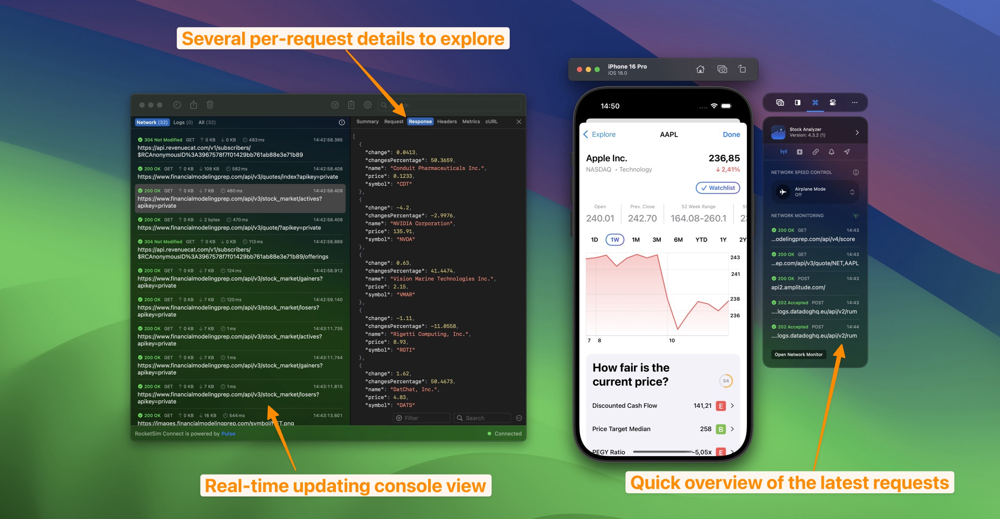
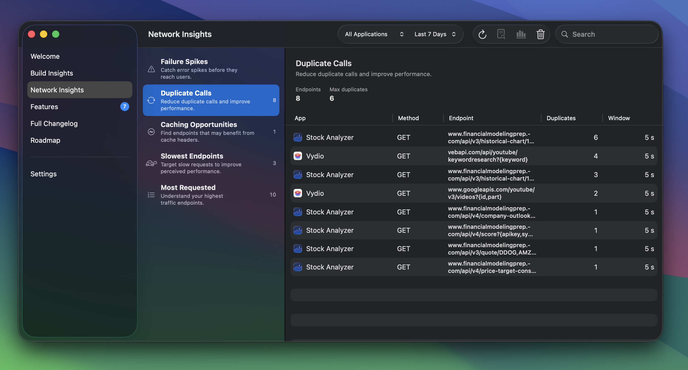
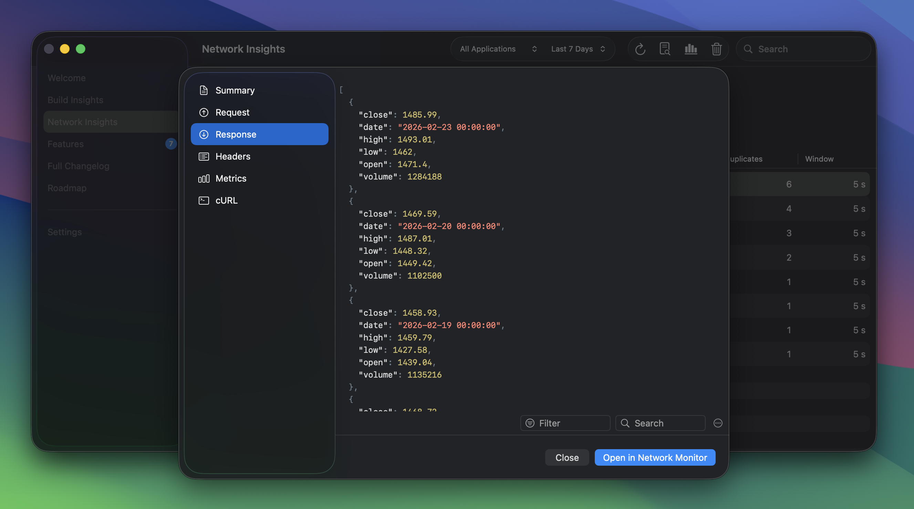

Powered by RocketSim Connect, you’re able to monitor in- and outgoing network requests for your app.

Being able to see which requests are running is essential for a fast development workflow.

## Insights overview

You can see aggregated insights across all your apps for the selected time period: failure spikes, duplicate calls, caching opportunities, slowest endpoints, and most requested URLs. Use the toolbar to switch to a specific application or a different time range.

For the historical view and the built-in agent prompt to debug API issues, see [Networking Insights](/docs/features/networking/networking-insights).

## Inspecting a request

Open the detail view for any request by double-clicking it in the list or using the toolbar button. From there you can inspect the **summary**, **request and response** body, **headers**, and **metrics**. You can also copy the request as a **cURL** command to reproduce the same call from the terminal or share it with your team.

## How does this work?

RocketSim Connect’s dynamic library gets loaded at runtime and swizzles URLSession methods to catch networking activity.

## How do I get started?

Follow the instructions for RocketSim Connect as described [here](/docs/getting-started/setting-up-rocketsim-connect).

## Do I need to set up a proxy or certificates?

Nope! Integrating RocketSim Connect is all you need.

## Are you saying I don’t need Proxyman, Charles Proxy, or any other proxy app anymore?

Basically, yes! However, RocketSim does not yet allow configuring breakpoints or adjusting responses before they return into your app. Though, in most cases, it's enough to be able to see which requests go in and out, what responses they return, and why a request failed.

## Powered by open-sourced framework Pulse

Network monitoring is made possible by [Pulse](https://github.com/kean/Pulse), an open-sourced library developed by [Alex Grebenyuk](https://github.com/kean). For a more advanced Network Logger that includes powerful mocking capabilities, advanced filtering, and more — check out [Pulse Pro](https://pulselogger.com/).
