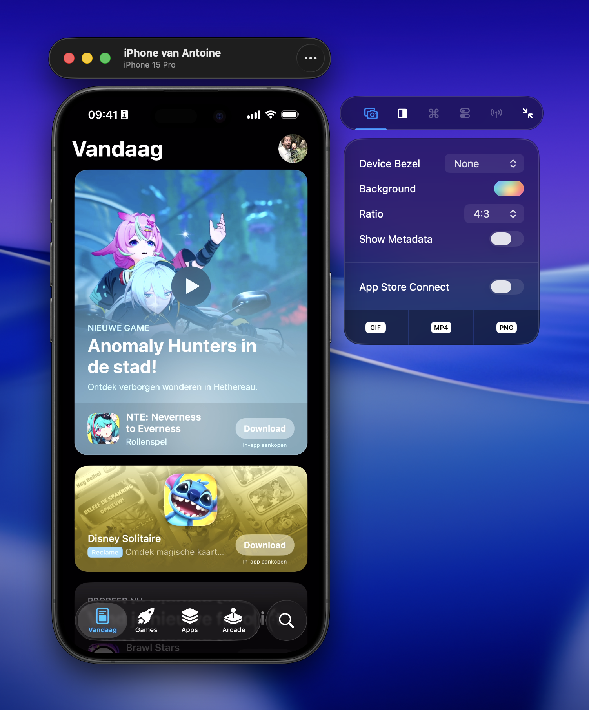
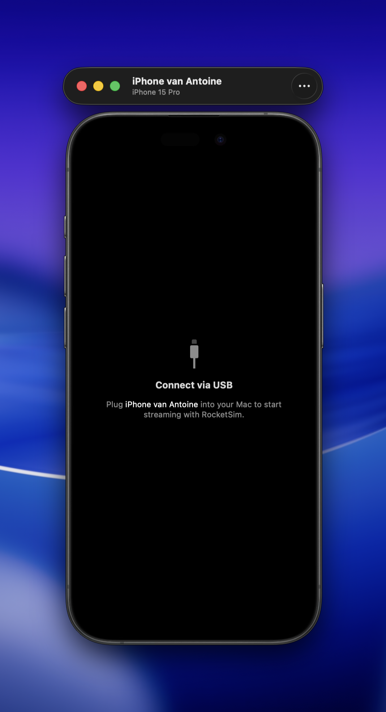
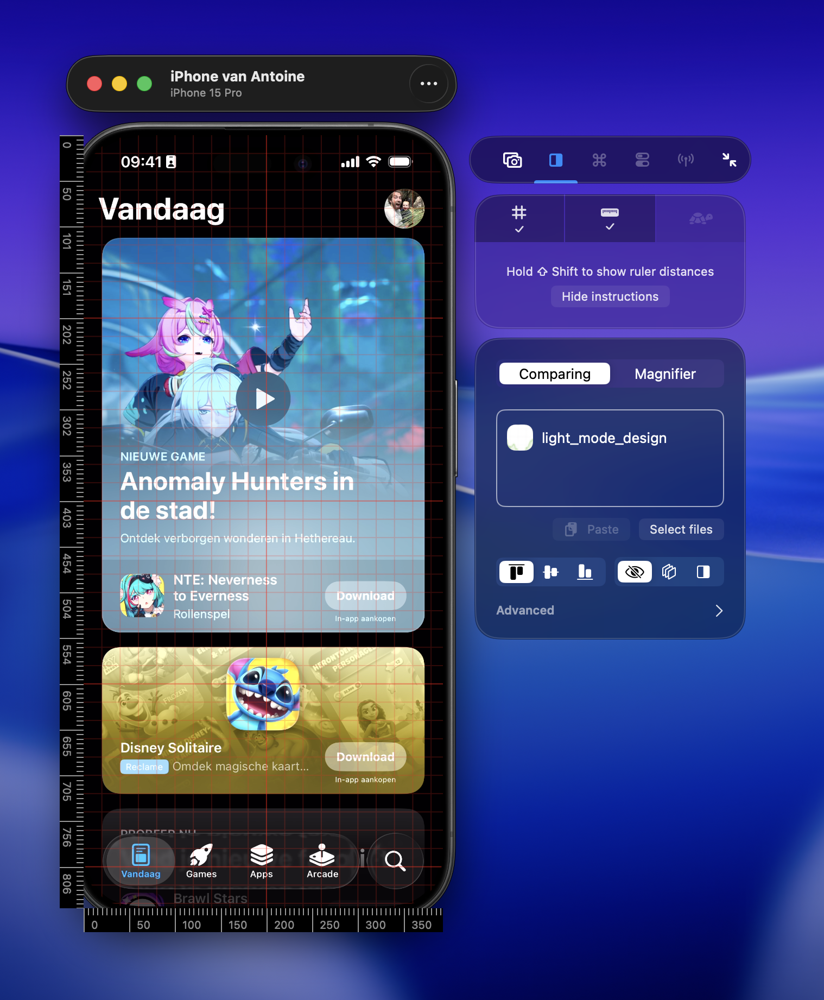

Connect an iPhone or iPad over USB to open a live physical-device preview beside RocketSim's side window. The preview makes real-device capture and design-review workflows feel similar to working with the Simulator.

## Connect your device

1. Connect the iPhone or iPad to your Mac using USB.
2. Make sure the device is paired for development and appears in Xcode.
3. Open RocketSim.
4. Wait for the physical-device preview window and attached side window.

If automatic preview windows are disabled, choose the device from RocketSim's **Connected Devices** status-bar menu. You can change this behavior under **RocketSim → Settings → Physical Devices**.

Network discovery can tell RocketSim that a paired device is nearby, but live streaming still requires a USB cable.

## Capture real-device output

The physical-device stream supports:

- PNG screenshots
- GIF captures
- MP4 video recordings
- Device audio and microphone audio
- Capture metadata from recent app builds

If a device disconnects during a recording, RocketSim stops cleanly and keeps the footage captured up to that point.

Capture options shared with the Simulator are documented under [Taking Screenshots](/docs/features/capturing/screenshots/) and [Creating Recordings](/docs/features/capturing/recordings/).

## Compare a design on real hardware

Use comparing overlays, grids, and rulers directly on the physical-device preview to verify spacing, alignment, and rendering on real hardware.

See [Grids & Rulers](/docs/features/design-comparison/grids-and-rulers/) for the shared comparison workflow.

## Why captures often show 9:41

Screenshots and recordings from a connected iPhone often show **9:41** in the status bar. iOS applies this when the system captures the physical device's screen; RocketSim does not set it and cannot disable it.

The Simulator behaves differently and allows status-bar customization. See [Status Bar Appearance](/docs/features/capturing/statusbar-appearance/).

If your app renders its own clock for marketing assets, consider a debug-only screenshot mode that also displays 9:41.

## Troubleshooting the preview

- Confirm USB device support is enabled in [Physical Devices settings](/docs/settings/physical-devices/).
- Disconnect and reconnect the cable after Xcode or iOS updates.
- If the side window is attached to the wrong target, focus the intended device window again.
- Do not run Device Hub and Simulator.app side by side when both display Simulator windows; see [Device Hub Support](/docs/features/capturing/device-hub-support/).
