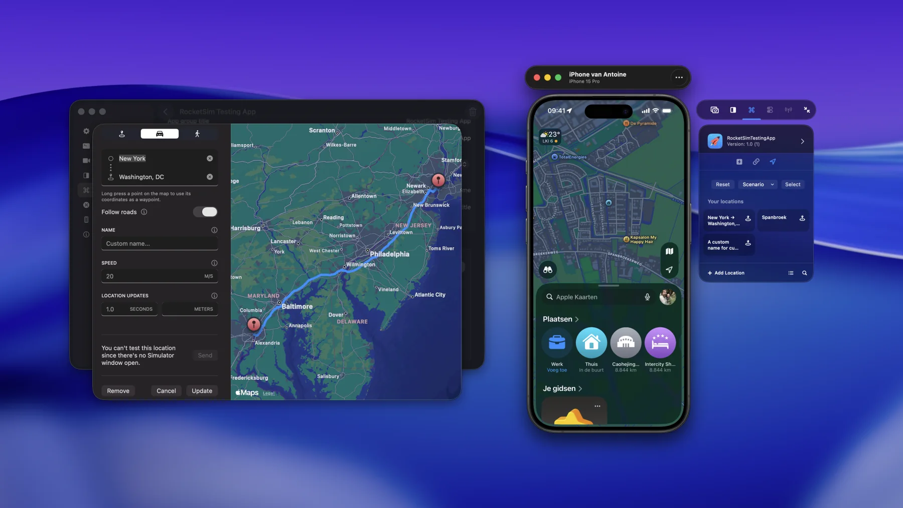

RocketSim 16.4 and Xcode 27 let you simulate locations on a connected physical iPhone or iPad. Besides testing Core Location behavior on real hardware, a simulated coordinate can make iOS automatically adopt that location's system time zone.

This creates a repeatable way to test travel, calendar, booking, delivery, and date-formatting flows in another time zone without changing the setting manually.



## Requirements

- RocketSim 16.4 or later
- Xcode 27
- A physical iPhone or iPad paired for development and connected over USB
- An app run on that device from Xcode

RocketSim checks the selected Xcode's capabilities and only exposes the physical Locations tab when location simulation is available.

## Simulate a coordinate or scenario

1. Run your app on the physical iPhone or iPad from Xcode.
2. Focus the physical-device preview and open **Recent Builds**.
3. Select your app and open **Locations**.
4. Choose **Select** for a map coordinate, pick a built-in scenario, or run a saved location App Action.
5. Choose **Reset** when you want iOS to use the device's real location again.

Saved single locations and car or walking routes use the same App Actions as Simulator testing. RocketSim resolves route points and sends them through Xcode's physical-device location service.

<video
controls
muted
playsinline
preload="metadata"
poster="/features/posters/physical-device-location-system-behaviors.webp"
aria-label="RocketSim simulating a route from San Francisco to Apple Park on a physical iPhone"

>

  <source
    src="/features/physical-device-location-route.mp4"
    type="video/mp4"
  />
  The video demonstrates a simulated route from San Francisco to Apple Park on
  a physical iPhone.
</video>

## Test routes with system modes enabled

The demo follows a simulated route from San Francisco to Apple Park while the physical iPhone reports its changing location. Because the route runs on real hardware, you can combine it with iOS features such as Driving Focus and Vehicle Motion Cues to test your app under realistic conditions.

RocketSim provides the simulated route; iOS controls those system modes, so enable them separately when your test requires them.

## Test the device in another time zone

With **Xcode 27**, simulating a physical-device location can also update the device's system time zone.

Both iOS settings must be enabled:

1. Open **Settings → General → Date & Time** and enable **Set Automatically**.
2. Open **Settings → Privacy & Security → Location Services → System Services** and enable **Setting Time Zone**.

Now simulate a coordinate in another time zone. iOS automatic time-zone detection uses the simulated Core Location coordinate and may update the system zone after a short delay.

`devicectl` and RocketSim do **not** set the time zone directly. They provide the simulated coordinate; iOS decides whether and when to update its automatic system time zone.

## Restore the real location and time zone

Press **Reset** in RocketSim's Locations tab to clear the simulation. Core Location returns to the device's real coordinates, after which automatic time-zone detection should restore the appropriate local zone.

The time-zone change can lag behind the location reset. Keep the device connected, confirm both automatic settings remain enabled, and allow iOS time to reevaluate its location.

## Verify changes inside your app

Use an automatically updating time zone when your app needs to react while running:

```swift
let identifier = TimeZone.autoupdatingCurrent.identifier
```

Observe `NSSystemTimeZoneDidChange` if a visible screen should refresh as soon as iOS changes the system zone:

```swift
NotificationCenter.default.addObserver(
    forName: .NSSystemTimeZoneDidChange,
    object: nil,
    queue: .main
) { _ in
    // Refresh date and time-zone dependent state.
}
```

Also test a cold launch after the device changes zones. Apps often cache calendars, formatters, or `TimeZone.current`, which can hide bugs until the process restarts.

For Apple's platform context, see [Get the most out of Device Hub](https://developer.apple.com/videos/play/wwdc2026/260/), [Core Location](https://developer.apple.com/documentation/corelocation), and [`TimeZone.autoupdatingCurrent`](https://developer.apple.com/documentation/foundation/timezone/autoupdatingcurrent).

## Frequently asked questions

### Does RocketSim directly change the physical device's time zone?

No. RocketSim simulates a location through Xcode. When automatic date, time, and time-zone location settings are enabled, iOS can infer the matching zone from that coordinate.

### Why did the location change without the time zone changing?

Check **Set Automatically** and **Setting Time Zone** first. iOS controls the update and can apply it after a delay.

### Does resetting the location immediately restore my real time zone?

Resetting restores real location input. The system time zone should then update automatically, but iOS can take additional time to reevaluate it.

### Is this the same as RocketSim's Simulator “Relaunch with time zone” option?

No. The Simulator option launches one app process with a matching time-zone environment. The physical-device workflow relies on iOS automatic system time-zone detection and therefore affects the device's system zone.
