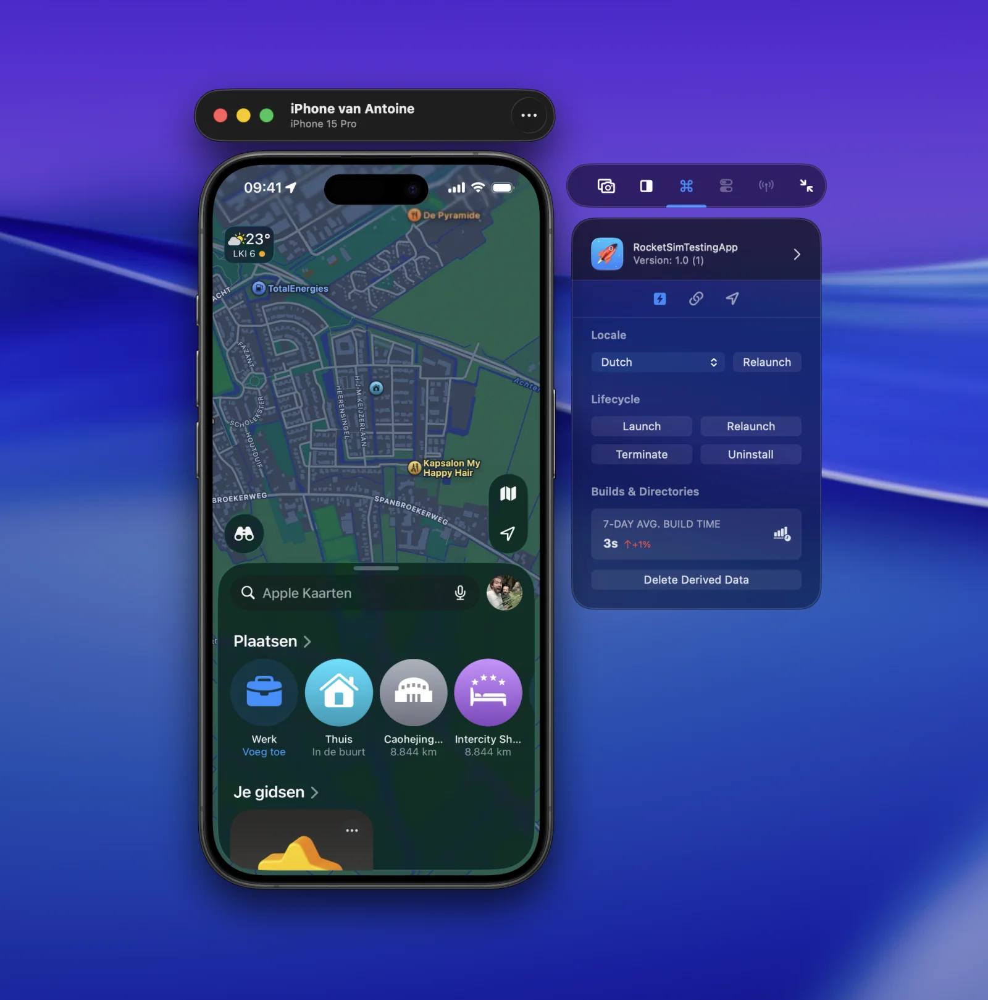

RocketSim 16.4 brings Recent Builds to physical iPhones and iPads. After you run an app from Xcode, RocketSim matches the installed app to local Derived Data and exposes the actions supported by that device.

## Requirements

- RocketSim 16.4 or later
- Xcode 27 selected as the active developer directory
- A physical iPhone or iPad paired for development and connected over USB
- An app run on that device from Xcode

RocketSim preloads installed applications when the device connects and refreshes Recent Builds after a successful Xcode run. CoreDevice can take a moment to index a newly installed app, so RocketSim retries briefly before showing it.

## Open Recent Builds

1. Connect and focus the physical-device preview.
2. Open **Recent Builds** in RocketSim's side window.
3. Select an app previously run from Xcode.
4. Choose a supported General Action or open the Deeplinks tab.

## Supported lifecycle actions

For a physical-device build, RocketSim can:

- Launch the app.
- Relaunch the app.
- Terminate the running app.
- Uninstall the app from the device.
- Relaunch using one of the locales declared by the app.
- Delete matching local Derived Data when available.

These actions use Apple's device-control services from the selected Xcode installation. RocketSim does not install a helper framework in your app for lifecycle control.

## Relaunch with a locale

RocketSim reads the localizations supported by the selected app and presents them as relaunch options. This is useful for checking translated layouts and locale-sensitive formatting on real hardware without navigating through the device's Language & Region settings for every test.

Relaunching with a locale is different from changing the device's system time zone. To test location-driven time-zone behavior, see [Physical-Device Location and Time-Zone Simulation](/docs/features/physical-devices/location-and-time-zone-simulation/).

## Actions that remain Simulator-only

RocketSim filters the side window by target capability. Physical devices do not currently expose RocketSim's push notification, privacy permission, Keychain, User Defaults, pasteboard, or network-monitoring panels.

Location and deep-link actions have dedicated physical-device workflows:

- [Deep-Link Testing on a Physical Device](/docs/features/physical-devices/deep-link-testing/)
- [Location and Time-Zone Simulation](/docs/features/physical-devices/location-and-time-zone-simulation/)
