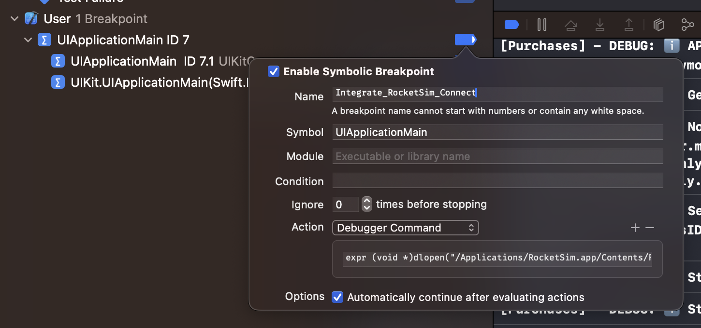

RocketSim Connect creates a connection between your running application and RocketSim. A dynamic library gets injected at runtime and opens a network connection which allows RocketSim to capture events.

## How can I setup RocketSim Connect?

RocketSim Connect works by implementing a small piece of code into your application. The app will guide you and provides a `Copy Code` button.

## Where do I find this onboarding?

You can find the onboarding by following these steps:

1. Select the **Recent Builds** tab
2. Select the **Networking** tab
3. Press the **Setup RocketSim Connect** button

## Can I integrate RocketSim Connect using a breakpoint?

Yes, you can!

1. Define a symbolic breakpoint for `UIApplicationMain`
2. Add a debugger command action using `expr (void *)dlopen("/Applications/RocketSim.app/Contents/Frameworks/RocketSimConnectLinker.nocache.framework/RocketSimConnectLinker", 0x2)`
   _Note: make sure to point to RocketSim’s .app path correctly._
3. Enable “Automatically continue after evaluating actions”
4. Move the breakpoint to “User” using the right-click menu to make it apply on all your Xcode projects

## Does this work with React Native?

Not officially supported, but from the community, we’ve been told it’s working by using [this gist](https://gist.github.com/juanchoperezj/7a057c6ab1040e41abd0bde2f406e448).

## Will RocketSim’s code end up in my release builds?

Absolutely not. RocketSim’s setup code ensures it’s only running in debug builds using the `#if DEBUG` checks.

## What kind of code are you injecting in my app?

Injecting sounds scary, but it really is not. RocketSim will never harm your app’s performance, influence it’s data, and will never perform any privacy impacting actions. All communication finds place locally on a local network and will never leave your machine.
