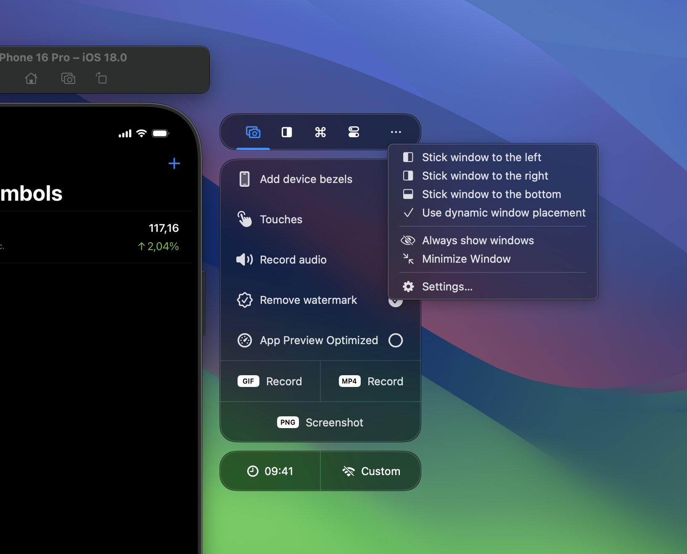
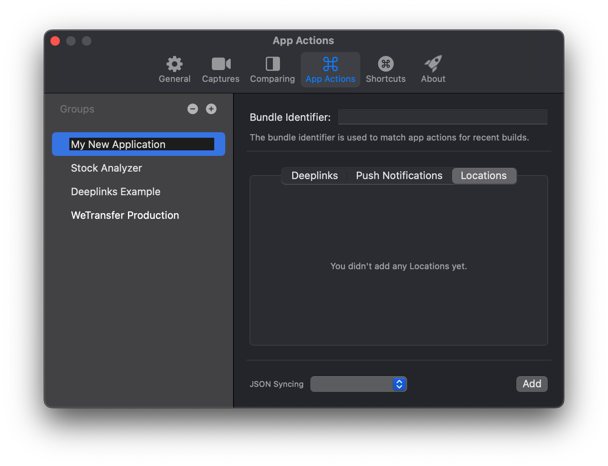
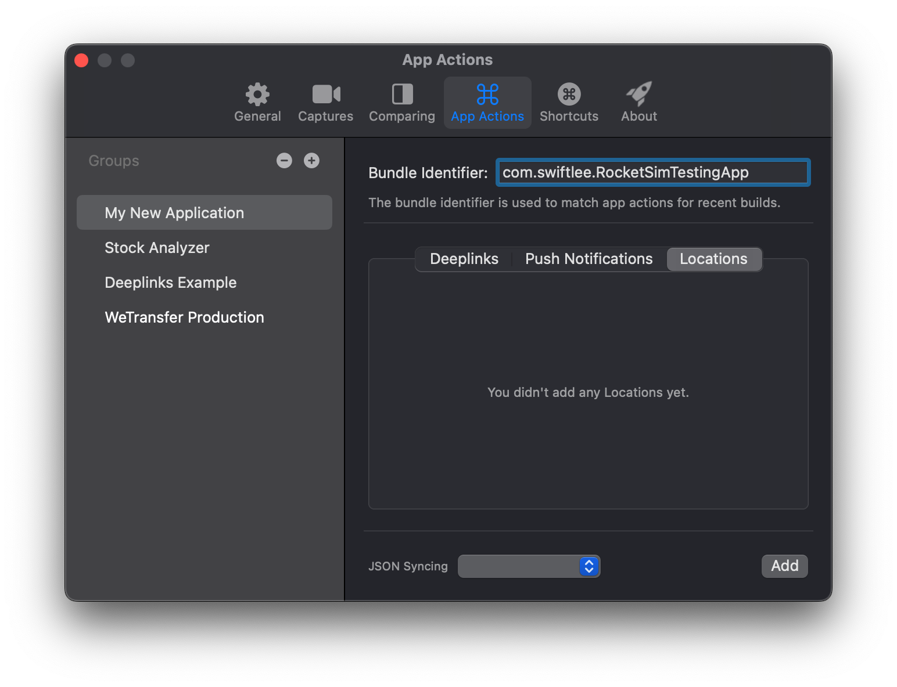
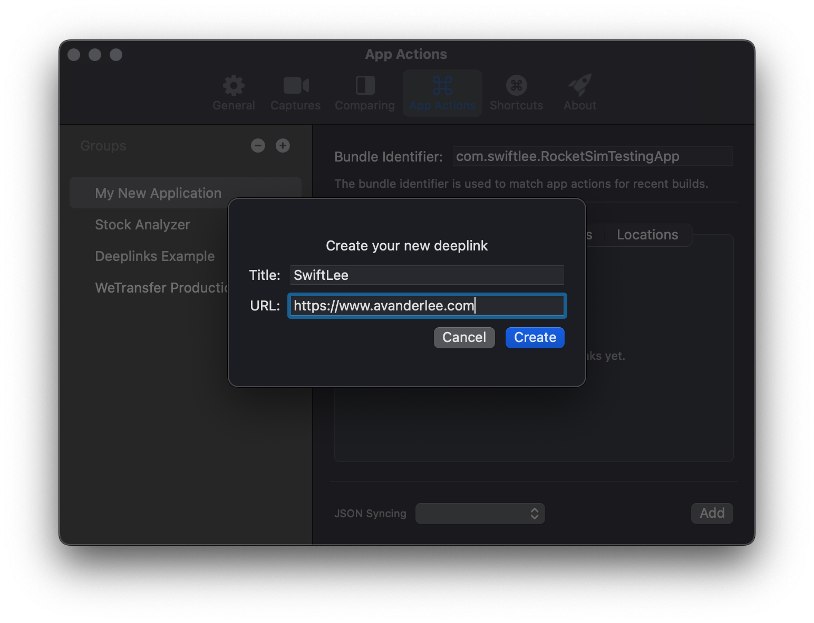
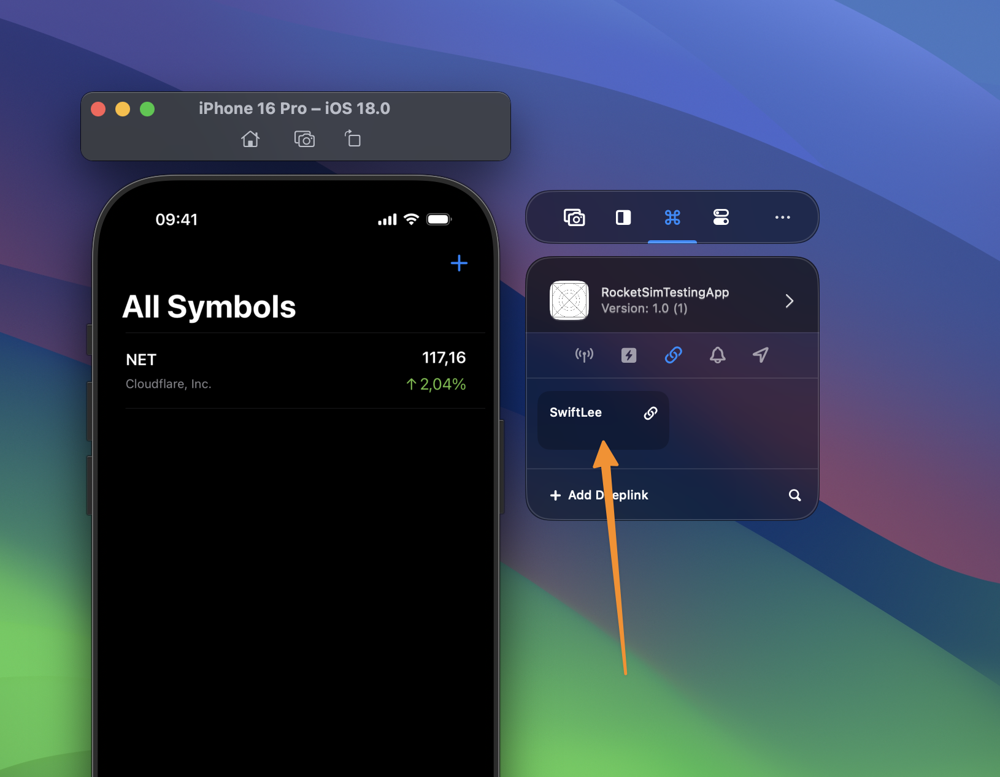
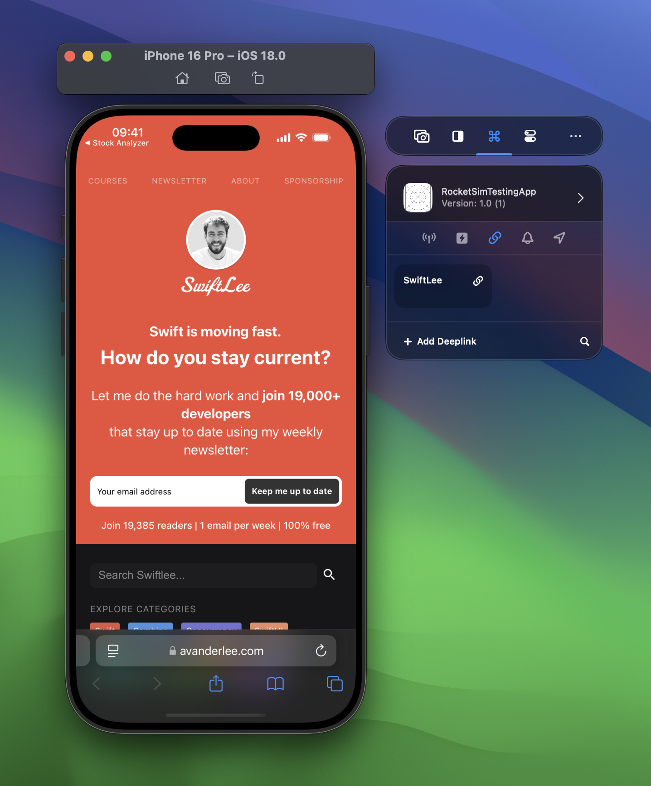

A major part of RocketSim’s functionality is based on so-called App Actions. They’re configured based on your app’s primary target bundle identifier and allow you to perform the following actions:

- Test deeplinks (Universal Links)
- Test Push Notifications
- Simulate Locations (Single Locations & Routes)
- Run quick actions like relaunching, terminating, or resetting app state
- Reset permissions (E.g., location access, photo access)

## Create a new App Actions Group

1. Start by opening the Settings window from either the Status Bar menu or the side window more menu:

   

2. Select the App Actions tab and create a new group:

1. Provide the bundle identifier for your recent build. If you’ve already build your app before configuring, RocketSim will be able to suggest your recent build.

   

2. Press the **Add** button and start adding an App Action. For example, start by adding a deeplink for a basic website:

   

3. Go back to the Simulator and notice that your deeplink shows up after selecting the Recent Build matching your App Action Group:

   

4. Click on your App Action and validate that it correctly opens the configured deeplink:

   

## Exploring all App Actions

Well done, you’ve configured your first App Actions group and executed a deeplink in the Simulator!

This is just the beginning, there’s much more to discover. While you’re at it, how about creating App Actions for [Location Simulation](/docs/features/app-actions/location-simulation) and [Push Notifications](/docs/features/app-actions/push-notifications)?

You can also explore relaunch buttons, directory shortcuts, or the permissions section. Networking tools like [Network Speed Control](/docs/features/networking/network-speed-control) and [Network Traffic Monitoring](/docs/features/networking/network-traffic-monitoring) now live in the dedicated **Networking** tab in the side window.
