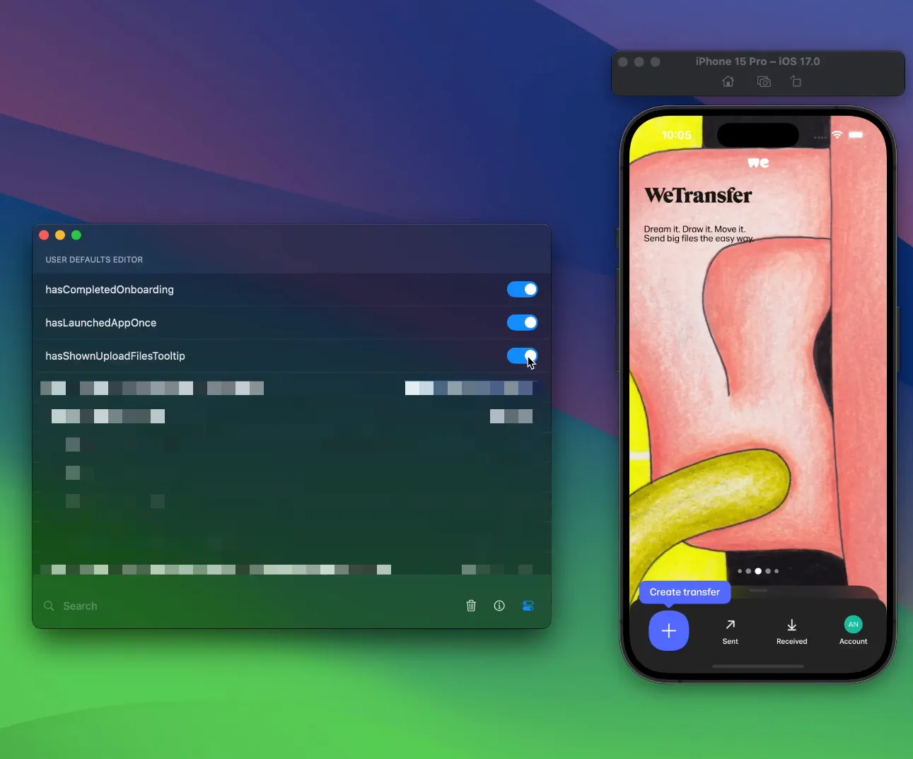
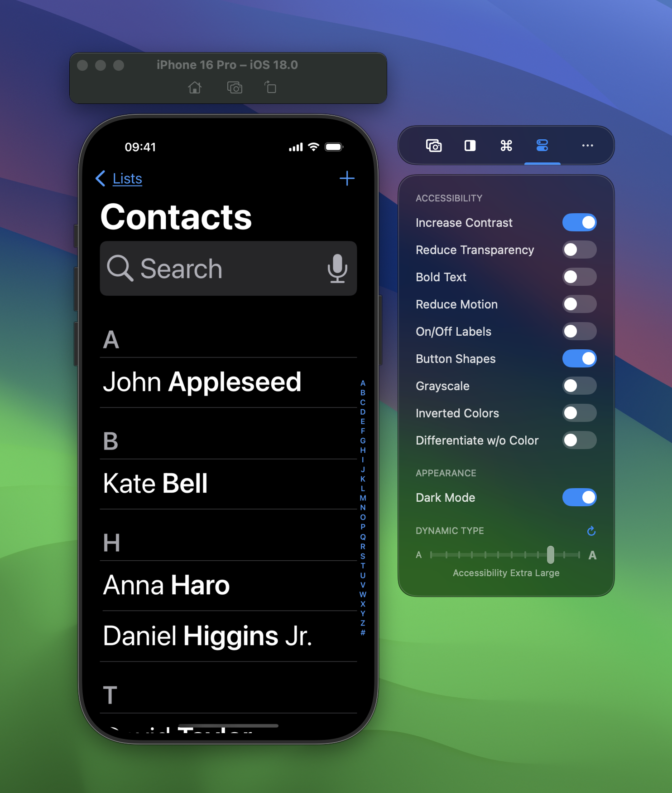

Many large teams make use of RocketSim to improve their development workflow. Developers, but also QA engineers and designers make use of RocketSim to validate designs, accessibility implementations, or execute deeplinks to enable certain feature flags. 

This article provides an overview of features that work best for specific cases, allowing you to explore what RocketSim has to offer.

## RocketSim for Teams

Brand new since 2025 is our RocketSim for Teams dashboard. 

You can find more info about this [on our website](https://www.rocketsim.app/team-insights).

## Sharing App Actions using Git

RocketSim allows you to save app actions per bundle identifier. App actions include deeplinks, push notifications, and locations that you commonly use to build and test your app.

By storing your configuration in Git, you allow all your team members to benefit from the same set of app actions related to your bundle identifier.

## Enabling feature flags

Many teams develop new features behind so-called feature flags. It’s common to have an in-app debug view that shows up after a hidden gesture like shaking the device.

RocketSim introduces an alternative to these debug views by allowing you to switch flags using the realtime User Defaults Editor.

## Preparing for European Accessibility Act (2025)

Your team should prepare for the [European Accessibility Act](https://ec.europa.eu/social/main.jsp?catId=1202&intPageId=5581&langId=en) and RocketSim is here to help. The environment toggles allow you to validate all kinds of accessibility related implementations, including dark mode and dynamic type.

## How designers and QA engineers validate implementations on the Simulator

Besides developers, it’s also QA engineers and designers that benefit from RocketSim. Large teams deliver Simulator builds automatically via CI, attached to every PR. Both designers and QA engineers will run the build on the Simulator and use RocketSim to validate.

- The design comparison feature ensures pixel-perfect views.
- Recordings with touches help QA engineers to better explain bugs.
- Relaunch apps in specific locale or timezone without resetting the Simulator greatly improves the QA testing cycle.
- Accessibility toggles in RocketSim’s side window takes away the need to teach your testers how they can switch common accessibility modes.

## Purchasing Team Licenses

You can [order team licenses via our website](https://www.rocketsim.app/team-insights). Batch discounts apply automatically if you order multiple seats.
