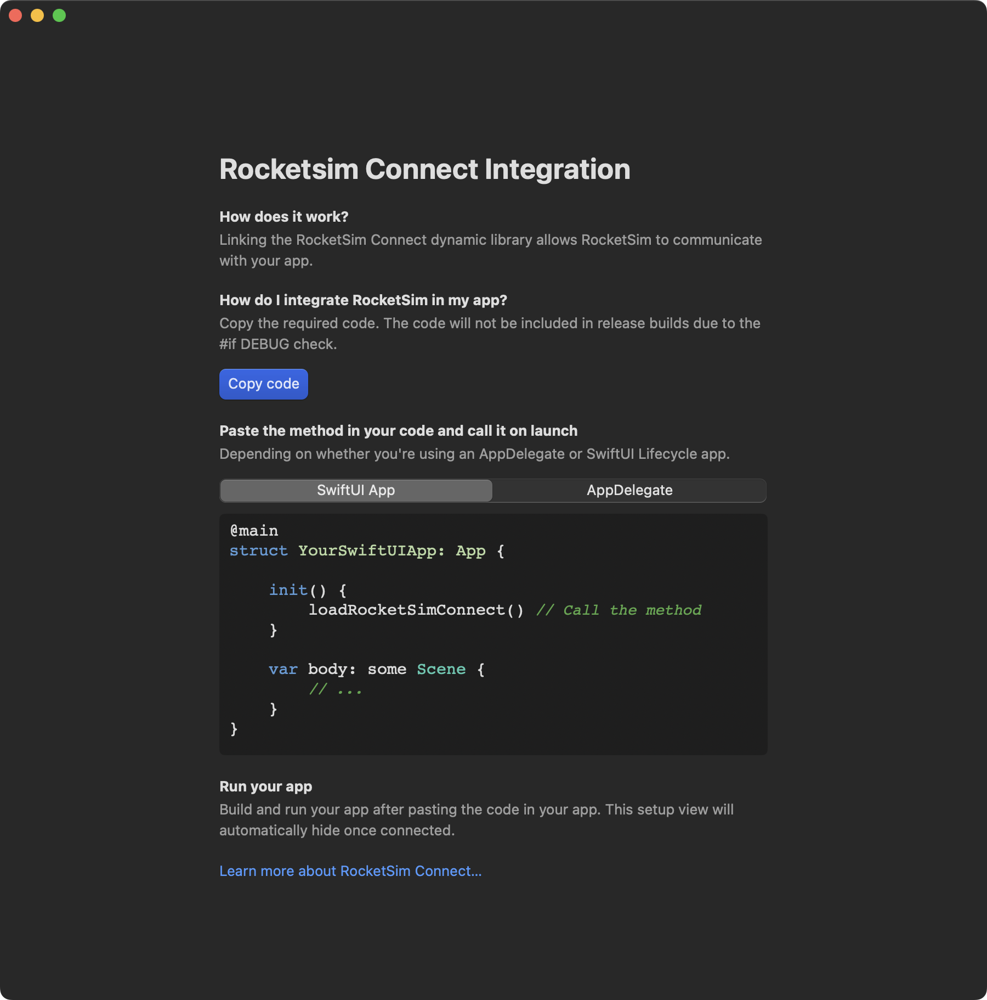
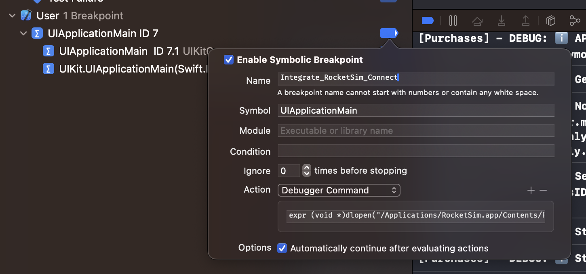

RocketSim Connect enables features like Simulator Camera and Network Traffic Monitoring by establishing a local connection between your Simulator app and the RocketSim Mac app. Without it, those features simply won't work.

## How it works

RocketSim Connect uses Bonjour discovery on your local machine. The framework (RocketSimConnectLinker) is bundled inside RocketSim.app and loaded at runtime. All communication stays local on your Mac — nothing is transmitted externally.

The framework is only active in debug builds (`#if DEBUG`). In release builds, it's completely stripped out.

## Setup via code

The app can guide you with a **Copy Code** button to add the framework load. Add the code to your app. The framework lives inside RocketSim.app's Frameworks directory. Load it at launch, for example in your app delegate or `@main` entry point:

```swift
#if DEBUG
Bundle(path: "/Applications/RocketSim.app/Contents/Frameworks/RocketSimConnectLinker.nocache.framework")?.load()
#endif
```

Adjust the path if you've installed RocketSim elsewhere. The `.nocache` suffix ensures the framework isn't cached by the system.



## Where to find the onboarding

Select the **Recent Builds** tab, then the **Networking** tab, and press **Setup RocketSim Connect**.


## Setup via breakpoint

RocketSim can install the symbolic breakpoint for you from the onboarding flow. If you need to add it manually as a fallback, create a symbolic breakpoint named `UIApplicationMain` and add this debugger command:

```
expr -l objc -- (void *)NSClassFromString(@"RocketSimConnectCoreLinker") != nil ? 0x0 : (void *)(BOOL)[[NSBundle bundleWithPath:@"/Applications/RocketSim.app/Contents/Frameworks/RocketSimConnectLinker.nocache.framework"] load]
```

This loads the framework bundle from the default App Store install path and only runs if RocketSim Connect is not already loaded. The breakpoint fires once at launch, and no code changes are required.



## Features using RocketSim Connect

Once set up, these features become available:

- [Simulator Camera Support](/docs/features/capturing/simulator-camera-support)
- [Network Traffic Monitoring](/docs/features/networking/network-traffic-monitoring)

## Privacy

All communication happens locally on your Mac. RocketSim Connect is only active in debug builds, and no data is transmitted to external servers.
