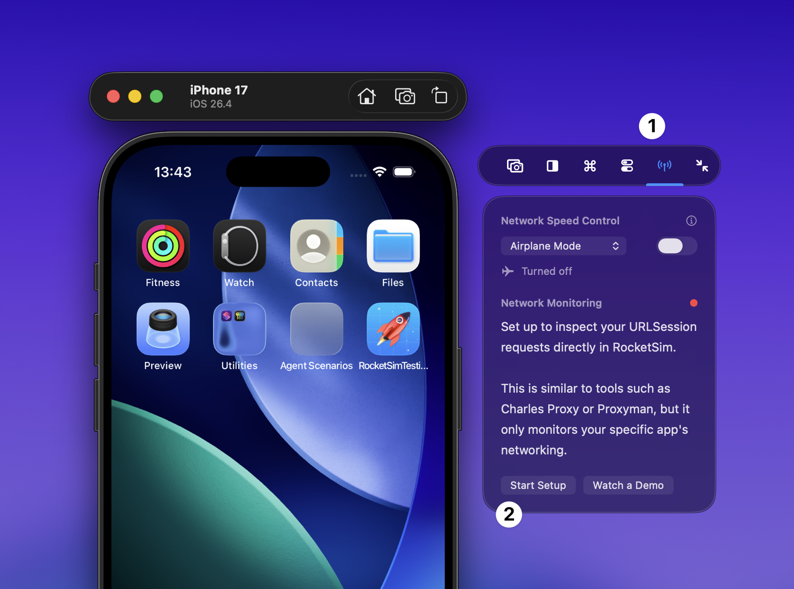
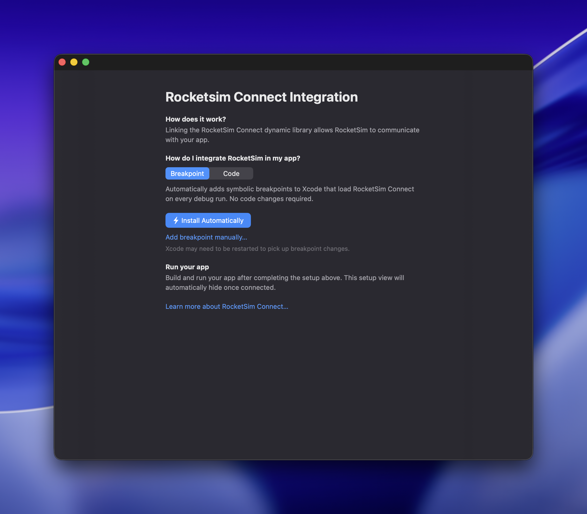
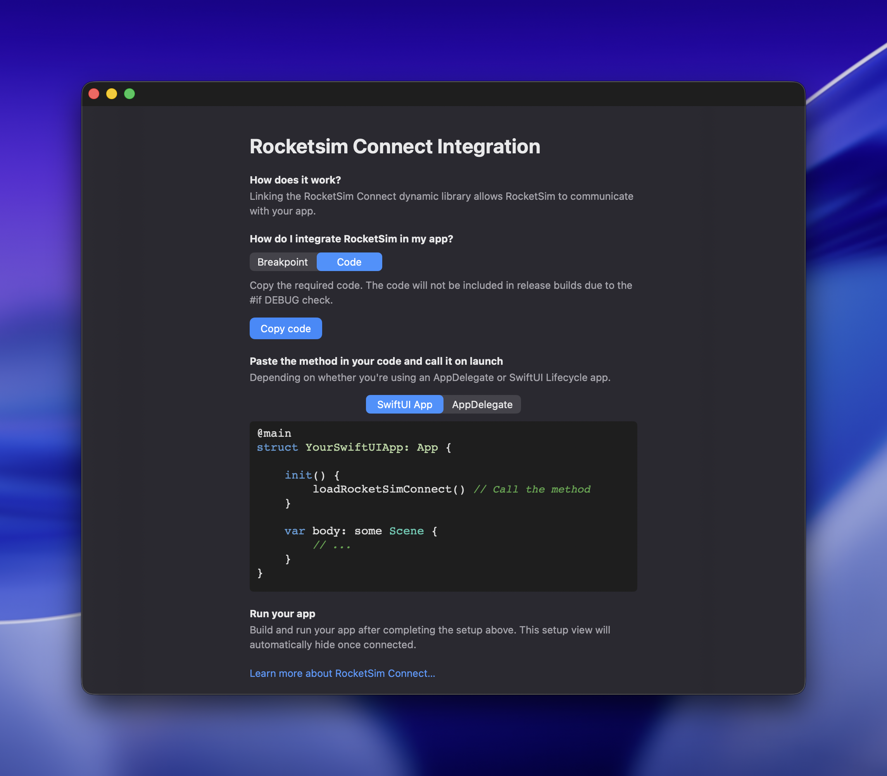

RocketSim Connect enables features like Simulator Camera and Network Traffic Monitoring by establishing a local connection between your Simulator app and the RocketSim Mac app. Without it, those features simply won't work.

## How it works

RocketSim Connect uses Bonjour discovery on your local machine. The framework (RocketSimConnectLinker) is bundled inside RocketSim.app and loaded at runtime. All communication stays local on your Mac — nothing is transmitted externally.

The framework is only active in debug builds (`#if DEBUG`). In release builds, it's completely stripped out.

## Where to find the onboarding

Select the side window's **Networking** tab with the antenna icon, then press **Start Setup**.



## Recommended: automatic breakpoint installation

The fastest setup is to let RocketSim install a symbolic breakpoint in Xcode. This is the recommended option because it does not require code changes in your app. RocketSim adds the breakpoint for you, Xcode loads RocketSim Connect on every debug run, and the setup view hides automatically once your app connects.



If you need to add the breakpoint manually as a fallback, create a symbolic breakpoint named `UIApplicationMain` and add this debugger command:

```
expr -l objc -- (void *)NSClassFromString(@"RocketSimConnectCoreLinker") != nil ? 0x0 : (void *)(BOOL)[[NSBundle bundleWithPath:@"/Applications/RocketSim.app/Contents/Frameworks/RocketSimConnectLinker.nocache.framework"] load]
```

This loads the framework bundle from the default App Store install path and only runs if RocketSim Connect is not already loaded. The breakpoint fires once at launch, keeping the integration out of your source code.

## Alternative: copy the debug code

If your team prefers an explicit integration, use the **Code** tab and press **Copy code** inside RocketSim. The generated snippet is tailored to the current RocketSim install and should be used instead of copying the example below. Add the generated code to your app and call it at launch, for example in your app delegate or `@main` entry point:

```swift
/// This is for example purposes. Use the Copy Code button inside RocketSim for a correct version of the code.
#if DEBUG
Bundle(path: "/Applications/RocketSim.app/Contents/Frameworks/RocketSimConnectLinker.nocache.framework")?.load()
#endif
```

Adjust the path if you've installed RocketSim elsewhere. The `.nocache` suffix ensures the framework isn't cached by the system.



## Features using RocketSim Connect

Once set up, these features become available:

- [Simulator Camera Support](/docs/features/capturing/simulator-camera-support)
- [Network Traffic Monitoring](/docs/features/networking/network-traffic-monitoring)

## Privacy

All communication happens locally on your Mac. RocketSim Connect is only active in debug builds, and no data is transmitted to external servers.
