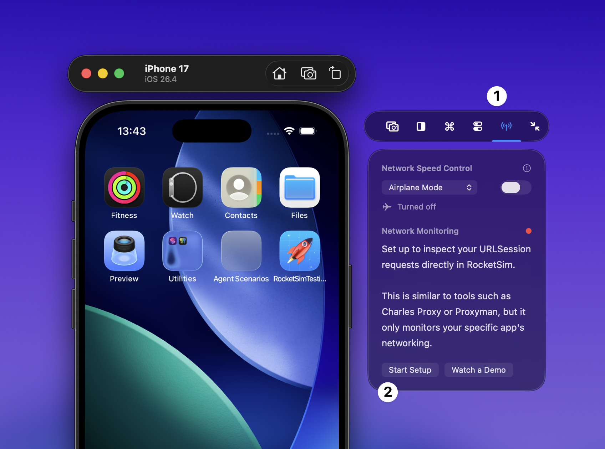
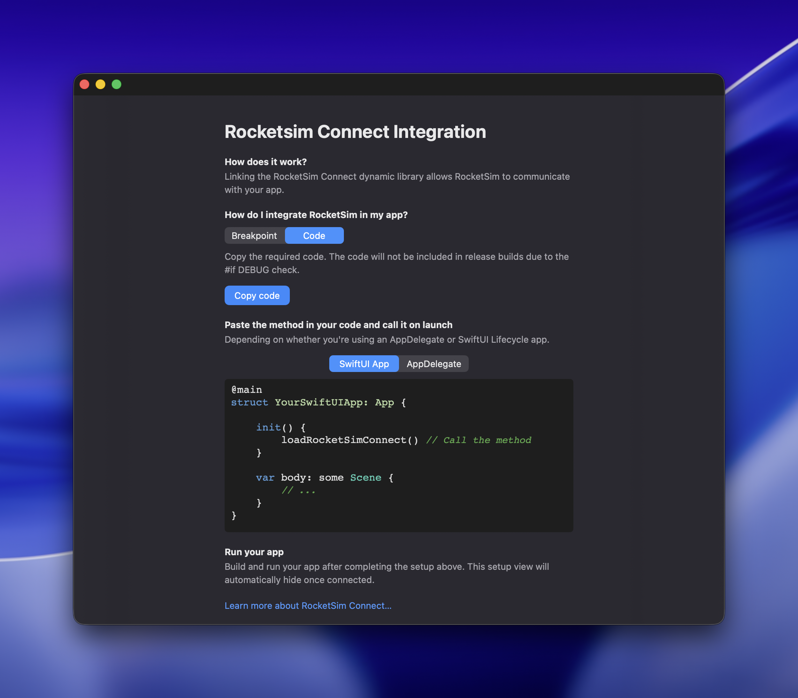

RocketSim Connect enables features like Simulator Camera and Network Traffic Monitoring by establishing a local connection between your Simulator app and the RocketSim Mac app. Without it, those features simply won't work.

## How it works

RocketSim Connect uses a small framework bundled inside RocketSim.app. Xcode loads that framework into your app while it runs in the iOS Simulator, after which it finds the RocketSim Mac app through Bonjour and establishes a local connection.

The recommended setup does not add a package, framework, build phase, or source-code change to your Xcode project. It only runs when Xcode launches an iOS Simulator app under the debugger, so archived and App Store builds are unaffected.

## Where to find the onboarding

Select the side window's **Networking** tab with the antenna icon, then press **Start Setup**.



## Recommended: automatic Xcode setup

RocketSim configures Xcode through its `~/.lldbinit-Xcode` file. This is the recommended setup because it works automatically for every Simulator app you debug and keeps RocketSim Connect matched to your installed RocketSim version.

### What is `.lldbinit-Xcode`?

LLDB is the debugger used by Xcode. Each time Xcode starts a debugging session, LLDB reads the hidden `~/.lldbinit-Xcode` file from your home folder.

In simple terms, the file tells Xcode: “When I debug an iOS Simulator app, also load RocketSim Connect.”

RocketSim adds a small, clearly marked block:

```text
# BEGIN RocketSim Connect LLDB Hook
command source "/Users/<you>/Library/Application Support/com.swiftlee.RocketSim/rocketsim-connect-lldbinit"
# END RocketSim Connect LLDB Hook
```

The block only points to a RocketSim-managed helper script. RocketSim leaves your other LLDB settings untouched and can update or remove its own block independently.

### What happens when you run your app?

1. Xcode starts an LLDB debugging session and reads `~/.lldbinit-Xcode`.
2. The managed RocketSim script waits until the app reaches `main`.
3. It confirms the target is an **iOS Simulator** app. Mac apps and physical-device processes are ignored.
4. LLDB loads the `RocketSimConnectLinker` framework from your installed RocketSim.app.
5. RocketSim Connect discovers the RocketSim Mac app locally and enables features such as Network Monitoring and Simulator Camera.

The helper uses LLDB's standard `process load` command. Nothing is permanently embedded in your app, and changing projects requires no additional setup.

### Install the LLDB init hook

Press **Start Setup** and follow the displayed steps:

1. If `~/.lldbinit-Xcode` already exists, choose **Select ~/.lldbinit-Xcode** and select that exact file when macOS asks for access.
2. If it does not exist, choose **Create ~/.lldbinit-Xcode** and confirm the hidden filename.
3. Run your app from Xcode.
4. The setup view completes after the first debug-launched app connects.

RocketSim 16.4.2 also offers **Validate Later** when you want to finish onboarding before launching a debug build. The LLDB init hook remains installed, and RocketSim validates the connection the next time an eligible Simulator app starts.

If file access does not work, RocketSim also provides an inspectable Terminal command. It creates the helper script and updates only RocketSim's managed block. The command does not use `sudo` or request broad access to your home folder.

Existing symbolic-breakpoint setups are considered legacy. RocketSim can prompt older installations to move to the LLDB init workflow so Connect setup remains consistent across projects.

### Why RocketSim uses a separate helper script

Keeping the implementation in RocketSim's Application Support folder leaves your personal LLDB init file readable and minimal. It also lets RocketSim repair a stale framework path if RocketSim.app moves or is reinstalled. RocketSim 16.4.2 reduces the work performed during LLDB startup, making Connect initialization faster in both Xcode 26 and Xcode 27.

After a RocketSim update, the setup continues to load the framework from the installed app. If RocketSim reports that the hook is outdated, reopen the Connect setup and let RocketSim repair it.

### Troubleshooting automatic setup

- Make sure you run the app from Xcode with the debugger attached.
- The hook supports iOS Simulator targets; it intentionally ignores physical devices and Mac apps.
- If RocketSim lost access to `~/.lldbinit-Xcode`, select the file again from the setup screen.
- If RocketSim.app moved, use the setup screen to repair the generated helper script.
- Existing custom commands in `.lldbinit-Xcode` can remain; RocketSim owns only the block between its `BEGIN` and `END` comments.
- Restart the current Xcode debug session after installing or repairing the hook.

## Alternative: copy the debug code

If your team prefers an explicit integration, use the **Code** tab and press **Copy code** inside RocketSim. The generated snippet is tailored to the current RocketSim install and should be used instead of copying the example below. Add the generated code to your app and call it at launch, for example in your app delegate or `@main` entry point:

```swift
/// This is for example purposes. Use the Copy Code button inside RocketSim for a correct version of the code.
#if DEBUG
Bundle(path: "/Applications/RocketSim.app/Contents/Frameworks/RocketSimConnectLinker.nocache.framework")?.load()
#endif
```

Adjust the path if you've installed RocketSim elsewhere. The `.nocache` suffix ensures the framework isn't cached by the system.



## Features using RocketSim Connect

Once set up, these features become available:

- [Simulator Camera Support](/docs/features/capturing/simulator-camera-support)
- [Network Traffic Monitoring](/docs/features/networking/network-traffic-monitoring)

## Privacy

All RocketSim Connect communication stays local on your Mac. The LLDB hook only loads for iOS Simulator processes running under Xcode's debugger, and no data is transmitted to external servers.
