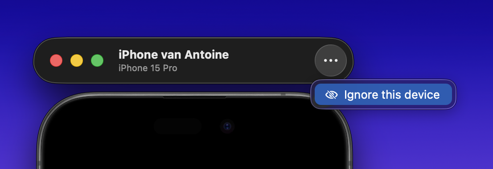

Use **RocketSim → Settings → Physical Devices** to control how RocketSim monitors connected iOS devices.

Physical device support lets RocketSim show a live preview window for a USB-connected iPhone, attach the side window to that preview, and use capture or comparison workflows on real hardware.

## Enable USB device support

Keep **Enable USB device support** turned on if you want RocketSim to detect physical devices connected by USB.

When you turn it off, RocketSim stops monitoring physical devices and closes any open physical-device windows. Turning it back on restarts monitoring without requiring an app restart.

## Network-detected devices

Some paired devices can appear as reachable on the local network even when they are not currently connected by USB.

Use **Show device window when detected on the network** to decide whether RocketSim should show these devices. Turning this off keeps RocketSim focused on cabled devices only.

USB-connected devices are still shown when USB support is enabled.

## Ignored devices

If there is a device you do not want RocketSim to manage, use the device window menu and choose **Ignore this device**.

Ignored devices:

- Stop opening physical-device preview windows
- Stay ignored across app launches
- Appear in **Settings → Physical Devices → Ignored Devices**
- Can be restored by clicking **Stop Ignoring**

This is useful when multiple devices are connected but you only want RocketSim to work with one of them.

## Related docs

- [Physical Device Support](/docs/features/capturing/physical-device-support)
- [Taking Screenshots](/docs/features/capturing/screenshots)
- [Creating Recordings](/docs/features/capturing/recordings)
